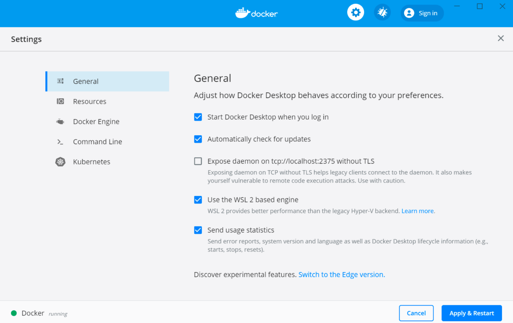
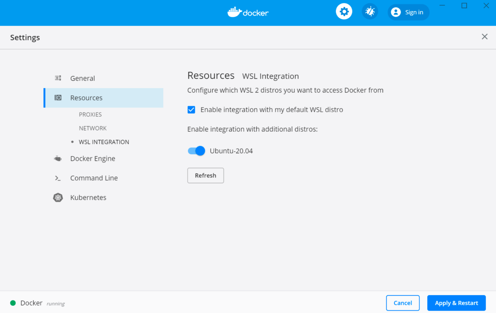
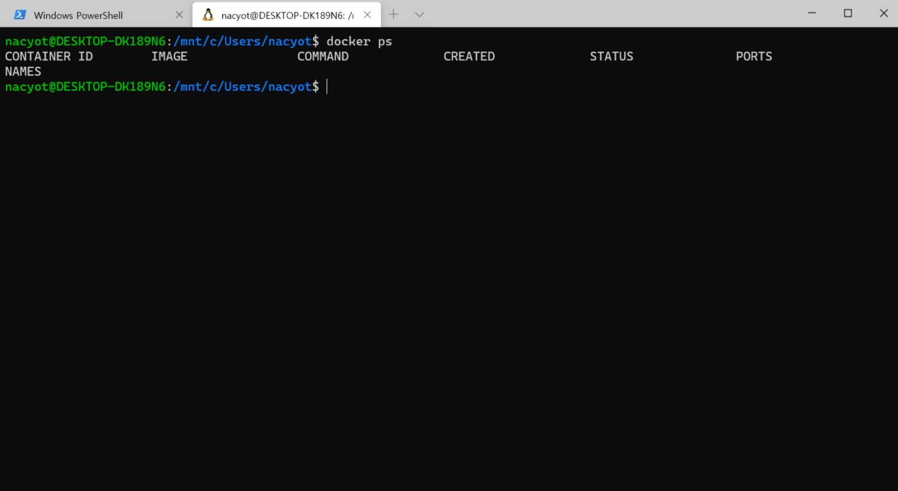
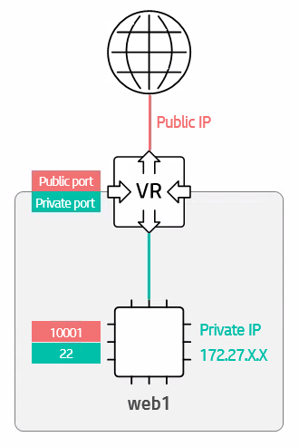
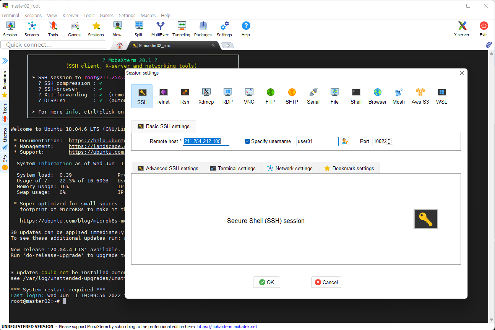

# < 시작전에 >


# 1. 실습 환경 준비(개인PC)

우리는 Kubernetes 기반에 Kafka / Redis 설치를 진행할 것이다.

그러므로 개인 PC 에 Kubernetes 환경을 미리 준비해야 한다.

개인 PC 에서 Kubernetes 환경을 준비할 수 있는 방안은 몇가지 가 있지만 우리는 DockerDesktop 이 제공하는 Kubernetes 를 사용할 것이다.

또한 WSL2 기반에 docker engine 이 수행할 것이다.


## 1) WSL2 설치

### (1) 사전준비

- - 버젼확인

    - Windows 10 version 2004 and higher (Build 19041 and higher)  또는 Windows 11 이 필요
    
    


### (2) 설치

  - 링크: https://docs.microsoft.com/en-us/windows/wsl/install


## 2) Docker Desktop 설치

Kafka / Redis External Test 를 위해서 Docker Container 가 필요하다.  또한 Docker Desktop 에서 제공되는 Kubernetes 환경을 이용할 것이다.


### (1) 다운로드 및 설치

- 링크 : https://docs.docker.com/desktop/windows/install/


### (2) Docker Destktop 확인

우측 하단  docker desktop  아이콘에서 우클릭후 아래 그림 처럼 Docker Desktop is running 확인


### (3) Kubernetes 설치


- 완료되면 아래 와 같이 docker / kubernetes is running 표기됨


### (3) docker daemon 확인

docker 가 실행가능 곳에서 아래와 같이 version 을 확인하자.

```sh
$ docker version
Client:
 Version:           20.10.7
 API version:       1.41
 Go version:        go1.13.8
 Git commit:        20.10.7-0ubuntu5~20.04.2
 Built:             Mon Nov  1 00:34:17 2021
 OS/Arch:           linux/amd64
 Context:           default
 Experimental:      true

Server: Docker Desktop
 Engine:
  Version:          20.10.14
  API version:      1.41 (minimum version 1.12)
  Go version:       go1.16.15
  Git commit:       87a90dc
  Built:            Thu Mar 24 01:46:14 2022
  OS/Arch:          linux/amd64
  Experimental:     false
 containerd:
  Version:          1.5.11
  GitCommit:        3df54a852345ae127d1fa3092b95168e4a88e2f8
 runc:
  Version:          1.0.3
  GitCommit:        v1.0.3-0-gf46b6ba
 docker-init:
  Version:          0.19.0
  GitCommit:        de40ad0
  
```

Server version 을 확인할 수 있다면 정상 설치되었다고 볼 수 있다.


### (4) WSL2에서 도커 데스크탑 실행 설정

도커 데스크탑을 설치하고 설정 페이지의 **General** 탭에서 **Use the WSL2 based engine** 옵션을 체크해준다.




Resource -> WSL Integration 페이지로 이동해서 설정을 확인한다. 자신이 사용중인 WSL2 배포판이 맞는지 확인한다.




도커 데스크탑을 설치하고 정상적으로 설정되어있다면, 바로 WSL2 우분투 터미널에서 도커 명령어를 사용할 수 있다.




## 3) MobaxTerm 설치

WSL2 에 접근하기 위해서는 터미널이 필요하다.

CMD / PowerShell / putty 와 같은 기본 터미널을 이용해도 되지만 좀더 많은 기능이 제공되는 MobaxTerm(free 버젼) 을 사용해보자.

 WSL에 접속 가능하고 터미널을 이미 사용중이고 본인에게 익숙하다면 해당 터미널을 사용해도 된다.


- download 위치
  - 링크: https://download.mobatek.net/2202022022680737/MobaXterm_Installer_v22.0.zip

- mobaxterm 실행


## 4) Typora 설치

### (1) 설치

- 링크 : https://typora.io/windows/typora-setup-x64.exe?0611


### (2) typora 환경설정

원할한 실습을 위해 코드펜스 옵션을 아래와 같이 변경하자.

- 메뉴 : 파일 > 환경설정 > 마크다운 > 코드펜스
  - 코드펜스에서 줄번호 보이기 - check
  - 긴문장 자동 줄바꿈 : uncheck


## 5) 교육문서 Download

해당 교육문서는 모두 markdown 파일이다.  해당 자료를 typora 로 오픈하기 위해서 본인 PC 에서 교육자료를 다운받아서 Typora 로 오픈하자.

```sh

# 임의의 디렉토리를 생성
D:\>mkdir githubrepo

D:\>cd githubrepo

D:\githubrepo> git clone https://github.com/ssongman/ktds-edu2.git
Cloning into 'ktds-edu2'...
remote: Enumerating objects: 424, done.
remote: Counting objects: 100% (424/424), done.
remote: Compressing objects: 100% (305/305), done.
remote: Total 424 (delta 123), reused 397 (delta 96), pack-reused 0 eceiving objects:  88% (374/424), 11.09 MiB | 5.54 MiB/s
Receiving objects: 100% (424/424), 12.94 MiB | 5.67 MiB/s, done.
Resolving deltas: 100% (123/123), done.


D:\githubrepo\ktds-edu2>dir
2022-07-02  오후 03:17    <DIR>          .
2022-06-27  오후 11:56    <DIR>          ..
2022-07-02  오후 03:51    <DIR>          beforebegin
2022-07-02  오후 03:10    <DIR>          kafka
2022-07-01  오전 01:37    <DIR>          ktcloud-setup
2022-07-02  오후 03:17             2,930 README.md
2022-07-01  오전 01:58    <DIR>          redis


```


- typora 로 오픈

```
## typora 에서 아래 파일 오픈

D:\githubrepo\ktds-edu2\README.md
```


# 아래는 그냥 삭제하자...........


# 2. 실습 환경 준비(KT Cloud)

## 1) KT Cloud 서버

개인 PC의 WSL 에서의 Kubernetes는 한개의 노드를 사용한 소형 Cluster이다. 그러므로 Kafka 모니터링 을 위한 Prometheus 등 고용량이 필요한 프로그램들은 설치 되지 않는다.

실습을 위해서는 좀더 높은 Cluster 사양이 필요하다.

원할한 실습을 위해서 KT Cloud 에 Kafka Monitoring 등 관련 셋팅을 미리 해 놓은 상태이다.

개인별 계정과 개인별 Namespace 에서 다양한 실습을 진행할 것이다.  이를 위해 서버 접근정보를 이해하고 개인 계정을 확인하자.


### (1) KT Cloud 이해

KT Cloud에 VM 서버 하나를 생성하게 되면 다음과 같은 구조가 된다.




- 기본환경 설명
  - Public IP는 외부에서 접근을 할 수 있는 IP

  - Private IP는 외부에서 접근은 못하나, 같은 서브넷 내에서 사용할 수 있는 IP
  - 외부에서 VM에 접근을 하기 위해서는 가상라우터에서 포트포워딩 작업이 필요하다.
- 가상라우터 (Virtual Router)

  - 사용자만 접근할 수 있는 서브넷과 외부의 관문(게이트웨이) 및 라우터 역할을 하는 가상 서버이다.

  - 한 계정의 한 zone에서 최초 VM을 생성하게 되면 자동으로 생성된다.

  - 기본으로 제공되어 과금이 되지 않으며, 사용자가 콘트롤 할 수 없다.

  - 하나의 공인IP가 기본으로 부여되며, 추가 공인IP를 할당할 수 있다.
- 포트포워딩

  - 가상라우터에서 외부에서 접근가능한 공인IP를 내부의 사설IP로 연결(포워딩) 해주는 작업이다.

  - Public IP:port  <-> Private IP:port 와 1:1 매핑이 기본이며, StaticNAT를 이용해 공인IP <-> 사설IP IP간의 매핑도 가능하다.


### (2) ssh terminal (Mobaxterm) 실행

- 메뉴 : session > SSH 

- Romote host : 211.254.212.105
- User : user01(개인별 계정)
- Port : 10022(master02),   10023(master03)
- password : 별도 통지





## 2) 수강생별 계정 매핑
별도 공지


## 3) 교육자료 download

본인 계정으로 접속 하였다면 테스트를 위해서 git clone 으로 교육 자료를 받아 놓자.

```sh
# 본인 계정
## githubrepo directory 생성
$ mkdir ~/githubrepo

$ cd ~/githubrepo

$ git clone https://github.com/ssongman/ktds-edu2.git
Cloning into 'ktds-edu2'...
remote: Enumerating objects: 69, done.
remote: Counting objects: 100% (69/69), done.
remote: Compressing objects: 100% (55/55), done.
remote: Total 69 (delta 15), reused 62 (delta 11), pack-reused 0
Unpacking objects: 100% (69/69), 1.63 MiB | 4.09 MiB/s, done.

$ ll ~/githubrepo
drwxrwxr-x  5 song song 4096 Jun  2 13:32 ktds-edu/

$ cd ~/githubrepo/ktds-edu
```

