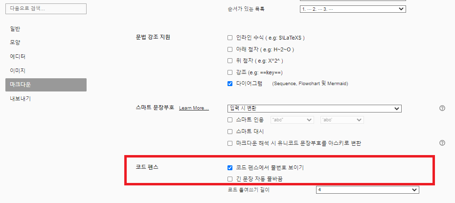

# < 시작전에 >


# 1. 실습 환경 준비(개인PC)

우리는 Kubernetes 기반에 Kafka / Redis 설치를 진행할 것이다.

그러므로 개인 PC 에 Kubernetes 환경을 미리 준비해야 한다.

개인 PC 에서 Kubernetes 환경을 준비할 수 있는 방안은 몇가지 가 있지만 우리는 DockerDesktop 이 제공하는 Kubernetes 를 사용할 것이다.

또한 WSL2 기반에 docker engine 이 수행할 것이다.


## 1.1 WSL2 설치

### (1) 사전준비

- - 버젼확인

    - Windows 10 version 2004 and higher (Build 19041 and higher)  또는 Windows 11 이 필요
    
    


### (2) 설치

  - 링크: https://docs.microsoft.com/en-us/windows/wsl/install


## 1.2 Docker Desktop 설치

Kafka / Redis External Test 를 위해서 Docker Container 가 필요하다.  또한 Docker Desktop 에서 제공되는 Kubernetes 환경을 이용할 것이다.


### (1) 다운로드 및 설치

- 링크 : https://docs.docker.com/desktop/windows/install/


### (2) Docker Destktop 확인

우측 하단  docker desktop  아이콘에서 우클릭후 아래 그림 처럼 Docker Desktop is running 확인


### (3) Docker Daemon 확인

docker 가 실행가능 곳에서 아래와 같이 version 을 확인하자.

```sh
$ docker version
Client:
 Version:           20.10.7
 API version:       1.41
 Go version:        go1.13.8
 Git commit:        20.10.7-0ubuntu5~20.04.2
 Built:             Mon Nov  1 00:34:17 2021
 OS/Arch:           linux/amd64
 Context:           default
 Experimental:      true

Server: Docker Desktop
 Engine:
  Version:          20.10.14
  API version:      1.41 (minimum version 1.12)
  Go version:       go1.16.15
  Git commit:       87a90dc
  Built:            Thu Mar 24 01:46:14 2022
  OS/Arch:          linux/amd64
  Experimental:     false
 containerd:
  Version:          1.5.11
  GitCommit:        3df54a852345ae127d1fa3092b95168e4a88e2f8
 runc:
  Version:          1.0.3
  GitCommit:        v1.0.3-0-gf46b6ba
 docker-init:
  Version:          0.19.0
  GitCommit:        de40ad0
  
```

Server version 을 확인할 수 있다면 정상 설치되었다고 볼 수 있다.


### (4) WSL2에서 Docker Engine 실행 설정

도커 데스크탑을 설치하고 설정 페이지의 **General** 탭에서 **Use the WSL2 based engine** 옵션을 체크해준다.


도커 데스크탑을 설치하고 정상적으로 설정되어있다면, 바로 WSL2 우분투 터미널에서 도커 명령어를 사용할 수 있다.


## 1.3 Docker Desktop - K8s 설정


### (1) Kubernetes 설정

Docker Desktop 에서 Kubernetes 를 설치해보자.

- 위치 : Dashboard > Settings > Kubernetes
  - Enable Kubernetes 에 check 하기


- 완료되면 아래 와 같이 docker / kubernetes is running 표기됨


### (2) Kubernetes version 확인

kubectl 명령으로 kubernetes version 을 확인해보자.

```sh
$ kubectl version -o yaml
clientVersion:
  buildDate: "2022-05-03T13:46:05Z"
  compiler: gc
  gitCommit: 4ce5a8954017644c5420bae81d72b09b735c21f0
  gitTreeState: clean
  gitVersion: v1.24.0
  goVersion: go1.18.1
  major: "1"
  minor: "24"
  platform: linux/amd64
kustomizeVersion: v4.5.4
serverVersion:
  buildDate: "2022-05-03T13:38:19Z"
  compiler: gc
  gitCommit: 4ce5a8954017644c5420bae81d72b09b735c21f0
  gitTreeState: clean
  gitVersion: v1.24.0
  goVersion: go1.18.1
  major: "1"
  minor: "24"
  platform: linux/amd64

```

ServerVersion 이 출력된다면 Kubernetes 와 연결이 잘 된것이다.


#### Multi Cluster Client 설정

kubernetes 가 기존에 설치 되어 있던 환경이라면 cluster 를 선택할 수 있다.

```sh
# context 확인
$ kubectl config get-contexts
CURRENT   NAME             CLUSTER          AUTHINFO         NAMESPACE
*         default          default          default
          docker-desktop   docker-desktop   docker-desktop


# docker-desktop 으로 변경
$ kubectl config set current-context docker-desktop


# context 확인
$ kubectl config get-contexts
CURRENT   NAME             CLUSTER          AUTHINFO         NAMESPACE
          default          default          default
*         docker-desktop   docker-desktop   docker-desktop


# kubectl 연결 확인
$ kubectl version -o yaml
clientVersion:
  buildDate: "2022-05-03T13:46:05Z"
  compiler: gc
  gitCommit: 4ce5a8954017644c5420bae81d72b09b735c21f0
  gitTreeState: clean
  gitVersion: v1.24.0
  goVersion: go1.18.1
  major: "1"
  minor: "24"
  platform: linux/amd64
kustomizeVersion: v4.5.4
serverVersion:
  buildDate: "2022-05-03T13:38:19Z"
  compiler: gc
  gitCommit: 4ce5a8954017644c5420bae81d72b09b735c21f0
  gitTreeState: clean
  gitVersion: v1.24.0
  goVersion: go1.18.1
  major: "1"
  minor: "24"
  platform: linux/amd64

# 위와 같이 serverVersion 이 표현되어야 정상연결 된 것이다.

```


## 1.4 MobaxTerm 설치

WSL2 에 접근하기 위해서는 터미널이 필요하다.

CMD / PowerShell / putty 와 같은 기본 터미널을 이용해도 되지만 좀더 많은 기능이 제공되는 MobaxTerm(free 버젼) 을 사용해보자.

 WSL에 접속 가능하고 터미널을 이미 사용중이고 본인에게 익숙하다면 해당 터미널을 사용해도 된다.


- download 위치
  - 링크: https://download.mobatek.net/2202022022680737/MobaXterm_Installer_v22.0.zip

- mobaxterm 실행


## 1.5 Typora 설치

### (1) 설치

- 링크 : https://typora.io/windows/typora-setup-x64.exe?0611


### (2) typora 환경설정

원할한 실습을 위해 코드펜스 옵션을 아래와 같이 변경하자.

- 메뉴 : 파일 > 환경설정 > 마크다운 > 코드펜스
  - 코드펜스에서 줄번호 보이기 - check
  - 긴문장 자동 줄바꿈 : uncheck





## 1.6 STS 설치

### (1) 설치

- 링크 : https://download.springsource.com/release/STS4/4.15.1.RELEASE/dist/e4.24/spring-tool-suite-4-4.15.1.RELEASE-e4.24.0-win32.win32.x86_64.self-extracting.jar


### (2) Lombok 설치

- 링크: https://lovelyunsh.tistory.com/126


# 2. 교육문서

해당 교육문서는 모두 markdown 형식으로 작성되었다.  Chrome Browser 에서 github 문서를 직접 확인해도 된다.

하지만 실습을 따라가다 보면 개인별로 수정해야 할 부분이 있는데 web browser 에서는 수정이 안되기 때문에 수정이 용이한 환경이 훨씬 좋을 것이다.

좀더 효율적인 실습을 위해서 해당 자료를 download 하여 markdown 전용 viewer 인 Typora 로 오픈하여 실습에 참여하자.


## 2.1 교육문서 Download

command 명령어로 아래와 같이 임의의 디렉토리를 생성후 git clone 으로 download 하자.

```sh

# 본인 PC에서 임의의 디렉토리를 생성
D:\>mkdir githubrepo

D:\>cd githubrepo

D:\githubrepo> git clone https://github.com/ssongman/ktds-edu2.git
Cloning into 'ktds-edu2'...
remote: Enumerating objects: 424, done.
remote: Counting objects: 100% (424/424), done.
remote: Compressing objects: 100% (305/305), done.
remote: Total 424 (delta 123), reused 397 (delta 96), pack-reused 0 eceiving objects:  88% (374/424), 11.09 MiB | 5.54 MiB/s
Receiving objects: 100% (424/424), 12.94 MiB | 5.67 MiB/s, done.
Resolving deltas: 100% (123/123), done.


D:\githubrepo\ktds-edu2>dir
2022-07-02  오후 03:17    <DIR>          .
2022-06-27  오후 11:56    <DIR>          ..
2022-07-02  오후 03:51    <DIR>          beforebegin
2022-07-02  오후 03:10    <DIR>          kafka
2022-07-01  오전 01:37    <DIR>          ktcloud-setup
2022-07-02  오후 03:17             2,930 README.md
2022-07-01  오전 01:58    <DIR>          redis


```


## 2.2 typora 로 readme.md 파일오픈


- typora 로 오픈

```
## typora 에서 아래 파일 오픈

D:\githubrepo\ktds-edu2\README.md
```


# 3. 실습자료

실습시 필요한 다양한 yaml 파일들을 미리 download받아 놓자.


## 3.1 실습자료 Download

kubernetes 접근이 가능한 terminal(mobaxterm 등) 에서 아래와 같이  실습파일을 download 하자.

```sh
$ mkdir ~/githubrepo/

$ cd ~/githubrepo/

$ git clone https://github.com/ssongman/ktds-edu2
Cloning into 'ktds-edu2'...
remote: Enumerating objects: 435, done.
remote: Counting objects: 100% (435/435), done.
remote: Compressing objects: 100% (313/313), done.
remote: Total 435 (delta 126), reused 408 (delta 99), pack-reused 0
Receiving objects: 100% (435/435), 13.15 MiB | 6.58 MiB/s, done.
Resolving deltas: 100% (126/126), done.

$ cd ~/githubrepo/ktds-edu2

$ ll
drwxr-xr-x 8 song song 4096 Jul  2 17:02 .git/
-rw-r--r-- 1 song song 2595 Jul  2 17:02 README.md
drwxr-xr-x 3 song song 4096 Jul  2 17:02 beforebegin/
drwxr-xr-x 5 song song 4096 Jul  2 17:02 kafka/
drwxr-xr-x 3 song song 4096 Jul  2 17:02 ktcloud-setup/
drwxr-xr-x 4 song song 4096 Jul  2 17:02 redis/
```

