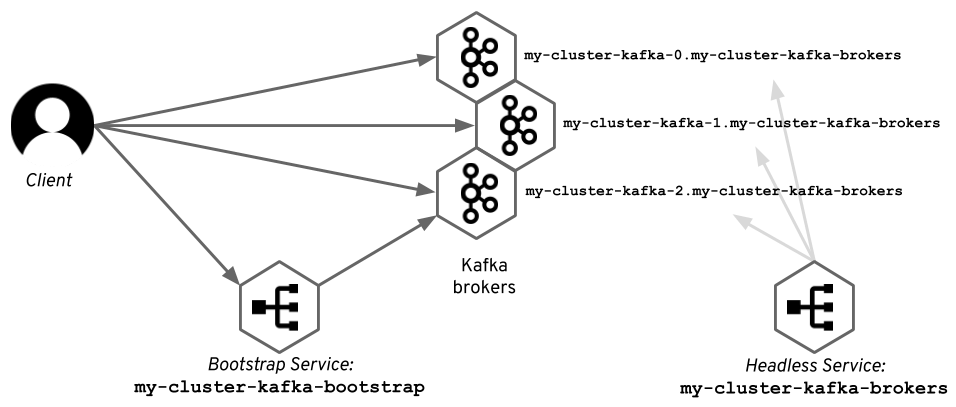

# Kafka on Kubernetes


# 1. 사전설정

## 1.1 namespace 생성

strimzi operator 와 kafka cluster 를 kafka namespace 에 설치해야 한다.  worker node 를 준비한후 kafka namespace 를 생성하자.

```
$ kubectl create ns kafka
```


# 2. Strimzi Cluster Operator Install

srimzi  operator 를 install 한다.


## 2.1 관련 file download

- 해당 사이트(https://strimzi.io/downloads/) 에서 해당 버젼을 다운로드 받는다.

```sh
$ mkdir -p ~/song/strimzi

$ cd ~/song/strimzi

$ wget https://github.com/strimzi/strimzi-kafka-operator/releases/download/0.29.0/strimzi-0.29.0.zip

$ unzip strimzi-0.29.0.zip
```


## 2.2 single name 모드 namespace 설정

- single name 모드로 설치진행
  - strimzi operator 는 다양한 namespace 에서 kafka cluster 를 쉽게 생성할 수 있는 구조로 운영이 가능하다.  이때 STRIMZI_NAMESPACE 를 설정하여 특정 namespace 만으로 cluster 를 제한 할 수 있다.  ICIS-TR SA의 경우는 kafka-system 라는 namespace 에서만  kafka cluster 를 구성할 수 있도록 설정한다. 그러므로 아래 중 Single namespace 설정에 해당한다.

```sh
$ cd  ~/song/strimzi/strimzi-0.29.0

$ sed -i 's/namespace: .*/namespace: kafka/' install/cluster-operator/*RoleBinding*.yaml
```


## 2.4 deploy

- kafka namespace 를 watch 할 수 있는 권한 부여

```sh
$ cd  ~/song/strimzi/strimzi-0.29.0

# kafka namespace 를 watch 할 수 있는 권한 부여
$ kubectl -n kafka create -f install/cluster-operator/020-RoleBinding-strimzi-cluster-operator.yaml

$ kubectl -n kafka create -f install/cluster-operator/031-RoleBinding-strimzi-cluster-operator-entity-operator-delegation.yaml


# Deploy the CRDs
$ kubectl -n kafka create -f install/cluster-operator/ 

```


## 2.5 clean up

```sh
$ cd  ~/song/strimzi/strimzi-0.29.0

$ oc -n kafka delete -f install/cluster-operator
```


# 3. Kafka Cluster 생성


## 1) ephemeral sample

### (1) kafka cluster 생성(no 인증)

- 기본생성

```sh
$ cd ~/githubrepo/ktds-edu2

$ cat ./kafka/strimzi/kafka/11.kafka-ephemeral-no-auth.yaml
apiVersion: kafka.strimzi.io/v1beta2
kind: Kafka
metadata:
  name: my-cluster
  namespace: kafka
spec:
  kafka:
    version: 3.2.0
    replicas: 3
    listeners:
      - name: plain
        port: 9092
        type: internal
        tls: false
      - name: tls
        port: 9093
        type: internal
        tls: true
    config:
      offsets.topic.replication.factor: 3
      transaction.state.log.replication.factor: 3
      transaction.state.log.min.isr: 2
      default.replication.factor: 3
      min.insync.replicas: 2
      inter.broker.protocol.version: "3.2"
    storage:
      type: ephemeral
  zookeeper:
    replicas: 3
    storage:
      type: ephemeral
  entityOperator:
    topicOperator: {}
    userOperator: {} 


$ kubectl -n kafka apply -f  ./strimzi/kafka/11.kafka-ephemeral-no-auth.yaml

```


### (2) kafka cluster 생성(인증)

#### 생성

```sh
$ cd ~/githubrepo/ktds-edu2

$ cat ./kafka/strimzi/kafka/12.kafka-ephemeral-auth.yaml
apiVersion: kafka.strimzi.io/v1beta2
kind: Kafka
metadata:
  name: my-cluster
  namespace: kafka
spec:
  kafka:
    version: 3.2.0
    replicas: 3
    authorization:
      type: simple
    listeners:
      - name: plain
        port: 9092
        type: internal
        tls: false
        authentication:
          type: scram-sha-512
      - name: tls
        port: 9093
        type: internal
        tls: true
    config:
      offsets.topic.replication.factor: 3
      transaction.state.log.replication.factor: 3
      transaction.state.log.min.isr: 2
      default.replication.factor: 3
      min.insync.replicas: 2
      inter.broker.protocol.version: "3.2"
    storage:
      type: ephemeral
  zookeeper:
    replicas: 3
    storage:
      type: ephemeral
  entityOperator:
    topicOperator: {}
    userOperator: {}

# 생성
$ kubectl -n kafka apply -f ./kafka/strimzi/kafka/12.kafka-ephemeral-auth.yaml

```

- 인증메커니즘

  - SASL 은 인증 멫 보안 서비스를 제공하는 프레임워크이다.
  - 위 yaml 파일의 인증방식은 scram-sha-512  방식인데 이는 SASL 이 지원하는 메커니즘 중 하나이며 Broker 를 SASL 구성로 구성한다.


#### 확인

```sh

$ kkf get pod
NAME                                        READY   STATUS    RESTARTS       AGE
kafkacat                                    1/1     Running   1 (7h7m ago)   7d18h
my-cluster-kafka-0                          1/1     Running   0              35s
my-cluster-kafka-1                          1/1     Running   0              35s
my-cluster-kafka-2                          1/1     Running   0              35s
my-cluster-zookeeper-0                      1/1     Running   0              59s
my-cluster-zookeeper-1                      1/1     Running   0              59s
my-cluster-zookeeper-2                      1/1     Running   0              59s
strimzi-cluster-operator-7c77f74847-llxn5   1/1     Running   1 (7h7m ago)   8d

$ kubectl -n kafka get kafka
NAME         DESIRED KAFKA REPLICAS   DESIRED ZK REPLICAS   READY   WARNINGS
my-cluster   3                        3                     True


```


#### clean up

```sh
$ kubectl -n kafka delete kafka my-cluster

```


# 4.  KafkaUser

- KafkaUser 를 생성하면 secret 에 Opaque 가 생성되며 향후 인증 password 로 사용됨
- 어떤 topic 에 접근 가능할지를 명시할 수 있다.
- 그러므로 특정 user로 namespace별 topic 간 경계설정이 가능하다.


## 1) User 정책


- user 정책

```
[Part명]-user
[Part명]-[서비스명]-user
[Part명]-[서비스명]-[서브도메인]-user
```


- sample user 별 설명

```
ㅇ my-user
my 로 시작하는 모든 topic을 처리할 수 있음
my 로 시작하는 모든 group을 Consume 가능

ㅇ order-user
order로 시작하는 모든 topic을 처리할 수 있음
order로 시작하는 모든 group을 Consume 가능

ㅇ order-user-readonly
order로 시작하는 모든 topic을 읽을 수 있음
order로 시작하는 모든 group을 Consume 가능
```


## 2) User 생성

### (1) kafkauser생성

```sh
$ cd ~/githubrepo/ktds-edu2

$ cat ./kafka/strimzi/user/11.kafka-user.yaml
---
apiVersion: kafka.strimzi.io/v1beta1
kind: KafkaUser
metadata:
  name: my-user
  labels:
    strimzi.io/cluster: arsenal-cluster
  namespace: kafka
spec:
  authentication:
    type: scram-sha-512
  authorization:
    type: simple
    acls:
      - operation: All
        resource:
          type: topic
          name: my
          patternType: prefix     # 1)
      - operation: All
        resource:
          name: my                # 2)
          patternType: prefix
          type: group
      - operation: All
        resource:
          name: my               # 3)
          patternType: prefix
          type: group
---


$ kubectl -n kafka apply -f ./kafka/strimzi/user/11.kafka-user.yaml


$ kubectl -n kafka get kafkauser
NAME      CLUSTER      AUTHENTICATION   AUTHORIZATION   READY
my-user   my-cluster   scram-sha-512    simple          True

```

- 1) my로 시작하는 topic 을 모두 처리가능

  - ex) my-board-create,  my-board-update

- 2) consumer group 은 항상 동일하다. 

  - ex) my-board-group

- 3) default consumer-group 을 위해서 생성한다.

  

### (2) password 확인

```sh

$ kubectl -n kafka get secret my-user
NAME      TYPE     DATA   AGE
my-user   Opaque   2      28s

$ kubectl -n kafka get secret my-user -o jsonpath='{.data.password}' | base64 -d
pprOnk80CDfo

# user/pass 
  my-user / pprOnk80CDfo   - KT Cloud 기준
  my-user / KV9tDU0AY4Wu   - Openshift 기준
  
```


### (3) clean up

```sh
$ kubectl -n kafka delete kafkauser my-user

```


# 5. KafkaTopic


## 1) Topic 정책 

일반적인 topic 정책


- topic 정책

```
[Part명]-[서비스명]-[서브도메인]-[사용자정의]
```


- sample topic 

```

order-intl-board-create
order-intl-board-update
order-intl-board-delete

bill-intl-board-create
bill-intl-board-update
bill-intl-board-delete

rater-intl-board-create
rater-intl-board-update
rater-intl-board-delete
```


## 2) Topic 생성

### (1) KafkaTopic 생성

#### 

```sh
$ cd ~/githubrepo/ktds-edu2

$ cat ./kafka/strimzi/topic/11.kafka-topic.yaml
---
apiVersion: kafka.strimzi.io/v1beta2
kind: KafkaTopic
metadata:
  name: my-topic
  labels:
    strimzi.io/cluster: my-cluster
  namespace: kafka
spec:
  partitions: 3
  replicas: 3
  config:
    #retention.ms: 7200000      # 2 hour
    retention.ms: 86400000      # 24 hours
    segment.bytes: 1073741824   # 1GB


$ kubectl -n kafka apply -f ./kafka/strimzi/topic/11.kafka-topic.yaml


$ kubectl -n kafka get kafkatopic my-topic
NAME       CLUSTER      PARTITIONS   REPLICATION FACTOR   READY
my-topic   my-cluster   3            3                    True

```

- partitions 1이면 producer 수행시 아래 메세지 발생할 수 있음.
  -  LEADER_NOT_AVAILABLE

### (2) 확인

```sh
$ kubectl -n kafka get kafkatopic my-topic -o yaml
apiVersion: kafka.strimzi.io/v1beta2
kind: KafkaTopic
metadata:
  annotations:
    kubectl.kubernetes.io/last-applied-configuration: |
      {"apiVersion":"kafka.strimzi.io/v1beta2","kind":"KafkaTopic","metadata":{"annotations":{},"labels":{"strimzi.io/cluster":"my-cluster"},"name":"my-topic","namespace":"kafka"},"spec":{"config":{"retention.ms":86400000,"segment.bytes":1073741824},"partitions":3,"replicas":3}}
  creationTimestamp: "2022-06-26T04:07:31Z"
  generation: 3
  labels:
    strimzi.io/cluster: my-cluster
  name: my-topic
  namespace: kafka
  resourceVersion: "2256885"
  uid: 07a78a24-b028-4bd6-8f06-2848be93e1dc
spec:
  config:
    retention.ms: 86400000
    segment.bytes: 1073741824
  partitions: 3
  replicas: 3
  topicName: my-topic
status:
  conditions:
  - lastTransitionTime: "2022-06-26T04:08:55.432530Z"
    status: "True"
    type: Ready
  observedGeneration: 3
  topicName: my-topic


```

- status 에서 true, ready 임을 확인하자.


### (3) clean up

```sh
$ kubectl -n kafka delete kafkatopic my-topic

```


# 6. Internal access

- 본 과정에서는 모두 인증(user/pass) 으로 테스트를 수행함.
- cluster 생성시 authentication.type이 scram-sha-512 일 경우 반드시 인증(user/pass) 가 있어야 함
- topic 관련 sh 은 zookeeper 에 연결되므로 scram-sha-512인증필요 없이 바로 접속 가능


## 1) 클러스터 내부에서 연결 매커니즘


### (1) 클라이언트와 브로커 직접연결

- 특정 파티션에 지정된 클라이언트는 해당 파티션을 호스팅하는 리더 브로커에 직접 연결함

- 그러므로 브로커간 데이터전달 불필요하며 이는 클러스터내 트래픽의 양을 줄이는데 도움이 됨


일단 수신되면 클라이언트는 *메타데이터* 를 사용 하여 주어진 파티션에 쓰거나 읽으려고 할 때 연결할 위치를 파악합니다. *메타데이터* 에 사용된 브로커 주소 는 브로커가 실행되는 시스템의 호스트 이름을 기반으로 브로커 자체에서 생성됩니다. 또는 옵션을 사용하여 사용자가 구성할 수 있습니다 `advertised.listeners`. 클라이언트는 메타데이터의 주소를 사용하여 *관심* 있는 특정 파티션을 호스팅하는 브로커의 주소에 대한 하나 이상의 새 연결을 엽니다. *메타데이터* 가 클라이언트가 이미 연결하고 수신한 동일한 브로커를 가리키는 경우에도 *메타데이터*에서 여전히 두 번째 연결을 엽니다. 그리고 이러한 연결은 데이터를 생성하거나 소비하는 데 사용됩니다.


클라이언트는 어떻게 해당 브로커의 위치를 알 수 있을까?


### (2) kafka discovery protocol


Kafka에는 자체 검색 프로토콜이 있습니다. Kafka 클라이언트가 Kafka 클러스터에 연결할 때 먼저 클러스터의 구성원인 브로커에 연결하고 하나 이상의 주제에 대한 *메타데이터 를 요청합니다.* *메타데이터* 에는 주제, 해당 파티션 및 이러한 파티션을 호스팅하는 브로커에 대한 정보가 포함됩니다 . 모든 브로커는 Zookeeper를 통해 모두 동기화되기 때문에 전체 클러스터에 대해 이 데이터를 가지고 있어야 합니다. 따라서 클라이언트가 처음으로 연결된 브로커는 중요하지 않습니다. 모든 브로커가 동일한 응답을 제공합니다.


일단 수신되면 클라이언트는 *메타데이터* 를 사용 하여 주어진 파티션에 쓰거나 읽으려고 할 때 연결할 위치를 파악합니다. *메타데이터* 에 사용된 브로커 주소 는 브로커가 실행되는 시스템의 호스트 이름을 기반으로 브로커 자체에서 생성됩니다. 또는 옵션을 사용하여 사용자가 구성할 수 있습니다 `advertised.listeners`. 클라이언트는 메타데이터의 주소를 사용하여 *관심* 있는 특정 파티션을 호스팅하는 브로커의 주소에 대한 하나 이상의 새 연결을 엽니다. *메타데이터* 가 클라이언트가 이미 연결하고 수신한 동일한 브로커를 가리키는 경우에도 *메타데이터*에서 여전히 두 번째 연결을 엽니다. 그리고 이러한 연결은 데이터를 생성하거나 소비하는 데 사용됩니다.


### (3) 클러스터 내부에서 연결

Kafka 클러스터와 동일한 Kubernetes 클러스터 내에서 실행되는 클라이언트에 대해 이 작업을 수행하는 것은 실제로 매우 간단합니다. 각 포드에는 다른 애플리케이션이 직접 연결하는 데 사용할 수 있는 고유한 IP 주소가 있습니다. 이것은 일반적으로 일반 Kubernetes 애플리케이션에서 사용되지 않습니다. 그 이유 중 하나는 Kubernetes가 이러한 IP 주소를 검색하는 좋은 방법을 제공하지 않기 때문입니다. IP 주소를 찾으려면 Kubernetes API를 사용하고 올바른 포드와 해당 IP 주소를 찾아야 합니다. 그리고 이에 대한 권리가 있어야 합니다. 대신 Kubernetes는 안정적인 DNS 이름이 있는 서비스를 기본 검색 메커니즘으로 사용합니다. 그러나 Kafka에서는 자체 discovery protocol 이 있으므로 문제가 되지 않습니다. 클라이언트가 Kubernetes API에서 API 주소를 알아낼 필요가 없습니다.

그러나 Strimzi에서 사용하는 더 나은 옵션이 하나 더 있습니다. Strimzi가 Kafka 브로커를 실행하는 데 사용하는 StatefulSet의 경우 Kubernetes 헤드리스 서비스를 사용하여 각 포드에 안정적인 DNS 이름을 지정할 수 있습니다. Strimzi는 이러한 DNS 이름을 Kafka 브로커에 대해 광고된 주소로 사용하고 있습니다. 

- 초기 연결은 *메타데이터* 를 가져오기 위해 일반 Kubernetes service 를 사용하여 수행됩니다 .
- 후속 연결은 다른 headless Kubernetes service 에서 Pod에 제공한 DNS 이름을 사용하여 열립니다. 





두 접근 방식 모두 장단점이 있습니다. DNS를 사용하면 캐시된 DNS 정보에 문제가 발생할 수 있습니다. 예를 들어 롤링 업데이트 중에 포드의 기본 IP 주소가 변경되면 브로커에 연결하는 클라이언트에 최신 DNS 정보가 있어야 합니다. 그러나 때때로 Kubernetes가 매우 적극적으로 IP 주소를 재사용하고 새 포드가 다른 Kafka 노드에서 불과 몇 초 전에 사용된 IP 주소를 가져오기 때문에 IP 주소를 사용하면 더 심각한 문제가 발생한다는 것을 알게 되었습니다.


## 2) Kafka Cluster service name 

일반 서비스와 headless 서비스를 확인할 수 있다.

```sh
$ kkf get svc
NAME                          TYPE        CLUSTER-IP      EXTERNAL-IP   PORT(S)                               AGE
my-cluster-kafka-bootstrap    ClusterIP   10.43.79.201    <none>        9091/TCP,9092/TCP,9093/TCP            80m
my-cluster-kafka-brokers      ClusterIP   None            <none>        9090/TCP,9091/TCP,9092/TCP,9093/TCP   80m
my-cluster-zookeeper-client   ClusterIP   10.43.125.232   <none>        2181/TCP                              80m
my-cluster-zookeeper-nodes    ClusterIP   None            <none>        2181/TCP,2888/TCP,3888/TCP            80m

```

- my-cluster-kafka-bootstrap:9092 로 접근이 가능


## 3) kafkacat 로 확인


### 1) kafkacat 설치

```sh
$ kubectl -n kafka create deploy kafkacat \
    --image=confluentinc/cp-kafkacat:latest \
    -- sleep 365d

$ kubectl -n kafka exec -it deploy/kafkacat -- bash

```


### 2) pub/sub test

id/pass 가 필요

```sh
$ kubectl -n kafka exec -it deploy/kafkacat -- bash


export BROKERS=my-cluster-kafka-bootstrap:9092
export KAFKAUSER=my-user
export PASSWORD=pprOnk80CDfo
export TOPIC=my-topic
 
## topic 리스트
kafkacat -b $BROKERS \
  -X security.protocol=SASL_PLAINTEXT \
  -X sasl.mechanisms=SCRAM-SHA-512 \
  -X sasl.username=$KAFKAUSER \
  -X sasl.password=$PASSWORD -L

Metadata for all topics (from broker -1: sasl_plaintext://my-cluster-kafka-bootstrap:9092/bootstrap):
 3 brokers:
  broker 0 at my-cluster-kafka-0.my-cluster-kafka-brokers.kafka.svc:9092
  broker 2 at my-cluster-kafka-2.my-cluster-kafka-brokers.kafka.svc:9092
  broker 1 at my-cluster-kafka-1.my-cluster-kafka-brokers.kafka.svc:9092 (controller)
 1 topics:
  topic "my-topic" with 3 partitions:
    partition 0, leader 1, replicas: 1, isrs: 1
    partition 1, leader 0, replicas: 0, isrs: 0
    partition 2, leader 2, replicas: 2, isrs: 2


## consumer
kafkacat -b $BROKERS \
  -X security.protocol=SASL_PLAINTEXT \
  -X sasl.mechanisms=SCRAM-SHA-512 \
  -X sasl.username=$KAFKAUSER \
  -X sasl.password=$PASSWORD \
  -t $TOPIC -C -o -5

<-- OK 

## consumer group
kafkacat -b $BROKERS \
  -X security.protocol=SASL_PLAINTEXT \
  -X sasl.mechanisms=SCRAM-SHA-512 \
  -X sasl.username=$KAFKAUSER \
  -X sasl.password=$PASSWORD \
  -t $TOPIC -C \
  -X group.id=my-board-group

<-- OK 


## consumer group
kafkacat -b $BROKERS \
  -X security.protocol=SASL_PLAINTEXT \
  -X sasl.mechanisms=SCRAM-SHA-512 \
  -X sasl.username=$KAFKAUSER \
  -X sasl.password=$PASSWORD \
  -t $TOPIC -C \
  -X group.id=order-intl-board-group -o -5

<-- OK 


## producer : 입력모드
kafkacat -b $BROKERS \
  -X security.protocol=SASL_PLAINTEXT \
  -X sasl.mechanisms=SCRAM-SHA-512 \
  -X sasl.username=$KAFKAUSER \
  -X sasl.password=$PASSWORD \
  -t $TOPIC -P -X acks=1
 
<-- OK


## 대량 발송 모드
$ cat > msg.txt
---
{"eventName":"a","num":1,"title":"a", "writeId":"", "writeName": "", "writeDate":"" }
---

## producer : file mode
kafkacat -b $BROKERS \
  -X security.protocol=SASL_PLAINTEXT \
  -X sasl.mechanisms=SCRAM-SHA-512 \
  -X sasl.username=$KAFKAUSER \
  -X sasl.password=$PASSWORD \
  -t $TOPIC -P ./msg.txt

<-- OK

## producer : while
while true; do kafkacat -b $BROKERS \
  -X security.protocol=SASL_PLAINTEXT \
  -X sasl.mechanisms=SCRAM-SHA-512 \
  -X sasl.username=$KAFKAUSER \
  -X sasl.password=$PASSWORD \
  -t $TOPIC -P ./msg.txt; done;

<-- OK


```


### 3) Clean up

```sh

## delete deploy
$ kubectl -n kafka delete deploy kafkacat 

```


# 7. External access

참고: https://strimzi.io/blog/2019/04/17/accessing-kafka-part-1/

Strimzi 는 외부에서 접근가능하도록  다양한 기능을 제공한다.  

- 특정 파티션에 지정된 클라이언트는 해당 파티션을 호스팅하는 리더 브로커에 직접 연결함

- 그러므로 브로커간 데이터전달 불필요하며 이는 클러스터내 트래픽의 양을 줄이는데 도움이 됨
- 클라이언트는 어떻게 해당 브로커의 위치를 알 수 있을까?


## 1) Node Port


### (1) Kafka Cluster NodePort 등록

- node port 는 route type 을 사용하지 못한다.(택일해야 함)
- 인증방식으로 셋팅

```sh
$ kubectl -n kafka edit kafka my-cluster
apiVersion: kafka.strimzi.io/v1beta2
kind: Kafka
metadata:
  name: my-cluster
  namespace: kafka
  ...
spec:
  ...
    listeners:
    ...
    
    ## nodeport type 등록
    - name: external
      port: 9094
      type: nodeport
      tls: false
      authentication:
        type: scram-sha-512
      configuration:
        bootstrap:
          nodePort: 32100
        brokers:
        - broker: 0
          advertisedHost: my-cluster.kafka.ktcloud.211.254.212.105.nip.io
          nodePort: 32000
        - broker: 1
          advertisedHost: my-cluster.kafka.ktcloud.211.254.212.105.nip.io
          nodePort: 32001
        - broker: 2
          advertisedHost: my-cluster.kafka.ktcloud.211.254.212.105.nip.io
          nodePort: 32002

...
---


```

- AdvertisedHost 필드에는 DNS 이름이나 IP 주소를 표기할 수 있다.
- nodePort 를 직접 명시할 수 있다.


### (2) 확인

```sh
$ kkf get svc
NAME                                  TYPE        CLUSTER-IP      EXTERNAL-IP   PORT(S)                               AGE
my-cluster-kafka-0                    NodePort    10.43.61.224    <none>        9094:32000/TCP                        42s
my-cluster-kafka-1                    NodePort    10.43.13.33     <none>        9094:32001/TCP                        42s
my-cluster-kafka-2                    NodePort    10.43.153.66    <none>        9094:32002/TCP                        42s
my-cluster-kafka-bootstrap            ClusterIP   10.43.79.201    <none>        9091/TCP,9092/TCP,9093/TCP            122m
my-cluster-kafka-brokers              ClusterIP   None            <none>        9090/TCP,9091/TCP,9092/TCP,9093/TCP   122m
my-cluster-kafka-external-bootstrap   NodePort    10.43.157.160   <none>        9094:32100/TCP                        42s
my-cluster-zookeeper-client           ClusterIP   10.43.125.232   <none>        2181/TCP                              123m
my-cluster-zookeeper-nodes            ClusterIP   None            <none>        2181/TCP,2888/TCP,3888/TCP            123m


## 정리하면...
my-cluster-kafka-external-bootstrap:32100
my-cluster-kafka-0:32000
my-cluster-kafka-1:32001
my-cluster-kafka-2:32002


my-cluster.kafka.ktcloud.211.254.212.105.nip.io:32100
my-cluster.kafka.ktcloud.211.254.212.105.nip.io:32000
my-cluster.kafka.ktcloud.211.254.212.105.nip.io:32001
my-cluster.kafka.ktcloud.211.254.212.105.nip.io:32002
```


### (3) kafkacat로 확인

```sh
$ kubectl -n kafka exec -it deploy/kafkacat -- bash

```


```sh

## nodeport 로 확인
export BROKERS=my-cluster.kafka.ktcloud.211.254.212.105.nip.io:32100,\
my-cluster.kafka.ktcloud.211.254.212.105.nip.io:32000,\
my-cluster.kafka.ktcloud.211.254.212.105.nip.io:32001,\
my-cluster.kafka.ktcloud.211.254.212.105.nip.io:32002
export KAFKAUSER=my-user
export PASSWORD=pprOnk80CDfo
export TOPIC=my-topic


## topic 리스트
kafkacat -b $BROKERS \
  -X security.protocol=SASL_PLAINTEXT \
  -X sasl.mechanisms=SCRAM-SHA-512 \
  -X sasl.username=$KAFKAUSER \
  -X sasl.password=$PASSWORD -L

Metadata for all topics (from broker -1: sasl_plaintext://my-cluster.kafka.ktcloud.211.254.212.105.nip.io:32100/bootstrap):
 3 brokers:
  broker 0 at my-cluster.kafka.ktcloud.211.254.212.105.nip.io:32000 (controller)
  broker 2 at my-cluster.kafka.ktcloud.211.254.212.105.nip.io:32002
  broker 1 at my-cluster.kafka.ktcloud.211.254.212.105.nip.io:32001
 1 topics:
  topic "my-topic" with 3 partitions:
    partition 0, leader 1, replicas: 1, isrs: 1
    partition 1, leader 0, replicas: 0, isrs: 0
    partition 2, leader 2, replicas: 2, isrs: 2

## consumer
kafkacat -b $BROKERS \
  -X security.protocol=SASL_PLAINTEXT \
  -X sasl.mechanisms=SCRAM-SHA-512 \
  -X sasl.username=$KAFKAUSER \
  -X sasl.password=$PASSWORD \
  -t $TOPIC -C -o -5

<-- OK 


## producer : 입력모드
kafkacat -b $BROKERS \
  -X security.protocol=SASL_PLAINTEXT \
  -X sasl.mechanisms=SCRAM-SHA-512 \
  -X sasl.username=$KAFKAUSER \
  -X sasl.password=$PASSWORD \
  -t $TOPIC -P -X acks=1
  
<-- OK 

```


## 2) Ingress - k3s에서는 https 통신 불가

- Route or Ingress type listener  는 반드시 TLS 통신만 가능하다.


### (1) Ingress 개념


Strimzi가 Ingress를 사용하여 Kafka를 노출하는 방식은 이전 블로그 게시물에서 이미 익숙할 것입니다. 클러스터의 각 Kafka 브로커에 개별적으로 액세스하기 위한 부트스트랩 서비스 및 추가 서비스로 하나의 서비스를 생성합니다. 이러한 각 서비스에 대해 해당 TLS 통과 규칙을 사용하여 하나의 Ingress 리소스도 생성합니다.


Ingress를 사용하도록 Strimzi를 구성할 때 외부 리스너의 유형을 지정 하고 필드 `ingress`의 부트스트랩뿐만 아니라 다른 브로커에 사용되는 수신 호스트를 지정해야 합니다


### (2) Kafka Cluster Ingress 등록

```sh
$ kubectl -n kafka edit kafka my-cluster
---
apiVersion: kafka.strimzi.io/v1beta2
kind: Kafka
metadata:
  name: my-cluster
  namespace: kafka
spec:
  kafka:
    authorization:
      type: simple
    config:
      ...
    listeners:
    - authentication:
        type: scram-sha-512
      name: plain
      port: 9092
      tls: false
      type: internal
    - name: tls
      port: 9093
      tls: true
      type: internal
      
    ## ingress type 등록
    - authentication:
        type: scram-sha-512
      configuration:
        bootstrap:
          host: bootstrap.kafka.ktcloud.211.254.212.105.nip.io
          annotations:
            #external-dns.alpha.kubernetes.io/hostname: bootstrap.kafka.ktcloud.211.254.212.105.nip.io
            #external-dns.alpha.kubernetes.io/ttl: "60"
            kubernetes.io/ingress.class: traefik
            ingress.kubernetes.io/ssl-passthrough: "true"
            traefik.ingress.kubernetes.io/backend-protocol: HTTPS
            traefik.ingress.kubernetes.io/ssl-passthrough: "true"
        brokers:
        - broker: 0
          host: broker-0.kafka.ktcloud.211.254.212.105.nip.io
          annotations:
            #external-dns.alpha.kubernetes.io/hostname: bootstrap.kafka.ktcloud.211.254.212.105.nip.io
            #external-dns.alpha.kubernetes.io/ttl: "60"
            kubernetes.io/ingress.class: traefik
            ingress.kubernetes.io/ssl-passthrough: "true"
            traefik.ingress.kubernetes.io/backend-protocol: HTTPS
            traefik.ingress.kubernetes.io/ssl-passthrough: "true"
        - broker: 1
          host: broker-1.kafka.ktcloud.211.254.212.105.nip.io
          annotations:
            #external-dns.alpha.kubernetes.io/hostname: bootstrap.kafka.ktcloud.211.254.212.105.nip.io
            #external-dns.alpha.kubernetes.io/ttl: "60"
            kubernetes.io/ingress.class: traefik
            ingress.kubernetes.io/ssl-passthrough: "true"
            traefik.ingress.kubernetes.io/backend-protocol: HTTPS
            traefik.ingress.kubernetes.io/ssl-passthrough: "true"
        - broker: 2
          host: broker-2.kafka.ktcloud.211.254.212.105.nip.io
          annotations:
            #external-dns.alpha.kubernetes.io/hostname: bootstrap.kafka.ktcloud.211.254.212.105.nip.io
            #external-dns.alpha.kubernetes.io/ttl: "60"
            kubernetes.io/ingress.class: traefik
            ingress.kubernetes.io/ssl-passthrough: "true"
            traefik.ingress.kubernetes.io/backend-protocol: HTTPS
            traefik.ingress.kubernetes.io/ssl-passthrough: "true"
      name: external
      port: 9094
      tls: true
      type: ingress
...
---


```


임시

```

##임시

  annotations:
    ingress.kubernetes.io/ssl-passthrough: "true"
    nginx.ingress.kubernetes.io/backend-protocol: HTTPS
    nginx.ingress.kubernetes.io/ssl-passthrough: "true"
    
 annotations:
   kubernetes.io/ingress.class: traefik
   traefik.ingress.kubernetes.io/auth-type: "basic"
   traefik.ingress.kubernetes.io/auth-secret: "mysecret"
   
  annotations:
    kubernetes.io/ingress.class: traefik

  annotations:
    kubernetes.io/ingress.class: traefik
    traefik.frontend.rule.type: PathPrefixStrip

  annotations:
    traefik.ingress.kubernetes.io/service-weights: |
      my-app: 99%
      my-app-canary: 1%

The TLS certificates will be added to all entrypoints defined by the ingress annotation traefik.frontend.entryPoints. 
If no such annotation is provided, the TLS certificates will be added to all TLS-enabled defaultEntryPoints.


```


### (3) 확인


```sh

$ kkf get svc
NAME                                  TYPE        CLUSTER-IP      EXTERNAL-IP   PORT(S)                               AGE
my-cluster-kafka-0                    ClusterIP   10.43.162.219   <none>        9094/TCP                              2m49s
my-cluster-kafka-1                    ClusterIP   10.43.21.92     <none>        9094/TCP                              2m49s
my-cluster-kafka-2                    ClusterIP   10.43.193.36    <none>        9094/TCP                              2m49s
my-cluster-kafka-bootstrap            ClusterIP   10.43.79.201    <none>        9091/TCP,9092/TCP,9093/TCP            3h16m
my-cluster-kafka-brokers              ClusterIP   None            <none>        9090/TCP,9091/TCP,9092/TCP,9093/TCP   3h16m
my-cluster-kafka-external-bootstrap   ClusterIP   10.43.116.121   <none>        9094/TCP                              2m49s
my-cluster-zookeeper-client           ClusterIP   10.43.125.232   <none>        2181/TCP                              3h16m
my-cluster-zookeeper-nodes            ClusterIP   None            <none>        2181/TCP,2888/TCP,3888/TCP            3h16m


$ kkf get ingress
NAME                         CLASS    HOSTS                                            ADDRESS                                                                   PORTS     AGE
my-cluster-kafka-0           <none>   broker-0.kafka.ktcloud.211.254.212.105.nip.io    172.27.0.168,172.27.0.29,172.27.0.48,172.27.0.68,172.27.0.76,172.27.1.2   80, 443   13m
my-cluster-kafka-1           <none>   broker-1.kafka.ktcloud.211.254.212.105.nip.io    172.27.0.168,172.27.0.29,172.27.0.48,172.27.0.68,172.27.0.76,172.27.1.2   80, 443   13m
my-cluster-kafka-2           <none>   broker-2.kafka.ktcloud.211.254.212.105.nip.io    172.27.0.168,172.27.0.29,172.27.0.48,172.27.0.68,172.27.0.76,172.27.1.2   80, 443   13m
my-cluster-kafka-bootstrap   <none>   bootstrap.kafka.ktcloud.211.254.212.105.nip.io   172.27.0.168,172.27.0.29,172.27.0.48,172.27.0.68,172.27.0.76,172.27.1.2   80, 443   13m


$ kkf get ingress my-cluster-kafka-bootstrap -o yaml
apiVersion: networking.k8s.io/v1
kind: Ingress
metadata:
  annotations:
    ingress.kubernetes.io/ssl-passthrough: "true"
    kubernetes.io/ingress.class: traefik
    nginx.ingress.kubernetes.io/backend-protocol: HTTPS
    nginx.ingress.kubernetes.io/ssl-passthrough: "true"
    traefik.ingress.kubernetes.io/backend-protocol: HTTPS
    traefik.ingress.kubernetes.io/ssl-passthrough: "true"
  creationTimestamp: "2022-06-25T12:49:27Z"
  generation: 1
  labels:
    app.kubernetes.io/instance: my-cluster
    app.kubernetes.io/managed-by: strimzi-cluster-operator
    app.kubernetes.io/name: kafka
    app.kubernetes.io/part-of: strimzi-my-cluster
    strimzi.io/cluster: my-cluster
    strimzi.io/kind: Kafka
    strimzi.io/name: my-cluster-kafka
  name: my-cluster-kafka-bootstrap
  namespace: kafka
  ownerReferences:
  - apiVersion: kafka.strimzi.io/v1beta2
    blockOwnerDeletion: false
    controller: false
    kind: Kafka
    name: my-cluster
    uid: ccd2f8af-cf45-47ae-93f7-54f4b3f356af
  resourceVersion: "2246186"
  uid: e73de52b-aabb-4ca5-8c4e-c1247f041cdc
spec:
  rules:
  - host: bootstrap.kafka.ktcloud.211.254.212.105.nip.io
    http:
      paths:
      - backend:
          service:
            name: my-cluster-kafka-external-bootstrap
            port:
              number: 9094
        path: /
        pathType: Prefix
  tls:
  - hosts:
    - bootstrap.kafka.ktcloud.211.254.212.105.nip.io
status:
  loadBalancer:
    ingress:
    - ip: 172.27.0.168
    - ip: 172.27.0.29
    - ip: 172.27.0.48
    - ip: 172.27.0.68
    - ip: 172.27.0.76
    - ip: 172.27.1.2


```


### (4) 인증서 획득

ingress 를 통한 접근은 반드시 인증서가 필요하다.

```sh
$ kubectl -n kafka get secret my-cluster-cluster-ca-cert
NAME                         TYPE     DATA   AGE
my-cluster-cluster-ca-cert   Opaque   3      3h17m


$ kubectl -n kafka get secret my-cluster-cluster-ca-cert -o jsonpath='{.data.ca\.crt}' | base64 -d

-----BEGIN CERTIFICATE-----
MIIFLTCCAxWgAwIBAgIUEcVPPUnITIf8UHljLTblIqddX5kwDQYJKoZIhvcNAQEN
BQAwLTETMBEGA1UECgwKaW8uc3RyaW16aTEWMBQGA1UEAwwNY2x1c3Rlci1jYSB2
MDAeFw0yMjA2MjUwODM4MzVaFw0yMzA2MjUwODM4MzVaMC0xEzARBgNVBAoMCmlv
LnN0cmltemkxFjAUBgNVBAMMDWNsdXN0ZXItY2EgdjAwggIiMA0GCSqGSIb3DQEB
AQUAA4ICDwAwggIKAoICAQCzzVoubinnlduqFhQlMJ0zSdaUsFrukKwopXbWwobI
dH+tEZq4rLIBZ1uhqOsC9hhlJmh96bYDiOf2nLb4fP3IZ8R0qmBwZR/bF5kLsmlW
IpdYhUHntySWQjisMGN36FFHR4DDWHST722s8vVzuiu3J8Hlo4bQ8G68d5wsYKgB
a8idHt+d4GIAmaKwXLv7SGPcMyCmFg0796K28xTKm+ydhR/jz3kka+jw2BlC+cRz
DS4qNdIbHXanCidUZ2sAY6nBslfcRNnCrAN3CVMaPi96wZgrZdx0vb2KVc+49LCa
SRtRPafv6sCz3w1/dYtpcBdo84B0oYS3yzJo7gP6rbsg/SXDV7/x5ppHXCJlYF0V
v6drgBC6l9J7Me7yDiTP6tZO9GsWXdhk2SgZ1I+Bs6pkOTU6ixoV98mOtusXa3SE
tQT79GEtPpeF3sXMoJgqlA8+WJ2y4dWuBNP6fDKgU7gCasUgRA4It5v6ZOFBdQai
0k+Hy31dGR4qfP0k70EIJspc0Uv3IEFWMUHqmpgn8iv414x3FzsYmwx/Gke09vqL
1EHJNDZzSYddQyZ+4s7xw1gdSqMktSBcE6mIUdkWadeUc3wmonqddUEGdT3YTk0g
BvI6YKq1MRRm1ymqDRW39v4iKfUeXmPJI4PxBgm/KYTbfotFt80m0Lld0zhtPo7h
nQIDAQABo0UwQzAdBgNVHQ4EFgQUVEv9ZslmUUKZvVwqNk7+Epm/zjYwEgYDVR0T
AQH/BAgwBgEB/wIBADAOBgNVHQ8BAf8EBAMCAQYwDQYJKoZIhvcNAQENBQADggIB
AB+nrpRyQgmXDbV4f0fWkET07rI7+SIni8y0O34va4j3Bn5YVEHIZsnwv9X2kNMN
EoONABt15pgJ3tWHnANi2M9SbisdJR7xFs/qkPswLKz/2Q9imwekEPW64T53t2Zg
DjsK/1GNXA1HraadZxW/Ef7uJzlcugN6kQA5zmmkg+bbRntt63KpVrC9OXN0i6QS
iKznG+mPaq7yIRLM09a3NR58eKslrbvpbah8Nj0jLrqvmcf2feCJKXJ9pQCzwU6X
d8ZLdL4ft7VYO7c/8Xi/FB2vHGRHlP+d/6tpn83WV1cmH+K/3ZSBG2bM+TEl0Im0
8pIZwhqcv4RVaZiPSgE+E9959QWAY5Buy7KyO7FXESP/fB9yzxJp09e4NEvWtEjf
N4wAclHDrS6e5/e1wdJa0Wj5s7JoizmklCS8rOWeDLMHto0dONdAG2rYg+4nC0oQ
bnnT4EHJgTEXuO/4aGls8fhkeejq9QVsqKxgKorf3g2mwhIX7HuI6GereJKEjBH0
RpTbYQhmv7iVVum/S95hqig5UFoZFe5dOSRgYKLchNf8FOfOhETYrMlPZfNWcIU7
HFlGA7bpO7ytbPyjvDNtJ5qUpVrm9+vusAB2Op1Nnc3/O4znr7MpspUti3te527V
r22FXa6sTzRXrdE7NB89VW24+pvBcXnj8Es4R/qnQBYS
-----END CERTIFICATE-----


# 인증서를 파일로 저장
$ kubectl -n kafka get secret my-cluster-cluster-ca-cert -o jsonpath='{.data.ca\.crt}' | base64 -d > ca.cart


# 인증서 확인


$ openssl s_client -connect bootstrap.kafka.ktcloud.211.254.212.105.nip.io:443 -CAfile ./ca.crt

CONNECTED(00000003)
depth=0 CN = TRAEFIK DEFAULT CERT
verify error:num=18:self signed certificate
verify return:1
depth=0 CN = TRAEFIK DEFAULT CERT
verify return:1
---
Certificate chain
 0 s:CN = TRAEFIK DEFAULT CERT
   i:CN = TRAEFIK DEFAULT CERT
---
Server certificate
-----BEGIN CERTIFICATE-----
MIIDXTCCAkWgAwIBAgIQJV8dv1IaXdAZmb8Np4P6izANBgkqhkiG9w0BAQsFADAf
MR0wGwYDVQQDExRUUkFFRklLIERFRkFVTFQgQ0VSVDAeFw0yMjA2MjUxMTU0MjNa
Fw0yMzA2MjUxMTU0MjNaMB8xHTAbBgNVBAMTFFRSQUVGSUsgREVGQVVMVCBDRVJU
MIIBIjANBgkqhkiG9w0BAQEFAAOCAQ8AMIIBCgKCAQEAxrMp2HHiGJogLfh1+pcD
TWmhxf48t7W6f278VSyU5mnt+v39L4ckiBqh4GYUo6OVzcHZIxri/khmY2vM5SKH
MoO7pUk8us0otteBgHMZ9wEyiwhrR2t4yfzotjbiCR3thjYXsri7OINeRNaA4B0+
xRD534BXvcKNITwwFwIzw3UCi5TeAclVSq9YEFn/Ffd1pMLsFWJqVySFbpGJEbHc
4hv0eAYvnI9sCdQ4m61QKqe9IITel/SOliB56nBJqZ+OXL26kJl1rErOVzE0Q2xQ
iThED+FfyO5BxA6UZaNOt3ZJOrzrKKMFoEn7Te4eZulwq9JzccRbu6xCGFQYFic0
0QIDAQABo4GUMIGRMA4GA1UdDwEB/wQEAwIDuDATBgNVHSUEDDAKBggrBgEFBQcD
ATAMBgNVHRMBAf8EAjAAMFwGA1UdEQRVMFOCUTZlMjgyNWQ4YWU3ZWYxYmY5OTVh
YzMyNmQ1ZTlmOTBjLjZiMWZhZWZjZTA5ZTU2M2NjMGNjNzNhMzFhM2I0MDgzLnRy
YWVmaWsuZGVmYXVsdDANBgkqhkiG9w0BAQsFAAOCAQEADQ2kn52CXfLVeBTTGFno
3YPEMvvdaYOSUbw+trfvmDh0VEbIXrJpk+bnxOjCA01APenU2Y/Zz2Otr6wv66Lp
ZbrV2kWWVx1tUMHRRAc/vF8LM0b5exnWACKhSM4VV5JW+wZKXJddQ4eWWfmWdy8u
ICXZ51mKgqaVVnsbyM0y3DcLjOHjWOPMBF65oeq/njPVmArrI9F5NOE4U33mnH8o
wTtgTlXSDRlvy1vFE0kLLCEdygaKdsizXw9vtG/Ftmg/CTfyhPczKlzdV52v9VX6
2DRY5R3jQ0eFwICWX969Pb7/lM3yd2w/SgIUEFoGnx2ffxDgUcf0/w+83Obyydtf
dw==
-----END CERTIFICATE-----
subject=CN = TRAEFIK DEFAULT CERT

issuer=CN = TRAEFIK DEFAULT CERT

---
No client certificate CA names sent
Peer signing digest: SHA256
Peer signature type: RSA-PSS
Server Temp Key: X25519, 253 bits
---
SSL handshake has read 1405 bytes and written 408 bytes
Verification error: self signed certificate
---
New, TLSv1.3, Cipher is TLS_AES_128_GCM_SHA256
Server public key is 2048 bit
Secure Renegotiation IS NOT supported
Compression: NONE
Expansion: NONE
No ALPN negotiated
Early data was not sent
Verify return code: 18 (self signed certificate)
---
---
Post-Handshake New Session Ticket arrived:
SSL-Session:
    Protocol  : TLSv1.3
    Cipher    : TLS_AES_128_GCM_SHA256
    Session-ID: 4F6FD6DC94BA71D608D4E1018E2D3791F0A33E52F1B5562FAD9D9A88B1DB8327
    Session-ID-ctx:
    Resumption PSK: 2A70438198C1CE669611E7D61EEB3C36F0CFB2005816C8F0207E1D0E4FCAFA8D
    PSK identity: None
    PSK identity hint: None
    SRP username: None
    TLS session ticket lifetime hint: 604800 (seconds)
    TLS session ticket:
    0000 - 58 50 88 c4 3c 9a c1 94-10 10 5c 91 88 96 37 7e   XP..<.....\...7~
    0010 - 1c 93 7f f4 56 18 5e 4d-af 0c e5 d4 be 67 5b da   ....V.^M.....g[.
    0020 - 74 d0 c1 b7 d8 54 fa bd-fe a9 19 b5 2c dd 89 24   t....T......,..$
    0030 - 19 f5 47 f5 fc ff 35 3a-a0 d6 0c 77 74 45 74 4f   ..G...5:...wtEtO
    0040 - 54 bf 24 6c ed 17 b0 da-fd 4b 3c a5 be da 49 1a   T.$l.....K<...I.
    0050 - 3c 43 db 7b 7b f9 b3 bc-c5 15 5b 34 1c 79 9b 86   <C.{{.....[4.y..
    0060 - ab 08 a5 b2 f4 6c b4 e1-a0 f9 24 d3 5b 77 67 b9   .....l....$.[wg.
    0070 - f9                                                .

    Start Time: 1656158950
    Timeout   : 7200 (sec)
    Verify return code: 18 (self signed certificate)
    Extended master secret: no
    Max Early Data: 0
---
read R BLOCK

HTTP/1.1 400 Bad Request
Content-Type: text/plain; charset=utf-8
Connection: close

400 Bad Requestclosed


```


### (5) kafkacat로 확인 - 실패

```sh
$ kubectl -n kafka exec -it deploy/kafkacat -- bash

```


```sh

## 참고
host: bootstrap.kafka.ktcloud.211.254.212.105.nip.io
host: broker-0.kafka.ktcloud.211.254.212.105.nip.io
host: broker-1.kafka.ktcloud.211.254.212.105.nip.io
host: broker-2.kafka.ktcloud.211.254.212.105.nip.io


export BROKERS=bootstrap.kafka.ktcloud.211.254.212.105.nip.io:443
export BROKERS="bootstrap.kafka.ktcloud.211.254.212.105.nip.io:443,broker-0.kafka.ktcloud.211.254.212.105.nip.io:443,broker-1.kafka.ktcloud.211.254.212.105.nip.io:443,broker-2.kafka.ktcloud.211.254.212.105.nip.io:443"
export KAFKAUSER=my-user
export PASSWORD=pprOnk80CDfo
export TOPIC=my-topic
export GROUP=my-topic-group


## topic list
kafkacat -b $BROKERS \
   -X security.protocol=SASL_SSL \
   -X sasl.mechanisms=SCRAM-SHA-512 \
   -X sasl.username=$KAFKAUSER \
   -X sasl.password=$PASSWORD \
   -X ssl.ca.location=./ca.crt -L

<-- 연결 실패
% ERROR: Failed to acquire metadata: Local: Broker transport failure
<-- 사유 : 주소인식이 안된경우, 인증서 실패, user/pass 실패  


## producer
kafkacat -b $BROKERS \
  -X security.protocol=SASL_SSL \
  -X sasl.mechanisms=SCRAM-SHA-512 \
  -X sasl.username=$KAFKAUSER \
  -X sasl.password=$PASSWORD \
  -X ssl.ca.location=./ca.crt \
  -t $TOPIC -P -X acks=1
<-- 성공


## 파일의 내용을 보내기
cat > msg.txt
abcdefg
---

## producer
kafkacat -b $BROKERS \
  -X security.protocol=SASL_SSL \
  -X sasl.mechanisms=SCRAM-SHA-512 \
  -X sasl.username=$KAFKAUSER \
  -X sasl.password=$PASSWORD \
  -X ssl.ca.location=./ca.crt \
  -t $TOPIC -P -X acks=1 msg.txt
<-- 성공


## Consumer
kafkacat -b $BROKERS \
  -X security.protocol=SASL_SSL \
  -X sasl.mechanisms=SCRAM-SHA-512 \
  -X sasl.username=$KAFKAUSER \
  -X sasl.password=$PASSWORD \
  -X ssl.ca.location=./ca.crt \
  -t $TOPIC -C
<-- 성공
 
 
## consumer 처음부터 읽어 확인할 경우
kafkacat -b $BROKERS \
  -X security.protocol=SASL_SSL \
  -X sasl.mechanisms=SCRAM-SHA-512 \
  -X sasl.username=$KAFKAUSER \
  -X sasl.password=$PASSWORD \
  -X ssl.ca.location=./ca.crt \
  -t $TOPIC -C -o beginning
<-- 성공


## Consumer Group-id
kafkacat -b $BROKERS \
  -X security.protocol=SASL_SSL \
  -X sasl.mechanisms=SCRAM-SHA-512 \
  -X sasl.username=$KAFKAUSER \
  -X sasl.password=$PASSWORD \
  -X ssl.ca.location=./ca.crt \
  -t $TOPIC -G $GROUP  -C
<-- 성공

```


## 3) Openshift Route - no 인증

참조링크: https://strimzi.io/blog/2019/04/30/accessing-kafka-part-3/


### (1) Route 개념


개별 브로커에 대한 액세스를 제공하기 위해 노드 포트에서 사용하는 것과 동일한 트릭을 사용하고 [이전 블로그 게시물](https://strimzi.io/2019/04/23/accessing-kafka-part-2.html) 에서 이미 설명했습니다 . 우리는 각 브로커를 위한 전용 서비스를 만듭니다. 이들은 개별 브로커를 직접 처리하는 데 사용됩니다. 그 외에도 클라이언트의 부트스트래핑을 위해 하나의 서비스도 사용할 것입니다. 이 서비스는 사용 가능한 모든 Kafka 브로커 간에 라운드 로빈됩니다.

그러나 노드 포트를 사용할 때와 달리 이러한 서비스는 해당 `clusterIP`유형의 일반 Kubernetes 서비스일 뿐입니다. Strimzi Kafka 운영자는 `Route`이러한 각 서비스에 대한 리소스도 생성합니다. 그러면 HAProxy 라우터를 사용하여 노출됩니다. 이 경로에 할당된 DNS 주소는 Strimzi에서 다른 Kafka 브로커에서 보급된 주소를 구성하는 데 사용됩니다.


Kafka 클라이언트는 부트스트랩 서비스를 통해 브로커 중 하나로 라우팅하는 부트스트랩 경로에 연결합니다. 이 브로커에서 브로커별 경로의 DNS 이름을 포함하는 메타데이터를 가져옵니다. Kafka 클라이언트는 이 주소를 사용하여 특정 브로커 전용 경로에 연결합니다. 그리고 라우터는 해당 서비스를 통해 다시 올바른 포드로 라우팅합니다.

이전 섹션에서 설명한 대로 라우터의 주요 사용 사례는 HTTP(S) 트래픽 라우팅입니다. 따라서 항상 포트 80 및 443에서 수신 대기합니다. Strimzi는 TLS 통과 기능을 사용하고 있으므로 다음을 의미합니다.

- 포트는 HTTPS에 사용되는 포트로 항상 443입니다.
- 트래픽은 **항상 TLS 암호화를 사용** 합니다.

클라이언트와 연결할 주소를 얻는 것은 쉽습니다. 위에서 언급했듯이 포트는 항상 443입니다. 이것은 사용자가 443 대신 포트 9094에 연결하려고 할 때 종종 문제의 원인입니다. 그러나 443은 항상 OpenShift Routes에서 올바른 포트 번호입니다. 리소스 상태에서 호스트를 찾을 수 있습니다 ( 클러스터 이름으로 `Route`교체 ).`my-cluster`


### (2) Kafka Cluster Route 등록

```yaml
## route 등록을 위한 listener 등록후 apply 수행
---
apiVersion: kafka.strimzi.io/v1beta2
kind: Kafka
metadata:
  name: sa-cluster
  namespace: kafka
  ...
spec:
  ...
  kafka:
    ...
    listeners:
      - name: plain
        port: 9092
        tls: false
        type: internal
      - name: tls
        port: 9093
        tls: true
        type: internal
        
      ## route type 등록
      - name: route
        port: 9094
        tls: true
        type: route
        
      ## route type 등록2
      - name: external
        port: 9094
        type: route
        tls: true
        authentication:
          type: scram-sha-512  # 인증
        configuration:
          bootstrap:
            host: bootstrap.kafka.apps.211-34-231-82.nip.io
          brokers:
          - broker: 0
            host: broker-0.kafka.apps.211-34-231-82.nip.io
          - broker: 1
            host: broker-1.kafka.apps.211-34-231-82.nip.io
          - broker: 2
            host: broker-2.kafka.apps.211-34-231-82.nip.io
---

```

 


### (3) 확인

```sh

## 확인
$ kubectl -n kafka get route
NAME                         HOST/PORT                                   PATH   SERVICES                              PORT   TERMINATION   WILDCARD
my-cluster-kafka-0           broker-0.kafka.apps.211-34-231-82.nip.io           my-cluster-kafka-0                    9094   passthrough   None
my-cluster-kafka-1           broker-1.kafka.apps.211-34-231-82.nip.io           my-cluster-kafka-1                    9094   passthrough   None
my-cluster-kafka-2           broker-2.kafka.apps.211-34-231-82.nip.io           my-cluster-kafka-2                    9094   passthrough   None
my-cluster-kafka-bootstrap   bootstrap.kafka.apps.211-34-231-82.nip.io          my-cluster-kafka-external-bootstrap   9094   passthrough   None

	
https://bootstrap.kafka.apps.211-34-231-82.nip.io

## 접근가능한 route 4개 생성완료


```


### (4) 인증서 획득

client 에서 사용할 인증서 획득 (인증서 기간은 1년)

```sh
## openshift 에서 인증서 획득
$ oc -n kafka extract secret/my-cluster-cluster-ca-cert --keys=ca.crt  --to=-
-----BEGIN CERTIFICATE-----
MIIFLTCCAxWgAwIBAgIUQ+S6Q/I1Bbbgdkja3rdYpacOyOAwDQYJKoZIhvcNAQEN
BQAwLTETMBEGA1UECgwKaW8uc3RyaW16aTEWMBQGA1UEAwwNY2x1c3Rlci1jYSB2
MDAeFw0yMjA2MjUxMzUwMjlaFw0yMzA2MjUxMzUwMjlaMC0xEzARBgNVBAoMCmlv
LnN0cmltemkxFjAUBgNVBAMMDWNsdXN0ZXItY2EgdjAwggIiMA0GCSqGSIb3DQEB
AQUAA4ICDwAwggIKAoICAQCtWWBKQNMWXp7C3gyVnYG28qafYenI8wF747OEgE5x
bShImZszJKsKBQbHQgUPtWMNbHTejpLrkIqS8/dcJMI61flpTyqDZYYTKWUOdEVH
x0+hgsmcXd6pLCAdbEZ5vCSbOhEiGVuPFovq/pJGfOlFxpkSafhfWdJJ4EbwaJ7B
soXxEfsvorak2TRutNEf52syStIfa8Jy42tbWVBS3viwwybvNUA3/vbqRxehJmzJ
74oIRIumT0Qmgomte4gpn8rZGkd+pXrhRJ2v4nd5Ch9QAxUcBoBY9QbecG2/+RE3
670cmVaF2r/BPgnpUt0iYOp44iJrsNo4SDR/XU27N0AHpK0DOVbLXK1ANet22JKj
U5P0N92vLvJAUkevT7k2V7VSnBrU47TH57z260R4o1nO2mIunDpyZ7z4VQN/uPe6
ISk1ldLmmNOkJ3E1rBSwsRIXJ8dyc0IOTLIuGF6XP/PCymTWzhKrOzaTmMRxtWes
GwNTikzzxXzSM4iO6inemyGGtQi6/f5oc37O1YCFGsBTFvhAVzdcPcbFoJ6jdULm
IWBv+GZsY6Hb6YsZQPZpz3HyTL4ArW5RRTjDbFKOPIR1FbxcnQQu3zxug1WQRc7U
bRBp9YSaMVnjV9bK+ScMTx+hY1SkIPX2tuPbElh2UXpDhJDMEmYJU2VKXk0n7At1
SwIDAQABo0UwQzAdBgNVHQ4EFgQUI9x2JoR/ajwKVxR4ba6KOR7DbvQwEgYDVR0T
AQH/BAgwBgEB/wIBADAOBgNVHQ8BAf8EBAMCAQYwDQYJKoZIhvcNAQENBQADggIB
AB6dnPQxtvhq/vfLjcMkET13GekbmpeOgBP32ke+n3xRW3/p3ORJdXXj+QZApKPj
eKjRQmSwFfO1/2dWsUNqOx8+g4mugKMzVE/eJY6EkDmZwRaq9aYNBdsx39eaDSBB
le0Sr0kXS2NU7n60v7v1yMr3od6IPNMwoBHi0BtqcX5bGFixjPtafbWKhDovWmLC
7P3lFtsQ6yLMyVj/e6lhpO0rAcwTNTnf2zZ1/qzQKwIoCUr7XSismpRBjWxPa/wi
sTjUqWylVQlWVZVdXpWUW+Rz2gUPlKO9fzx0PtothuJsXPg7JIEI20jSzu3aASjR
UdlhDtR9U/0ASkjmgiYxkBNBJANro72muVKVCgdZg1GB9m269iQmTwm1ATIxnIbu
IJUCcumDwBq239NC2d1DUfwhFB9YMg62mSzCIZTi/ZeNPZl0Z/vGSQ4PMZbKivF7
UkHS61RyNfNE1Ryp0ekczBqlP/lfwFQgMdTEHwtuVkx4ACzyg/x2Zqt0egTpkhea
seErJA/woM8XouwgBJKpSdOyEcAQNP2o7F2hKvDiy3e0N6tbHUJ8sWCbBxSEP+yl
ikkaEPRxXKjSibe/HfYkLEBfjBeFfSmmTXApOR/+ZJeTIPtZgnRDKwxAkXiJo5r/
wmzsXFUgChPN9wnJYUQzhW+lwWaJc5ZXJmtzNokAH6fx
-----END CERTIFICATE-----

# 인증서를 파일로 저장
$ oc -n kafka extract secret/my-cluster-cluster-ca-cert --keys=ca.crt  --to=- > ca.crt


```


### (5) kafkacat로 확인

kafkacat 을 실행한다.

docker 를 이용하든 아니면 kubernetes 내에서 실행하든 상관없다.  본인이 편한것으로 진행하자. 

```sh
$ docker run --name kafkacat -d --rm --user root confluentinc/cp-kafkacat:latest sleep 365d

or

$ kubectl -n kafka exec -it deploy/kafkacat -- bash

```


```sh


## 참고
host: bootstrap.kafka.apps.211-34-231-82.nip.io
host: broker-0.kafka.apps.211-34-231-82.nip.io
host: broker-1.kafka.apps.211-34-231-82.nip.io
host: broker-2.kafka.apps.211-34-231-82.nip.io


## nodeport 로 확인
export BROKERS=bootstrap.kafka.apps.211-34-231-82.nip.io:443 \
broker-0.kafka.apps.211-34-231-82.nip.io:443,\
broker-1.kafka.apps.211-34-231-82.nip.io:443,\
broker-2.kafka.apps.211-34-231-82.nip.io:443


export BROKERS=bootstrap.kafka.apps.211-34-231-82.nip.io:443
export KAFKAUSER=my-user
export PASSWORD=KV9tDU0AY4Wu
export TOPIC=my-topic

 
  
## topic list
kafkacat -b $BROKERS \
   -X security.protocol=SASL_SSL \
   -X sasl.mechanisms=SCRAM-SHA-512 \
   -X sasl.username=$KAFKAUSER \
   -X sasl.password=$PASSWORD \
   -X ssl.ca.location=./ca.crt -L

Metadata for all topics (from broker -1: sasl_ssl://bootstrap.kafka.apps.211-34-231-82.nip.io:443/bootstrap):
 3 brokers:
  broker 0 at broker-0.kafka.apps.211-34-231-82.nip.io:443
  broker 2 at broker-2.kafka.apps.211-34-231-82.nip.io:443
  broker 1 at broker-1.kafka.apps.211-34-231-82.nip.io:443 (controller)
 1 topics:
  topic "my-topic" with 3 partitions:
    partition 0, leader 0, replicas: 0, isrs: 0
    partition 1, leader 2, replicas: 2, isrs: 2
    partition 2, leader 1, replicas: 1, isrs: 1


## producer
kafkacat -b $BROKERS \
  -X security.protocol=SASL_SSL \
  -X sasl.mechanisms=SCRAM-SHA-512 \
  -X sasl.username=$KAFKAUSER \
  -X sasl.password=$PASSWORD \
  -X ssl.ca.location=./ca.crt \
  -t $TOPIC -P -X acks=1


## Consumer
kafkacat -b $BROKERS \
  -X security.protocol=SASL_SSL \
  -X sasl.mechanisms=SCRAM-SHA-512 \
  -X sasl.username=$KAFKAUSER \
  -X sasl.password=$PASSWORD \
  -X ssl.ca.location=./ca.crt \
  -t $TOPIC -C


```


## 9) kafkacat 추가


### 1) docker run

```
docker login nexus.dspace.kt.co.kr -u icistr-cmmn-readonly -p icis1234

docker pull nexus.dspace.kt.co.kr/confluentinc/cp-kafkacat:latest

docker run --name kafkacat -d --user root nexus.dspace.kt.co.kr/confluentinc/cp-kafkacat:latest sleep 365d

docker run --name kafkacat -d --user root confluentinc/cp-kafkacat:latest sleep 365d

```


### 2) pub/sub 확인

```sh

export BROKERS=bootstrap.211.254.212.105.nip.io:443
export TOPIC=my-topic
export GROUP=my-topic-group

  
## topic list
kafkacat -b $BROKERS \
  -X security.protocol=SSL \
  -X ssl.ca.location=./ca.crt \
  -L


## producer
kafkacat -b $BROKERS \
  -X security.protocol=SSL \
  -X ssl.ca.location=./ca.crt \
  -t $TOPIC -P -X acks=1
<-- 성공


## Consumer
kafkacat -b $BROKERS \
  -t $TOPIC -C -o beginning

## Consumer Group-id
kafkacat -b $BROKERS \
  -t $TOPIC -G $GROUP  -C
<-- 성공


---
## topic list
kafkacat -b $BROKERS \
   -X security.protocol=SSL \
   -X ssl.ca.location=./ca.crt \
   -L

<-- 성공
% ERROR: Failed to acquire metadata: Local: Broker transport failure   <-- 주소인식이 안된경우


## producer
kafkacat -b $BROKERS \
  -X security.protocol=SASL_SSL \
  -X sasl.mechanisms=SCRAM-SHA-512 \
  -X sasl.username=$KAFKAUSER \
  -X sasl.password=$PASSWORD \
  -X ssl.ca.location=./ca.crt \
  -t $TOPIC -P -X acks=1
<-- 성공


## 파일의 내용을 보내기
cat > msg.txt
abcdefg
---

## producer
kafkacat -b $BROKERS \
  -X security.protocol=SASL_SSL \
  -X sasl.mechanisms=SCRAM-SHA-512 \
  -X sasl.username=$KAFKAUSER \
  -X sasl.password=$PASSWORD \
  -X ssl.ca.location=./ca.crt \
  -t $TOPIC -P -X acks=1 msg.txt
<-- 성공


## Consumer
kafkacat -b $BROKERS \
  -X security.protocol=SASL_SSL \
  -X sasl.mechanisms=SCRAM-SHA-512 \
  -X sasl.username=$KAFKAUSER \
  -X sasl.password=$PASSWORD \
  -X ssl.ca.location=./ca.crt \
  -t $TOPIC -C
<-- 성공
 
 
## consumer 처음부터 읽어 확인할 경우
kafkacat -b $BROKERS \
  -X security.protocol=SASL_SSL \
  -X sasl.mechanisms=SCRAM-SHA-512 \
  -X sasl.username=$KAFKAUSER \
  -X sasl.password=$PASSWORD \
  -X ssl.ca.location=./ca.crt \
  -t $TOPIC -C -o beginning
<-- 성공


## Consumer Group-id
kafkacat -b $BROKERS \
  -X security.protocol=SASL_SSL \
  -X sasl.mechanisms=SCRAM-SHA-512 \
  -X sasl.username=$KAFKAUSER \
  -X sasl.password=$PASSWORD \
  -X ssl.ca.location=./ca.crt \
  -t $TOPIC -G $GROUP  -C
<-- 성공

```


# 8. Monitoring

모니터링이 필요할 경우 exporter 를 설치후 promtheus와 연동할 수 있다. 


## 1) metric

모니터링이 필요할 경우 아래와 같이 exporter 를 설치후 promtheus와 연동할 수 있다. 


- exporter 기능은 Strimzi에서 제공되는 통합 이미지 내에 포함되어 있음.   

  - strimzi/kafka:0.29.0-kafka-3.2.0    <-- strimzi-cluster-operator 에서 기본 이미지 설정가능
- kafka cluster 에서 위 yaml 파일만 수정후 apply 해도 추가가능.(kafka cluster 를 재설치 하지 않아도 됨.)
- prometheus / grafana 는 일반적인 내용과 동일함.
- grafana 에서는 strimzi dashboard 를 찾아서 import 한다.
- arsenal-cluster-kafka-exporter:9404 로 접근가능


### (1) my-cluter 에 exporter 생성

```sh
$ kubectl -n kafka edit kafka my-cluster
---
apiVersion: kafka.strimzi.io/v1beta2
kind: Kafka
metadata:
  name: sa-cluster
  namespace: kafka-system
  ...
spec:
  entityOperator:
  kafka:
  zookeeper:
  
  ## exporter 추가
  kafkaExporter:
    groupRegex: .*
    topicRegex: .*
  ...    
---


```


- exporter pod 생성 여부 확인

```sh
# 확인
$ kubectl -n kafka get pod
NAME                                          READY   STATUS              RESTARTS      AGE
...
my-cluster-kafka-exporter-79b8c986f8-wg259    0/1     ContainerCreating   0             0s
...


## my-cluster-kafka-exporter 가 추가된다.


```


### (2) exporter service 생성

exporter service 는 자동으로 생성되지 않는다.

아래와 같이 수동으로 추가해야 한다.

```sh
$ cd ~/githubrepo/ktds-edu2

$ cat ./kafka/strimzi/monitoring/11.my-cluster-kafka-exporter-service.yaml
---
kind: Service
apiVersion: v1
metadata:
  name: my-cluster-kafka-exporter
  namespace: kafka
spec:
  ports:
    - name: http
      protocol: TCP
      port: 80
      targetPort: 9404
  selector:    
    app.kubernetes.io/instance: my-cluster
    app.kubernetes.io/managed-by: strimzi-cluster-operator
    app.kubernetes.io/name: kafka-exporter    
  type: ClusterIP


$ kubectl -n kafka apply -f ./kafka/strimzi/monitoring/11.my-cluster-kafka-exporter-service.yaml


```


- 확인

```
kkf get svc
NAME                                  TYPE        CLUSTER-IP      EXTERNAL-IP   PORT(S)                               AGE
...
my-cluster-kafka-exporter             ClusterIP   10.43.246.16    <none>        80/TCP                                4s
...
```


- exporter pod 에서 metric 정상 수집 여부 확인

```sh
$ kkf exec -it my-cluster-kafka-exporter-79b8c986f8-wg259 -- bash


$ curl localhost:9404/metrics
# HELP go_gc_duration_seconds A summary of the pause duration of garbage collection cycles.
# TYPE go_gc_duration_seconds summary
go_gc_duration_seconds{quantile="0"} 0.00037912
go_gc_duration_seconds{quantile="0.25"} 0.00037912
go_gc_duration_seconds{quantile="0.5"} 0.00037912
go_gc_duration_seconds{quantile="0.75"} 0.00037912
go_gc_duration_seconds{quantile="1"} 0.00037912
go_gc_duration_seconds_sum 0.00037912
go_gc_duration_seconds_count 1
# HELP go_goroutines Number of goroutines that currently exist.
# TYPE go_goroutines gauge
go_goroutines 19
# HELP go_info Information about the Go environment.
# TYPE go_info gauge
go_info{version="go1.17.1"} 1


$ curl my-cluster-kafka-exporter.kafka.svc/metrics
<-- ok
```


## 2) prometheus 


### (1) 권한부여

- openshift 에서 수행시 anyuid 권한이 필요하다.

```
# 권한부여시
oc adm policy add-scc-to-user    anyuid -z prometheus-server -n kafka

# 권한삭제시
oc adm policy remove-scc-from-user anyuid  -z prometheus-server -n kafka

```


### (2) helm deploy

```sh
$ helm repo add prometheus-community https://prometheus-community.github.io/helm-charts

$ helm fetch prometheus-community/prometheus

$ tar -zxvf prometheus-15.10.1.tgz


$ helm -n kafka list

$ helm -n kafka install prometheus prometheus-community/prometheus \
  --set alertmanager.enabled=false \
  --set configmapReload.prometheus.enabled=false \
  --set configmapReload.alertmanager.enabled=false \
  --set kubeStateMetrics.enabled=false \
  --set nodeExporter.enabled=false \
  --set server.enabled=true \
  --set server.image.repository=quay.io/prometheus/prometheus \
  --set server.namespaces[0]=kafka \
  --set server.ingress.enabled=false \
  --set server.persistentVolume.enabled=false \
  --set pushgateway.enabled=false \
  --dry-run=true > dry-run.yaml


## 확인
$ helm3 -n kafka ls
NAME            NAMESPACE       REVISION        UPDATED                                 STATUS          CHART                   APP VERSION
prometheus      kafka           1               2022-06-26 00:45:11.7836364 +0900 KST   deployed        prometheus-15.10.1      2.34.0
   

## 삭제
$ helm3 -n kafka delete prometheus 
```


### (3) prometheus svc 확인 

```sh
$ kkf get svc
NAME                                  TYPE        CLUSTER-IP       EXTERNAL-IP   PORT(S)                               AGE
...
prometheus-server                     ClusterIP   172.30.246.251   <none>        80/TCP                                68s

```


### (4) ingress

````sh
$ cd ~/githubrepo/ktds-edu2

$ cat ./kafka/strimzi/monitoring/21.prometheus-ingress.yaml
---
apiVersion: networking.k8s.io/v1
kind: Ingress
metadata:
  name: prometheus-ingress
  annotations:
    kubernetes.io/ingress.class: "traefik"
spec:
  rules:
  - host: "prometheus.kafka.ktcloud.211.254.212.105.nip.io"
    http:
      paths:
      - path: /
        pathType: Prefix
        backend:
          service:
            name: prometheus-server
            port:
              number: 80


$ kubectl -n kafka apply -f ./kafka/strimzi/monitoring/21.prometheus-ingress.yaml
````

- 확인


### (5) route

openshift 환경일때는 route 를 생성한다.

````sh
$ cd ~/githubrepo/ktds-edu2

$ cat ./kafka/strimzi/monitoring/22.prometheus-route.yaml
---
kind: Route
apiVersion: route.openshift.io/v1
metadata:
  name: prometheus-route
  namespace: kafka-system
  labels:
    app: prometheus
    app.kubernetes.io/managed-by: Helm
    chart: prometheus-15.8.4
    component: server
    heritage: Helm
    release: prometheus
spec:
  host: prometheus-kafka.apps.211-34-231-82.nip.io
  to:
    kind: Service
    name: prometheus-server
    weight: 100
  port:
    targetPort: http
    
$ kubectl -n kafka apply -f ./kafka/strimzi/monitoring/22.prometheus-route.yaml
````


### (6) configmap

exporter 주소를 추가해야 한다.

````sh
$ kubectl -n kafka edit configmap prometheus-server
---
kind: ConfigMap
apiVersion: v1
metadata:
  name: prometheus-server
  namespace: kafka
  ...
data:
  ...
  prometheus.yml: |
    global:
      evaluation_interval: 1m
      scrape_interval: 1m
      scrape_timeout: 10s
    rule_files:
    - /etc/config/recording_rules.yml
    - /etc/config/alerting_rules.yml
    - /etc/config/rules
    - /etc/config/alerts
    scrape_configs: 
    
    ## 아래 부분 추가
    - job_name: kafka-exporter
      metrics_path: /metrics
      scrape_interval: 10s
      scrape_timeout: 10s
      static_configs:
      - targets:
        - my-cluster-kafka-exporter.kafka.svc
     ...
````

- 추가후 prometheus server 재기동

```sh
$ kkf get pod
NAME                                          READY   STATUS    RESTARTS      AGE
...
prometheus-server-5dc67b6855-cdm54            1/1     Running   0             24m
...


$kkf delete pod prometheus-server-5dc67b6855-cdm54
pod "prometheus-server-5dc67b6855-cdm54" deleted


$kkf get pod
NAME                                          READY   STATUS    RESTARTS      AGE
my-cluster-kafka-exporter-79b8c986f8-wg259    1/1     Running   1 (60m ago)   60m
prometheus-server-5dc67b6855-67xts            0/1     Running   0             9s

```


- status / target 에서 아래와 같이 kafka-exporter 가 추가된것을 확인한다.


## 3) Grafana deploy

- deploy

```sh
$ cd ~/githubrepo/ktds-edu2

$ cat ./kafka/strimzi/monitoring/31.grafana-deployment.yaml
---
apiVersion: apps/v1
kind: Deployment
metadata:
  name: grafana
  namespace: kafka
  labels:
    app: strimzi
spec:
  replicas: 1
  selector:
    matchLabels:
      name: grafana
  template:
    metadata:
      labels:
        name: grafana
    spec:
      containers:
      - name: grafana
        image: docker.io/grafana/grafana:7.3.7
        ports:
        - name: grafana
          containerPort: 3000
          protocol: TCP
        volumeMounts:
        - name: grafana-data
          mountPath: /var/lib/grafana
        - name: grafana-logs
          mountPath: /var/log/grafana
        readinessProbe:
          httpGet:
            path: /api/health
            port: 3000
          initialDelaySeconds: 5
          periodSeconds: 10
        livenessProbe:
          httpGet:
            path: /api/health
            port: 3000
          initialDelaySeconds: 15
          periodSeconds: 20
      volumes:
      - name: grafana-data
        emptyDir: {}
      - name: grafana-logs
        emptyDir: {}
        
$ kubectl -n kafka apply -f ./kafka/strimzi/monitoring/31.grafana-deployment.yaml
deployment.apps/grafana created

```


- service

```sh
$ cd ~/githubrepo/ktds-edu2

$ cat ./kafka/strimzi/monitoring/32.grafana-svc.yaml
---
apiVersion: v1
kind: Service
metadata:
  name: grafana
  namespace: kafka
  labels:
    app: strimzi
spec:
  ports:
  - name: grafana
    port: 3000
    targetPort: 3000
    protocol: TCP
  selector:
    name: grafana
  type: ClusterIP

$ kubectl -n kafka apply -f ./kafka/strimzi/monitoring/32.grafana-svc.yaml
service/grafana created


```


- ingress

```sh
$ cat ./kafka/strimzi/monitoring/33.grafana-ingress.yaml
---
apiVersion: networking.k8s.io/v1
kind: Ingress
metadata:
  name: grafana-ingress
  annotations:
    kubernetes.io/ingress.class: "traefik"
spec:
  rules:
  - host: "grafana.kafka.ktcloud.211.254.212.105.nip.io"
    http:
      paths:
      - path: /
        pathType: Prefix
        backend:
          service:
            name: grafana
            port:
              number: 3000


$ kubectl -n kafka apply -f ./kafka/strimzi/monitoring/33.grafana-ingress.yaml
ingress.networking.k8s.io/grafana-ingress created

```


- route
  - openshift 환경에서만 사용

```yaml
$ cat ./kafka/strimzi/monitoring/34.grafana-route.yaml
---
kind: Route
apiVersion: route.openshift.io/v1
metadata:
  name: grafana-kafka-route
  namespace: kafka
  labels:
    app: strimzi
spec:
  host: grafana-kafka.apps.211-34-231-82.nip.io
  to:
    kind: Service
    name: grafana
    weight: 100
  port:
    targetPort: grafana
  wildcardPolicy: None
$ kubectl -n kafka apply -f ./kafka/strimzi/monitoring/34.grafana-route.yaml
```


- 로그인

기본 Grafana 사용자 이름과 암호는 모두 admin 이다.


 

## 4) Grafana Monitoring

### (1) Grafana 접속

http://grafana-kafka.apps.211-34-231-82.nip.io


### (2) promehteus 연동

- 메뉴 : Data Sources / Promehteus 
- URL : prometheus-server  입력


### (3) strimzi exporter dashboard import

- 메뉴: Dashboards / Manage
- import : 11285입력
- 참고링크 

https://grafana.com/grafana/dashboards/11285-strimzi-kafka-exporter


### (4) 확인

- 메뉴 위치 : Dashboards > Manage > Strimzi Kafka Exporter


# 9. python 실습

아래 설명은 nodeport 기준이다.


## 1) 준비

### (1) python

#### Internal access 를 위한 Cluter python 실행

```sh
## cluster 에서 실행
# deploy
$ kubectl -n kafka create deploy python --image=python:3.9 -- sleep 365d

# python 실행
$ kubectl -n kafka exec -it deploy/python -- bash


```


#### External access 를 위한 docker python 실행

```sh
## docker 실행
$ docker run --name python --user root --rm -d python:3.9 sleep 365d

# python 실행
$ docker exec -it python -- bash

```

### 

### (2) python library install

python 을 이용해서kafka 에 접근하기 위해서는 kafka 가아닌 kafka-python 을 설치해야 한다.

```bash
pip install kafka-python
```


### (3) kafka host 확인

```sh


## internal 접근을 위한 host
bootstrap: my-cluster-kafka-bootstrap.kafka.svc:9092
broker0: my-cluster-kafka-0.my-cluster-kafka-brokers.kafka.svc:9092
broker2: my-cluster-kafka-2.my-cluster-kafka-brokers.kafka.svc:9092
broker1: my-cluster-kafka-1.my-cluster-kafka-brokers.kafka.svc:9092 

## external 접근을 위한 host (nodeport 기준)
bootstrap: my-cluster.kafka.ktcloud.211.254.212.105.nip.io:32100
broker0: my-cluster.kafka.ktcloud.211.254.212.105.nip.io:32000
broker1: my-cluster.kafka.ktcloud.211.254.212.105.nip.io:32001
broker2: my-cluster.kafka.ktcloud.211.254.212.105.nip.io:32002

## 인증값
export KAFKAUSER=my-user
export PASSWORD=pprOnk80CDfo
export TOPIC=my-topic
```


## 2) producer


### (1) Internal Access

internal 에서 접근시에는 인증서가 없는  9092 port 접근이므로 사용되는 protocol은 SASL_PLAINTEXT 이다.

```python
from kafka import KafkaProducer

producer = KafkaProducer(bootstrap_servers='my-cluster-kafka-bootstrap.kafka.svc:9092',
                        security_protocol="SASL_PLAINTEXT",
                        sasl_mechanism='SCRAM-SHA-512',
                        sasl_plain_username='my-user',
                        sasl_plain_password='pprOnk80CDfo')
    
producer.send('my-topic', b'python test2')
producer.send('my-topic', b'python test3')

```


- 대량 발송(성능테스트)

```python
# 20만건 테스트
for i in range(100000):
    print(i)
    producer.send('my-topic', b'{"eventName":"a","num":%d,"title":"a", "writeId":"", "writeName": "", "writeDate":"" }' % i)


# 20만건 테스트
for i in range(300000, 600000):
    print(i)
    producer.send('my-topic', b'{"eventName":"a","num":%d,"title":"a", "writeId":"", "writeName": "", "writeDate":"" }' % i)


```


### (2) External Access

Nodeport 설정에는 인증서가 불필요한 SASL_PLAINTEXT 이다.

```python
from kafka import KafkaProducer

producer = KafkaProducer(bootstrap_servers='my-cluster.kafka.ktcloud.211.254.212.105.nip.io:32100',
                        security_protocol="SASL_PLAINTEXT",
                        sasl_mechanism='SCRAM-SHA-512',
                        ssl_check_hostname=True,
                        sasl_plain_username='my-user',
                        sasl_plain_password='pprOnk80CDfo')
                        
producer.send('my-topic', b'python test2')
producer.send('my-topic', b'python test3')
```


- 대량테스트

```python

# 대량 테스트
for i in range(100000):
    print(i)
    producer.send('my-topic', b'{"eventName":"a","num":%d,"title":"a", "writeId":"", "writeName": "", "writeDate":"" }' % i)


# 대량 테스트2
for i in range(300000, 600000):
    print(i)
    producer.send('my-topic', b'{"eventName":"a","num":%d,"title":"a", "writeId":"", "writeName": "", "writeDate":"" }' % i)

    
```

- tps 비교
  - internal : 1.5k TPS
  - external : 1.7k TPS

- 결론
  - 당연한 내용이지만 internal 이  external 보다 조금 더 정도 빠름


## 3) consumer

### (1) Internal Access

```python
from kafka import KafkaConsumer

consumer = KafkaConsumer(bootstrap_servers='my-cluster-kafka-bootstrap.kafka.svc:9092',
                        security_protocol="SASL_PLAINTEXT",
                        sasl_mechanism='SCRAM-SHA-512',
                        sasl_plain_username='my-user',
                        sasl_plain_password='pprOnk80CDfo',
                        auto_offset_reset='earliest',
                        enable_auto_commit= True,
                        group_id='my-topic-group')

# topic 확인
consumer.topics()
# {'my-topic', 'my-topic3'}

# 사용할 topic 지정(구독)
consumer.subscribe("my-topic")
consumer.subscription()


# 메세지 읽기
for message in consumer:
   print("topic=%s partition=%d offset=%d: key=%s value=%s" %
        (message.topic,
          message.partition,
          message.offset,
          message.key,
          message.value))

'''
---
topic=my-topic partition=0 offset=38: key=None value=b'{"eventName":"a","num":88,"title":"a", "writeId":"", "writeName": "", "writeDate":"" }'
topic=my-topic partition=0 offset=39: key=None value=b'{"eventName":"a","num":90,"title":"a", "writeId":"", "writeName": "", "writeDate":"" }'
topic=my-topic partition=0 offset=40: key=None value=b'{"eventName":"a","num":96,"title":"a", "writeId":"", "writeName": "", "writeDate":"" }'
'''
```


### (2) External Access

```python
from kafka import KafkaConsumer

consumer = KafkaConsumer(bootstrap_servers='my-cluster.kafka.ktcloud.211.254.212.105.nip.io:32100',
                        security_protocol="SASL_PLAINTEXT",
                        sasl_mechanism='SCRAM-SHA-512',
                        sasl_plain_username='my-user',
                        sasl_plain_password='pprOnk80CDfo',
                        ssl_check_hostname=True,
                        auto_offset_reset='earliest',
                        enable_auto_commit= True,
                        group_id='my-topic-group')

# topic 확인
consumer.topics()
# {'my-topic'}

# 사용할 topic 지정(구독)
consumer.subscribe("my-topic")
consumer.subscription()    
## {'sa-edu-topic-01'}

# 메세지 읽기
for message in consumer:
   print("topic=%s partition=%d offset=%d: key=%s value=%s" %
        (message.topic,
          message.partition,
          message.offset,
          message.key,
          message.value))

'''
---
topic=my-topic partition=0 offset=38: key=None value=b'{"eventName":"a","num":88,"title":"a", "writeId":"", "writeName": "", "writeDate":"" }'
topic=my-topic partition=0 offset=39: key=None value=b'{"eventName":"a","num":90,"title":"a", "writeId":"", "writeName": "", "writeDate":"" }'
topic=my-topic partition=0 offset=40: key=None value=b'{"eventName":"a","num":96,"title":"a", "writeId":"", "writeName": "", "writeDate":"" }'
'''
```


## 4) Consumer Group 

### 1) List 

namesapce 를 보내서 CG list 리턴

- test1

```python
from kafka.admin import KafkaAdminClient

admin_client = KafkaAdminClient(bootstrap_servers="sa-cluster-kafka-bootstrap.kafka-system-system.svc:9092", 
                        security_protocol="SASL_PLAINTEXT",
                        sasl_mechanism='SCRAM-SHA-512',
                        sasl_plain_username='order-user',
                        sasl_plain_password='Kfix1IkttbDa',
                        #client_id='test1'
                        )

list_cg = admin_client.list_consumer_groups()
print(type(list_cg))
print(list_cg )

'''
---
python getConsumerGroupList.py
---
<class 'list'>
[
 ('console-consumer-78969', 'consumer'), 
 ('console-consumer-12890', 'consumer'), 
 ('console-consumer-52141', 'consumer'), 
 ('order-consumer-group', 'consumer'),
 ('order-consumer-group2','consumer')
]
---
[
('order-group-cons2', 'consumer'), 
('console-consumer-76018', 'consumer')
]

  <-- 오케이 잘된다.
'''
```

- 주의사항
  - list_consumer_groups 함수는 Kafka에 offset을 저장한 Consumer Group 만 리턴한다. 그룹만 추가되었다고 해서 조회되지는 않는다.  그러므로 list로 조회되려면 사실상 아래와 같이 3단계가 지나야 한다.
    - 그룹생성
    - 구독
    - 첫1회 consuming
  - 그러므로 위 3단계를 그룹추가 로직에 포함시켜야 한다.
  - 리턴되는 튜블중 두번째 인자는 consumer group protocol type 이다.


### 2) Describe

CG 명을 던져서 topicname, partition, current-offset 이 리턴되어야 한다.

참조: https://kafka-python.readthedocs.io/en/master/apidoc/KafkaAdminClient.html

참조: https://github.com/dpkp/kafka-python/issues/1798


- test1

```python
from kafka.admin import KafkaAdminClient

# external
admin_client = KafkaAdminClient(bootstrap_servers='sa-cluster-kafka-route-bootstrap-kafka-system.apps.ktis-console.c01-okd4.cz-tb.paas.kt.co.kr:443',
                         security_protocol="SASL_SSL",
                        sasl_mechanism='SCRAM-SHA-512',
                        sasl_plain_username='sa-edu-user',
                        sasl_plain_password='V1QEY60gW4lE',
                        ssl_check_hostname=True,
                        ssl_cafile='./ca.crt'
                        )

# internal
admin_client = KafkaAdminClient(bootstrap_servers="sa-cluster-kafka-bootstrap.kafka-system.svc:9092", 
                        security_protocol="SASL_PLAINTEXT",
                        sasl_mechanism='SCRAM-SHA-512',
                        sasl_plain_username='sa-edu-user',
                        sasl_plain_password='V1QEY60gW4lE',
                        #client_id='test1'
                        )

# 그룹명을 인수로 보낼때는 반드시 리스트[] 로 보내야 한다.
cg_desc = admin_client.describe_consumer_groups(['sa-edu-group-01'])
print(type(cg_desc))
print(cg_desc)
print('')

# offset 정보
cg_offsets = admin_client.list_consumer_group_offsets('sa-edu-group-01')
print(type(cg_offsets))
print(cg_offsets)


'''

<class 'list'>
[
GroupInformation(error_code=0, group='sa-edu-group-01', state='Stable', 
protocol_type='consumer', protocol='range', 
members=[MemberInformation(member_id='kafka-python-2.0.2-92366493-3d61-4b74-bac4-6245b7ffae37', 
client_id='kafka-python-2.0.2', client_host='/10.130.2.2', 
member_metadata=ConsumerProtocolMemberMetadata(version=0, subscription=['sa-edu-topic-01'], user_data=b''), 
member_assignment=ConsumerProtocolMemberAssignment(version=1, assignment=[(topic='sa-edu-topic-01', partitions=[2])], 
user_data=None)), 
MemberInformation(member_id='consumer-sa-edu-group-01-2-4eec207f-6467-45df-9806-aa9955a1ff52', 
client_id='consumer-sa-edu-group-01-2', client_host='/10.129.2.2', 
member_metadata=ConsumerProtocolMemberMetadata(version=1, subscription=['sa-edu-topic-01'], user_data=None), 
member_assignment=ConsumerProtocolMemberAssignment(version=1, assignment=[(topic='sa-edu-topic-01', partitions=[0, 1])], 
user_data=None))], 
authorized_operations=None)
]

<class 'dict'>
{
TopicPartition(topic='sa-edu-topic-01', partition=0): OffsetAndMetadata(offset=736, metadata=''), 
TopicPartition(topic='sa-edu-topic-01', partition=2): OffsetAndMetadata(offset=619, metadata=''), 
TopicPartition(topic='sa-edu-topic-01', partition=1): OffsetAndMetadata(offset=639, metadata='')
}


'''
```


### 3) Delete

- CG 삭제
  kafka native 나 bridge 를 통해서 삭제기능을 제공하지 않는다.
  그러므로 shell 을 통해서만 가능하다.


## 5) kafka admin Client


- topic 생성

```python
from kafka.admin import KafkaAdminClient, NewTopic
admin_client = KafkaAdminClient(bootstrap_servers="sa-cluster-kafka-bootstrap.kafka-system.svc:9092", client_id='test')

topic_list = []
topic_list.append(NewTopic(name="example_topic", num_partitions=1, replication_factor=1))
admin_client.create_topics(new_topics=topic_list, validate_only=False)

'''
---
python kafkaAdminClient.py
---
'''
```


# 9. Java Native Connect


### 1) application.yml

```
  cloud:
    stream:
      kafka:
        binder:
          # applicationId: my-user
          brokers:
          - sa-cluster-kafka-route-0-kafka.apps.ktis-console.c01-okd4.cz-tb.paas.kt.co.kr:443,sa-cluster-kafka-route-1-kafka.apps.ktis-console.c01-okd4.cz-tb.paas.kt.co.kr:443,sa-cluster-kafka-route-2-kafka.apps.ktis-console.c01-okd4.cz-tb.paas.kt.co.kr:443
            sa-cluster-kafka-route-bootstrap-kafka-system.apps.ktis-console.c01-okd4.cz-tb.paas.kt.co.kr
          configuration:
            security:
              protocol: SASL_SSL
            sasl:
              mechanism: SCRAM-SHA-512
              jaas:
                config: org.apache.kafka.common.security.scram.ScramLoginModule required username="my-user" password="StzbQLCa1XHH";
           
            ssl:
              truststore.location: classpath:/truststore.jks
              truststore.type: JKS
              truststore.password: new1234
              
          - sa-cluster-kafka-route-0-kafka.apps.ktis-console.c01-okd4.cz-tb.paas.kt.co.kr:443,sa-cluster-
          
          
          
```


```

          brokers:
          - 
          sa-cluster-kafka-route-0-kafka.apps.ktis-console.c01-okd4.cz-tb.paas.kt.co.kr:443,
          sa-cluster-kafka-route-1-kafka.apps.ktis-console.c01-okd4.cz-tb.paas.kt.co.kr:443,
          sa-cluster-kafka-route-2-kafka-system.apps.ktis-console.c01-okd4.cz-tb.paas.kt.co.kr:443
          sa-cluster-kafka-route-bootstrap-kafka-system.apps.ktis-console.c01-okd4.cz-tb.paas.kt.co.kr
          configuration:
          
          
          
```


## 9.1 producer

```java
	public static Properties setProperty() {
		String bootstrapServer = "sa-cluster-kafka-bootstrap.kafka-system.svc:9092";
		String username = "order-user";
		String password = "XVDMDpGgaTTu";

		Properties props = new Properties();
        props.put("bootstrap.servers", bootstrapServer);
        props.put("security.protocol", "SASL_PLAINTEXT");
        props.put("sasl.mechanism", "SCRAM-SHA-512");
        
        String jaasTemplate = "org.apache.kafka.common.security.scram.ScramLoginModule required username=\"%s\" password=\"%s\";";
        String jaasCfg = String.format(jaasTemplate, username, password);
        props.put("sasl.jaas.config", jaasCfg);
		
        return props;
	}
	
	public static void Producer() {
		String topicName = "order-my-topic1";

        // property
		Properties props = setProperty();
        props.put("key.serializer", "org.apache.kafka.common.serialization.StringSerializer");
        props.put("value.serializer", "org.apache.kafka.common.serialization.StringSerializer");

        // producer create
        KafkaProducer<String, String> producer = new KafkaProducer<String, String>(props);
        TestCallback callback = new TestCallback();

        // Message send     
        for (int i = 0; i < 5; i++) {
            producer.send(new ProducerRecord<String, String>(topicName, "my-key", "hello Arsenal ES - " + i), callback);
        }

        // producer Close
        producer.flush();
        producer.close();
	}
	
	private static class TestCallback implements Callback {
       @Override
       public void onCompletion(RecordMetadata recordMetadata, Exception e) {
           if (e != null) {
               System.out.println("Error while producing message to topic :" + recordMetadata);
               e.printStackTrace();
           } else {
               String message = String.format("sent message to topic:%s partition:%s  offset:%s", recordMetadata.topic(), recordMetadata.partition(), recordMetadata.offset());
               System.out.println(message);
           }
       }
	}
```


## 9.2 consumer

```java
	public static Properties setProperty() {
		String bootstrapServer = "sa-cluster-kafka-bootstrap.kafka-system.svc:9092";
		String username = "order-user";
		String password = "XVDMDpGgaTTu";

		Properties props = new Properties();
        props.put("bootstrap.servers", bootstrapServer);
        props.put("security.protocol", "SASL_PLAINTEXT");
        props.put("sasl.mechanism", "SCRAM-SHA-512");
        
        String jaasTemplate = "org.apache.kafka.common.security.scram.ScramLoginModule required username=\"%s\" password=\"%s\";";
        String jaasCfg = String.format(jaasTemplate, username, password);
        props.put("sasl.jaas.config", jaasCfg);
		
        return props;
	}
	
	public static void Consumer() {
		String topicName = "order-my-topic1";
		
        // property
		Properties props = setProperty();
        props.put("group.id", "order-consumer-group");
        props.put("enable.auto.commit", "true");
        props.put("auto.offset.reset", "latest");
        props.put("key.deserializer", "org.apache.kafka.common.serialization.StringDeserializer");
        props.put("value.deserializer", "org.apache.kafka.common.serialization.StringDeserializer");

        // Consumer create
		try {
			KafkaConsumer<String, String> consumer = new KafkaConsumer<String, String>(props);
			consumer.subscribe(Arrays.asList(topicName));
			while (true) {
				ConsumerRecords<String, String> records = consumer.poll(1000);
			    for (ConsumerRecord<String, String> record : records) {
			        System.out.printf("%s [%d] offset=%d, key=%s, value=\"%s\"\n",
									  record.topic(), record.partition(),
									  record.offset(), record.key(), record.value());
				}
			}
		} catch (Exception e) {
			// TODO Auto-generated catch block
			e.printStackTrace();
		}
	}
```


## 9.3 streams

```java
	public static void Pipe() {
		
        /*
         * 카프카 스트림 파이프 프로세스에 필요한 설정값
         * StreamsConfig의 자세한 설정값은
         * https://kafka.apache.org/10/documentation/#streamsconfigs 참고
         */

		String bootstrapServer = "sa-cluster-kafka-bootstrap.kafka-system.svc:9092";
		String username = "order-user";
		String password = "XVDMDpGgaTTu";

		Properties props = new Properties();
		// 카프카 스트림즈 애플리케이션을 유일할게 구분할 아이디
		props.put(StreamsConfig.APPLICATION_ID_CONFIG, "streams-pipe");
		// 스트림즈 애플리케이션이 접근할 카프카 브로커정보
		props.put(StreamsConfig.BOOTSTRAP_SERVERS_CONFIG, bootstrapServer);
		// 데이터를 어떠한 형식으로 Read/Write할지를 설정(키/값의 데이터 타입을 지정) - 문자열
		props.put(StreamsConfig.DEFAULT_KEY_SERDE_CLASS_CONFIG, Serdes.String().getClass());
		props.put(StreamsConfig.DEFAULT_VALUE_SERDE_CLASS_CONFIG, Serdes.String().getClass());

		
		props.put(StreamsConfig.SECURITY_PROTOCOL_CONFIG, "SASL_PLAINTEXT");
        props.put("sasl.mechanism", "SCRAM-SHA-512");
        
        String jaasTemplate = "org.apache.kafka.common.security.scram.ScramLoginModule required username=\"%s\" password=\"%s\";";
        String jaasCfg = String.format(jaasTemplate, username, password);
        props.put("sasl.jaas.config", jaasCfg);
        
        // consumer
        props.put("group.id", "order-consumer-group");
        props.put("enable.auto.commit", "true");
        props.put("auto.offset.reset", "latest");
        props.put("key.deserializer", "org.apache.kafka.common.serialization.StringDeserializer");
        props.put("value.deserializer", "org.apache.kafka.common.serialization.StringDeserializer");
        

		// 데이터의 흐름으로 구성된 토폴로지를 정의할 빌더
		final StreamsBuilder builder = new StreamsBuilder();

		// input에서 output으로 스트림 데이터 흐름을 정의 한다.
		// input-topic : order-my-topic1
		// output-topic : order-my-topic2
		/*
		 * KStream<String, String> source = builder.stream("order-my-topic1");
		 * source.to("order-my-topic2");
		 */
		builder.stream("order-my-topic1").to("order-my-topic2");

		// 최종적인 토폴로지 생성
		final Topology topology = builder.build();

		// 만들어진 토폴로지 확인
        System.out.println("Topology info: " + topology.describe());

		final KafkaStreams streams = new KafkaStreams(topology, props);

		try {
			streams.start();
			System.out.println("topology started");

		} catch (Throwable e) {
			System.exit(1);
		}
		System.exit(0);

	}
```


