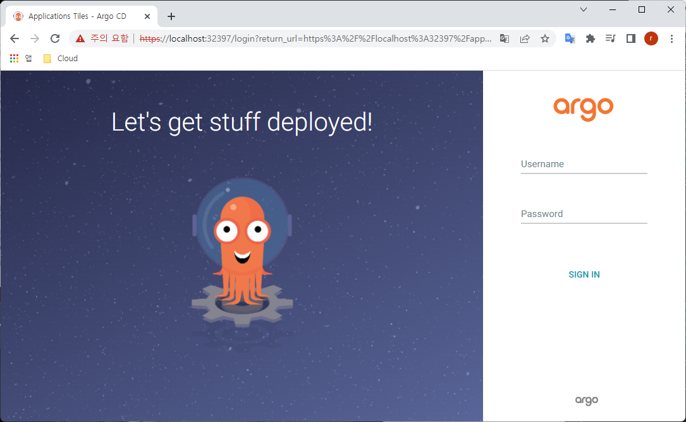

#  < KT Cloud Setup >


# 1. 서버생성


## 1) k3s Cluster 용도 vm 생성

ktcloud 에 k3s cluster 용도의 서버 생성

```
master01  ubuntu 2core, 4GB
master02  ubuntu 2core, 4GB
master03  ubuntu 2core, 4GB
worker01  ubuntu 2core, 4GB
worker02  ubuntu 2core, 4GB
worker03  ubuntu 2core, 4GB
```


## 2) port-forwarding set

### (1) ssh 접근용

master02 서버에 user 들 접근 가능하도록 port-forwarding한다.

```
211.254.212.105 : 10021  = master01 : 22
211.254.212.105 : 10022  = master02 : 22
211.254.212.105 : 10023  = master03 : 22
```


## 3) k3s 셋팅


### (1) node root pass 셋팅

passwd: \*****


### (2) master node - HA 구성

```sh
# master01에서
$ curl -sfL https://get.k3s.io | sh -s - --write-kubeconfig-mode 644 --cluster-init

# 확인
$ kubectl version
Client Version: version.Info{Major:"1", Minor:"23", GitVersion:"v1.23.6+k3s1", GitCommit:"418c3fa858b69b12b9cefbcff0526f666a6236b9", GitTreeState:"clean", BuildDate:"2022-04-28T22:16:18Z", GoVersion:"go1.17.5", Compiler:"gc", Platform:"linux/amd64"}
Server Version: version.Info{Major:"1", Minor:"23", GitVersion:"v1.23.6+k3s1", GitCommit:"418c3fa858b69b12b9cefbcff0526f666a6236b9", GitTreeState:"clean", BuildDate:"2022-04-28T22:16:18Z", GoVersion:"go1.17.5", Compiler:"gc", Platform:"linux/amd64"}


# IP/ token 확인
$ cat /var/lib/rancher/k3s/server/node-token
K1066187296a95fbc03fe9d7df352916e86d1407221891bdf45c57a5c7c6b696b3b::server:d465bf1e85e9848b1f45a8bf0e54671c


# master02, 03 에서
$ export MASTER_TOKEN="K1066187296a95fbc03fe9d7df352916e86d1407221891bdf45c57a5c7c6b696b3b::server:d465bf1e85e9848b1f45a8bf0e54671c"
  export MASTER_IP="172.27.0.48"

$ curl -sfL https://get.k3s.io | sh -s - --write-kubeconfig-mode 644 --server https://${MASTER_IP}:6443 --token ${MASTER_TOKEN}

…
[INFO]  systemd: Starting k3s-agent   ← 정상 로그


# master01 에서
$ kubectl get nodes
NAME       STATUS   ROLES                       AGE    VERSION
master01   Ready    control-plane,etcd,master   3m8s   v1.23.6+k3s1
master02   Ready    control-plane,etcd,master   46s    v1.23.6+k3s1
master03   Ready    control-plane,etcd,master   32s    v1.23.6+k3s1


# [참고]istio setup을 위한 k3s 설정시 아래 참고
## traefik 을 deploy 하지 않는다. 
## istio 에서 별도 traefic 을 설치하는데 이때 기설치된 controller 가 있으면 충돌 발생함
$ curl -sfL https://get.k3s.io |INSTALL_K3S_EXEC="--no-deploy traefik" sh -

```


- worker node

```sh
# worker node 01,02,03 에서 각각


$ export MASTER_TOKEN="K1066187296a95fbc03fe9d7df352916e86d1407221891bdf45c57a5c7c6b696b3b::server:d465bf1e85e9848b1f45a8bf0e54671c"
  export MASTER_IP="172.27.0.48"

$ curl -sfL https://get.k3s.io | K3S_URL=https://${MASTER_IP}:6443 K3S_TOKEN=${MASTER_TOKEN} sh -

…
[INFO]  systemd: Starting k3s-agent   ← 나오면 정상


# master01 에서
$ kubectl get nodes 
NAME       STATUS   ROLES                       AGE     VERSION
master01   Ready    control-plane,etcd,master   5m12s   v1.23.6+k3s1
master02   Ready    control-plane,etcd,master   2m50s   v1.23.6+k3s1
master03   Ready    control-plane,etcd,master   2m36s   v1.23.6+k3s1
worker01   Ready    <none>                      46s     v1.23.6+k3s1
worker02   Ready    <none>                      45s     v1.23.6+k3s1
worker03   Ready    <none>                      43s     v1.23.6+k3s1


# < 수동방식 >
$ sudo k3s agent --server https://${MASTER_IP}:6443 --token ${NODE_TOKEN} &


## uninstall
$ sh /usr/local/bin/k3s-killall.sh
  sh /usr/local/bin/k3s-uninstall.sh

```


### (2) kubeconfig 설정

local 에서 직접 kubctl 명령 실행을 위해서는 ~/.kube/config 에 연결정보가 설정되어야 한다.

현재는 /etc/rancher/k3s/k3s.yaml 에 정보가 존재하므로 이를 복사한다. 또한 모든 사용자가 읽을 수 있도록 권한을 부여 한다.

```sh
## root 권한으로 실행
## kubeconfig
$ mkdir -p ~/.kube
$ sudo cp /etc/rancher/k3s/k3s.yaml ~/.kube/config


# 자신만 RW 권한 부여
$ sudo chmod 600 /etc/rancher/k3s/k3s.yaml ~/.kube/config

## 확인
$ kubectl version
Client Version: version.Info{Major:"1", Minor:"23", GitVersion:"v1.23.6+k3s1", GitCommit:"418c3fa858b69b12b9cefbcff0526f666a6236b9", GitTreeState:"clean", BuildDate:"2022-04-28T22:16:18Z", GoVersion:"go1.17.5", Compiler:"gc", Platform:"linux/amd64"}
Server Version: version.Info{Major:"1", Minor:"23", GitVersion:"v1.23.6+k3s1", GitCommit:"418c3fa858b69b12b9cefbcff0526f666a6236b9", GitTreeState:"clean", BuildDate:"2022-04-28T22:16:18Z", GoVersion:"go1.17.5", Compiler:"gc", Platform:"linux/amd64"}

```

root 권한자가 아닌 다른 사용자도 사용하려면 위와 동일하게 수행해야한다.


### (3) alias 정의

```sh
$ cat > ~/env
alias k='kubectl'
alias kk='kubectl -n kube-system'
alias ks='k -n song'
alias ka='k -n argocd'
alias kar='k -n argo-rollouts'
alias ki='k -n istio-system'
alias kb='k -n bookinfo'
alias kii='k -n istio-ingress'
alias kka='k -n kafka'

## alias 를 적용하려면 source 명령 수행
$ source ~/env
```


### (4) 개인 namespace 생성

```sh
kubectl create ns user01
kubectl create ns user02
kubectl create ns user03
kubectl create ns user04
kubectl create ns user05
kubectl create ns user06
kubectl create ns user07
kubectl create ns user08
kubectl create ns user09
kubectl create ns user10
kubectl create ns user11
kubectl create ns user12
kubectl create ns user13
kubectl create ns user14
kubectl create ns user15
kubectl create ns user16
kubectl create ns user17
kubectl create ns user18
kubectl create ns user19
kubectl create ns user20
```


### (5) ingress controller port-forwarding 

```sh
$ kubectl -n kube-system get svc
NAME             TYPE           CLUSTER-IP     EXTERNAL-IP                                                               PORT(S)                      AGE
kube-dns         ClusterIP      10.43.0.10     <none>                                                                    53/UDP,53/TCP,9153/TCP       171m
metrics-server   ClusterIP      10.43.144.31   <none>                                                                    443/TCP                      171m
traefik          LoadBalancer   10.43.45.189   172.27.0.168,172.27.0.29,172.27.0.48,172.27.0.68,172.27.0.76,172.27.1.2   80:30070/TCP,443:31299/TCP   170m
```

30070 / 31299 node port 로 접근 가능한 것을 알수 있다.

master01 서버에 port-forwarding한다.

```
211.254.212.105 : 80   = master01 : 30070
211.254.212.105 : 443  = master01 : 31299
```

그러므로 우리는 211.254.212.105:80 으로 call 을 보내면 된다.  대신 Cluster 내 진입후 자신의 service 를 찾기 위한 host 를 같이 보내야 한다. 


### (6) Clean Up

```sh
# uninstall
$ sh /usr/local/bin/k3s-killall.sh
$ sh /usr/local/bin/k3s-uninstall.sh 

```


## 4) user생성

> root 권한으로 실행 필요
>
> 사용자 접근은 master02 로 일원화하자.  모자라면 나중에 master03으로 분산하는 방안도 고려하자.


### (1) 개별생성

```sh
$ adduser user01

$ password: ****
```


### (2) 일괄생성

- 일괄생성

```sh
# user
useradd -m -d /home/user01 -s /bin/bash user01
useradd -m -d /home/user02 -s /bin/bash user02
useradd -m -d /home/user03 -s /bin/bash user03
useradd -m -d /home/user04 -s /bin/bash user04
useradd -m -d /home/user05 -s /bin/bash user05
useradd -m -d /home/user06 -s /bin/bash user06
useradd -m -d /home/user07 -s /bin/bash user07
useradd -m -d /home/user08 -s /bin/bash user08
useradd -m -d /home/user09 -s /bin/bash user09
useradd -m -d /home/user10 -s /bin/bash user10
useradd -m -d /home/user11 -s /bin/bash user11
useradd -m -d /home/user12 -s /bin/bash user12
useradd -m -d /home/user13 -s /bin/bash user13
useradd -m -d /home/user14 -s /bin/bash user14
useradd -m -d /home/user15 -s /bin/bash user15
useradd -m -d /home/user16 -s /bin/bash user16
useradd -m -d /home/user17 -s /bin/bash user17
useradd -m -d /home/user18 -s /bin/bash user18
useradd -m -d /home/user19 -s /bin/bash user19
useradd -m -d /home/user20 -s /bin/bash user20


# password는 동일하게 : ****
passwd user01
passwd user02
passwd user03
passwd user04
passwd user05
passwd user06
passwd user07
passwd user08
passwd user09
passwd user10
passwd user11
passwd user12
passwd user13
passwd user14
passwd user15
passwd user16
passwd user17
passwd user18
passwd user19
passwd user20

or

$ for i in 01 02 03 04 05 06 07 08 09 10; do username=user$i; echo $username; passwd $username; echo; done
$ for i in 11 12 13 14 15 16 17 18 19 20; do username=user$i; echo $username; passwd $username; echo; done

```


- 확인

```sh
$ cat /etc/passwd
```


- 삭제

```
deluser user01 --remove-home
deluser user02 --remove-home
deluser user03 --remove-home
deluser user04 --remove-home
deluser user05 --remove-home
deluser user06 --remove-home
deluser user07 --remove-home
deluser user08 --remove-home
deluser user09 --remove-home
deluser user10 --remove-home
deluser user11 --remove-home
deluser user12 --remove-home
deluser user13 --remove-home
deluser user14 --remove-home
deluser user15 --remove-home
deluser user16 --remove-home
deluser user17 --remove-home
deluser user18 --remove-home
deluser user19 --remove-home
deluser user20 --remove-home
...
```


- [참고] 대량 사용자 추가

```sh
# 1. 사용자 이름 목록 작성
$ cat > ~/song/ubuntu_user_list/user_list.txt
---
user01
user02
user03
---


# 2. 홈 디렉토리와 기본 셸을 사용하여 사용자
$ for i in `cat ~/song/ubuntu_user_list/user_list.txt`; do useradd -m -d /home/$i -s /bin/bash $i; done

# 3. 각 사용자에 대한 암호 생성
$ for i in `cat /tmp/name`; do passwd $i; done

```

사용자 password 는 어쩔 수 없이 수동 입력해야 한다.


# 2. Istio 셋팅


## 1) helm 설치

root 권한으로 설치

```sh
## 임시 디렉토리를 하나 만들자.
$ mkdir -p ~/song/helm/
$ cd ~/song/helm/

$ wget https://get.helm.sh/helm-v3.9.0-linux-amd64.tar.gz
  tar -zxvf helm-v3.9.0-linux-amd64.tar.gz
  mv linux-amd64/helm /usr/local/bin/helm

$ ll /usr/local/bin/helm*
-rwxr-xr-x 1 song song 46182400 May 19 01:45 /usr/local/bin/helm*

```


- 확인

```sh
$ helm version
version.BuildInfo{Version:"v3.9.0", GitCommit:"7ceeda6c585217a19a1131663d8cd1f7d641b2a7", GitTreeState:"clean", GoVersion:"go1.17.5"}

$ helm -n song ls
NAME    NAMESPACE       REVISION        UPDATED STATUS  CHART   APP VERSION

```


## 2) helm 을 이용한 Istio 설치


### (1)  helm repo add

```sh
$ helm repo add istio https://istio-release.storage.googleapis.com/charts

$ helm repo update
...Successfully got an update from the "istio" chart repository


$ helm search repo istio
NAME            CHART VERSION   APP VERSION     DESCRIPTION
istio/istiod    1.14.0          1.14.0          Helm chart for istio control plane
istio/base      1.14.0          1.14.0          Helm chart for deploying Istio cluster resource...
istio/cni       1.14.0          1.14.0          Helm chart for istio-cni components
istio/gateway   1.14.0          1.14.0          Helm chart for deploying Istio gateways

<-- 이렇게 조회되면 성공
```


### (2) create ns

```sh
# 2. create ns
$ k create namespace istio-system
```


### (3) istio crd 설치

```sh
$ helm install istio-base istio/base -n istio-system
Istio base successfully installed!


$ helm -n istio-system ls
NAME            NAMESPACE       REVISION        UPDATED                                 STATUS          CHART           APP VERSION
istio-base      istio-system    1               2022-06-02 13:13:25.0734334 +0900 KST   deployed        base-1.13.4     1.13.4

# helm 확인
$ helm -n istio-system status istio-base
$ helm -n istio-system get all istio-base


# CRD 확인
$ kubectl get crd
NAME                                       CREATED AT
addons.k3s.cattle.io                       2022-06-01T04:53:50Z
helmcharts.helm.cattle.io                  2022-06-01T04:53:50Z
helmchartconfigs.helm.cattle.io            2022-06-01T04:53:50Z
tlsstores.traefik.containo.us              2022-06-01T04:54:55Z
serverstransports.traefik.containo.us      2022-06-01T04:54:55Z
ingressroutetcps.traefik.containo.us       2022-06-01T04:54:55Z
ingressrouteudps.traefik.containo.us       2022-06-01T04:54:55Z
tlsoptions.traefik.containo.us             2022-06-01T04:54:55Z
traefikservices.traefik.containo.us        2022-06-01T04:54:55Z
middlewaretcps.traefik.containo.us         2022-06-01T04:54:55Z
ingressroutes.traefik.containo.us          2022-06-01T04:54:55Z
middlewares.traefik.containo.us            2022-06-01T04:54:55Z
proxyconfigs.networking.istio.io           2022-06-02T04:13:22Z
requestauthentications.security.istio.io   2022-06-02T04:13:22Z
workloadentries.networking.istio.io        2022-06-02T04:13:22Z
peerauthentications.security.istio.io      2022-06-02T04:13:22Z
serviceentries.networking.istio.io         2022-06-02T04:13:22Z
sidecars.networking.istio.io               2022-06-02T04:13:22Z
telemetries.telemetry.istio.io             2022-06-02T04:13:22Z
wasmplugins.extensions.istio.io            2022-06-02T04:13:22Z
envoyfilters.networking.istio.io           2022-06-02T04:13:22Z
gateways.networking.istio.io               2022-06-02T04:13:22Z
authorizationpolicies.security.istio.io    2022-06-02T04:13:22Z
workloadgroups.networking.istio.io         2022-06-02T04:13:22Z
virtualservices.networking.istio.io        2022-06-02T04:13:22Z
destinationrules.networking.istio.io       2022-06-02T04:13:22Z
istiooperators.install.istio.io            2022-06-02T04:13:22Z

# istio 관련crd 가 존재한다면 정상 설치 된 것이다.

```


### (4) install istiod

Controle Plane역할을 수행하는 istiod 를 설치하자.

```sh
$ helm -n istio-system install istio-istiod istio/istiod
...
TEST SUITE: None
NOTES:
"istio-istiod" successfully installed!            <--- 이런 로그가 나오면 성공

## 확인
$ helm -n istio-system status istio-istiod

$ helm -n istio-system get all istio-istiod


## 확인
$ kubectl -n istio-system get all
NAME                          READY   STATUS    RESTARTS   AGE
pod/istiod-579df55f96-vp2z8   1/1     Running   0          2m12s

NAME             TYPE        CLUSTER-IP      EXTERNAL-IP   PORT(S)                                 AGE
service/istiod   ClusterIP   10.43.123.110   <none>        15010/TCP,15012/TCP,443/TCP,15014/TCP   2m12s

NAME                     READY   UP-TO-DATE   AVAILABLE   AGE
deployment.apps/istiod   1/1     1            1           2m12s

NAME                                DESIRED   CURRENT   READY   AGE
replicaset.apps/istiod-579df55f96   1         1         1       2m12s

NAME                                         REFERENCE           TARGETS   MINPODS   MAXPODS   REPLICAS   AGE
horizontalpodautoscaler.autoscaling/istiod   Deployment/istiod   0%/80%    1         5         1          2m12s


```


### (5) install istio-ingressgateway

```sh
$ k create namespace istio-ingress

$ helm -n istio-ingress install istio-ingress istio/gateway


$ alias kii='k -n istio-ingress'

$ kii get all
NAME                                 READY   STATUS    RESTARTS   AGE
pod/istio-ingress-7b64c49dd5-5jzxt   1/1     Running   0          68s
pod/svclb-istio-ingress-2vczm        0/3     Pending   0          68s
pod/svclb-istio-ingress-9xtnq        0/3     Pending   0          68s
pod/svclb-istio-ingress-n7ph9        0/3     Pending   0          68s
pod/svclb-istio-ingress-xxt2t        0/3     Pending   0          68s
pod/svclb-istio-ingress-zjxwf        0/3     Pending   0          68s
pod/svclb-istio-ingress-zxvh2        0/3     Pending   0          68s

## traefik port 충돌로 위와 같이 pending이 발생한다.
## 하지만 무시해도 됨,  k3s traefic 을 사용하면 된다.

NAME                    TYPE           CLUSTER-IP      EXTERNAL-IP   PORT(S)                                      AGE
service/istio-ingress   LoadBalancer   10.43.253.237   <pending>     15021:32444/TCP,80:31611/TCP,443:30577/TCP   68s

NAME                                 DESIRED   CURRENT   READY   UP-TO-DATE   AVAILABLE   NODE SELECTOR   AGE
daemonset.apps/svclb-istio-ingress   6         6         0       6            0           <none>          68s

NAME                            READY   UP-TO-DATE   AVAILABLE   AGE
deployment.apps/istio-ingress   1/1     1            1           68s

NAME                                       DESIRED   CURRENT   READY   AGE
replicaset.apps/istio-ingress-7b64c49dd5   1         1         1       68s

NAME                                                REFERENCE                  TARGETS   MINPODS   MAXPODS   REPLICAS   AGE
horizontalpodautoscaler.autoscaling/istio-ingress   Deployment/istio-ingress   3%/80%    1         5         1          68s


$ kii get svc

NAME            TYPE           CLUSTER-IP     EXTERNAL-IP   PORT(S)                                      AGE
istio-ingress   LoadBalancer   10.43.143.62   <pending>     15021:31657/TCP,80:32761/TCP,443:30157/TCP   4m14s

32761 / 30157 nodeport 로 접근 가능
```


### (6) clean up

```sh
$ helm -n istio-system delete istio-istiod
$ helm -n istio-system delete istio-base
$ helm -n istio-ingress delete istio-ingress
```


## 3) monitoring 설치


### (1) prometheus 설치

참조링크: https://istio.io/latest/docs/ops/integrations/prometheus/

아래 script로 클러스터에 Prometheus가 배포된다.  데모용이므로 성능이나 보안을 위해 조정되지 않는다.

```sh
$ kubectl -n istio-system apply -f https://raw.githubusercontent.com/istio/istio/release-1.14/samples/addons/prometheus.yaml


$ ki get pod
NAME                          READY   STATUS    RESTARTS   AGE
istiod-6466849569-vc5g7       1/1     Running   0          55m
kiali-6b455fd9f9-ht9k8        1/1     Running   0          48m
prometheus-7cc96d969f-f8mm4   2/2     Running   0          57s


$ ki get svc
NAME         TYPE        CLUSTER-IP      EXTERNAL-IP   PORT(S)                                 AGE
istiod       ClusterIP   10.43.159.49    <none>        15010/TCP,15012/TCP,443/TCP,15014/TCP   54m
kiali        ClusterIP   10.43.67.152    <none>        20001/TCP,9090/TCP                      48m
prometheus   ClusterIP   10.43.137.161   <none>        9090/TCP                                50s


# uninstall
$ kubectl -n istio-system delete -f https://raw.githubusercontent.com/istio/istio/release-1.13/samples/addons/prometheus.yaml

```


### (2) grafana 

```sh
$ kubectl -n istio-system apply -f https://raw.githubusercontent.com/istio/istio/release-1.14/samples/addons/grafana.yaml

 ki get svc
NAME         TYPE        CLUSTER-IP      EXTERNAL-IP   PORT(S)                                 AGE
grafana      ClusterIP   10.43.47.27     <none>        3000/TCP                                7s
istiod       ClusterIP   10.43.159.49    <none>        15010/TCP,15012/TCP,443/TCP,15014/TCP   59m
kiali        ClusterIP   10.43.67.152    <none>        20001/TCP,9090/TCP                      52m
prometheus   ClusterIP   10.43.137.161   <none>        9090/TCP                                5m16s


# uninstall
$ kubectl -n istio-system delete -f https://raw.githubusercontent.com/istio/istio/release-1.14/samples/addons/grafana.yaml

```


- ingress 

```sh
$ cd ~/githubrepo/ktds-edu

$ cat ./istio/monitoring/11.grafana-ingress-ktcloud.yaml
apiVersion: networking.k8s.io/v1
kind: Ingress
metadata:
  name: grafana-ingress
  annotations:
    kubernetes.io/ingress.class: "traefik"
spec:
  rules:
  - host: "grafana.istio-system.ktcloud.211.254.212.105.nip.io"
    http:
      paths:
      - path: /
        pathType: Prefix
        backend:
          service:
            name: grafana
            port:
              number: 3000


$ ki apply -f ./istio/monitoring/11.grafana-ingress-ktcloud.yaml

$ ki get ingress
NAME              CLASS    HOSTS                                                 ADDRESS                                                                   PORTS   AGE
grafana-ingress   <none>   grafana.istio-system.ktcloud.211.254.212.105.nip.io   172.27.0.168,172.27.0.29,172.27.0.48,172.27.0.68,172.27.0.76,172.27.1.2   80      6s
             
```


### (3) kiali 설치

```sh
$ kubectl -n istio-system apply -f https://raw.githubusercontent.com/istio/istio/release-1.14/samples/addons/kiali.yaml

$ kubectl -n istio-system get svc kiali
NAME    TYPE        CLUSTER-IP     EXTERNAL-IP   PORT(S)              AGE
kiali   ClusterIP   10.43.67.152   <none>        20001/TCP,9090/TCP   62s


# uninstall
$ kubectl -n istio-system delete -f https://raw.githubusercontent.com/istio/istio/release-1.14/samples/addons/kiali.yaml

```


- ingress 

```sh
$ cd ~/githubrepo/ktds-edu

$ cat > ./istio/monitoring/12.kiali-ingress-ktcloud.yaml
apiVersion: networking.k8s.io/v1
kind: Ingress
metadata:
  name: kiali-ingress
  annotations:
    kubernetes.io/ingress.class: "traefik"
spec:
  rules:
  - host: "kiali.istio-system.ktcloud.211.254.212.105.nip.io"
    http:
      paths:
      - path: /
        pathType: Prefix
        backend:
          service:
            name: kiali
            port:
              number: 20001

$ ki apply -f ./istio/monitoring/12.kiali-ingress-ktcloud.yaml

$ ki get ingress
NAME              CLASS    HOSTS                                                 ADDRESS                                                                   PORTS   AGE
kiali-ingress     <none>   kiali.istio-system.ktcloud.211.254.212.105.nip.io     172.27.0.168,172.27.0.29,172.27.0.48,172.27.0.68,172.27.0.76,172.27.1.2   80      36m

```


### (4) jaeger 설치

```sh
$ kubectl -n istio-system apply -f https://raw.githubusercontent.com/istio/istio/release-1.14/samples/addons/jaeger.yaml

$ kubectl -n istio-system get svc
NAME               TYPE        CLUSTER-IP      EXTERNAL-IP   PORT(S)                                 AGE
grafana            ClusterIP   10.43.47.27     <none>        3000/TCP                                4m14s
istiod             ClusterIP   10.43.159.49    <none>        15010/TCP,15012/TCP,443/TCP,15014/TCP   63m
jaeger-collector   ClusterIP   10.43.243.103   <none>        14268/TCP,14250/TCP,9411/TCP            9s
kiali              ClusterIP   10.43.67.152    <none>        20001/TCP,9090/TCP                      56m
prometheus         ClusterIP   10.43.137.161   <none>        9090/TCP                                9m23s
tracing            ClusterIP   10.43.103.151   <none>        80/TCP,16685/TCP                        9s
zipkin             ClusterIP   10.43.209.225   <none>        9411/TCP                                9s


# uninstall
$ kubectl -n istio-system delete -f https://raw.githubusercontent.com/istio/istio/release-1.14/samples/addons/jaeger.yaml

```


- ingress 

```sh
$ cd ~/githubrepo/ktds-edu

$ cat ./istio/monitoring/13.jaeger-ingress-ktcloud.yaml
apiVersion: networking.k8s.io/v1
kind: Ingress
metadata:
  name: jaeger-ingress
  annotations:
    kubernetes.io/ingress.class: "traefik"
spec:
  rules:
  - host: "jaeger.istio-system.ktcloud.211.254.212.105.nip.io"
    http:
      paths:
      - path: /
        pathType: Prefix
        backend:
          service:
            name: tracing
            port:
              number: 80

$ ki apply -f ./istio/monitoring/13.jaeger-ingress-ktcloud.yaml

$ ki get ingress
NAME              CLASS    HOSTS                                                 ADDRESS                                                                   PORTS   AGE
jaeger-ingress    <none>   jaeger.istio-system.ktcloud.211.254.212.105.nip.io    172.27.0.168,172.27.0.29,172.27.0.48,172.27.0.68,172.27.0.76,172.27.1.2   80      3s

```


### (5) clean up

```sh
$ cd ~/githubrepo/ktds-edu

$ ki delete -f ./istio/monitoring/11.grafana-ingress-ktcloud.yaml
$ ki delete -f ./istio/monitoring/12.kiali-ingress-ktcloud.yaml
$ ki delete -f ./istio/monitoring/13.jaeger-ingress-ktcloud.yaml
```


# 3. ArgoCD 셋팅


## 1) ArgoCD 설치


### (1) Create namespace

argocd 설치를 위한 namespace를 생성한다.

```sh
$ kubectl create namespace argocd

$ kubectl get namespace
```


### (2) ArgoCD install

```sh
$ kubectl apply -n argocd -f https://raw.githubusercontent.com/argoproj/argo-cd/stable/manifests/install.yaml

$ alias ka='kubectl -n argocd'

$ ka get pod -w

$ ka get pod
NAME                                                READY   STATUS    RESTARTS   AGE
argocd-redis-79bdbdf78f-sg8vr                       1/1     Running   0          5m47s
argocd-applicationset-controller-79f97597cb-n876k   1/1     Running   0          5m47s
argocd-notifications-controller-855df7bb69-rgthm    1/1     Running   0          5m47s
argocd-application-controller-0                     1/1     Running   0          5m47s
argocd-repo-server-6864955749-jrvkv                 1/1     Running   0          5m47s
argocd-server-795d56944c-ld9jd                      1/1     Running   0          5m47s
argocd-dex-server-fd9588cbc-4wj2t                   1/1     Running   0          5m47s


$ ka get svc
NAME                                      TYPE        CLUSTER-IP      EXTERNAL-IP   PORT(S)                      AGE
argocd-applicationset-controller          ClusterIP   10.43.214.14    <none>        7000/TCP                     8m5s
argocd-dex-server                         ClusterIP   10.43.237.245   <none>        5556/TCP,5557/TCP,5558/TCP   8m5s
argocd-metrics                            ClusterIP   10.43.8.174     <none>        8082/TCP                     8m5s
argocd-notifications-controller-metrics   ClusterIP   10.43.218.128   <none>        9001/TCP                     8m5s
argocd-redis                              ClusterIP   10.43.218.182   <none>        6379/TCP                     8m5s
argocd-repo-server                        ClusterIP   10.43.117.73    <none>        8081/TCP,8084/TCP            8m5s
argocd-server                             ClusterIP   10.43.205.134   <none>        80/TCP,443/TCP               8m5s
argocd-server-metrics                     ClusterIP   10.43.125.160   <none>        8083/TCP                     8m5s

```


- tls disable 처리
  - deployment 에서 command parameter 로 --insecure 처리
  - insecure 처리하지 않으면 ingress 로 접근이 안된다.

```sh
$ ka get deploy argocd-server -o yaml

apiVersion: apps/v1
kind: Deployment
metadata:
  name: argocd-server
  namespace: argocd
...
spec:
  template:
    metadata:
    spec:
      containers:
      - command:
        - argocd-server
        - --insecure               <--- 삽입
        env:
...
```


### (3) Ingress

- ingress 방식

```sh
$ cd ~/githubrepo/ktds-edu

$ cat ./argocd/argocd-install/13.argocd-ingress-ktcloud.yaml
apiVersion: networking.k8s.io/v1
kind: Ingress
metadata:
  name: argocd-ingress
  annotations:
    kubernetes.io/ingress.class: "traefik"
spec:
  rules:
  - host: "argocd.ktcloud.211.254.212.105.nip.io"
    http:
      paths:
      - path: /
        pathType: Prefix
        backend:
          service:
            name: argocd-server
            port:
              name: http

$ kubectl -n argocd -f ./argocd/argocd-install/13.argocd-ingress-ktcloud.yaml


## 확인
$ curl http://argocd.ktcloud.211.254.212.105.nip.io/
```


### (4) ArgoCD-ui 접근

http://argocd.ktcloud.211.254.212.105.nip.io/




### (5) Password 확인

확인Argo CD는 최초 admin account의 초기 password를 kubernetes 의 secret 으로 저장해 놓는다. 아래와 같이 password를 얻는다.

```sh
# 1) jsonpath 방식 
$ ka get secret argocd-initial-admin-secret -o jsonpath="{.data.password}" | base64 -d; echo

C7TBBBRxh4LcG28m


# 2) yaml 방식
$ ka -n argocd get secret argocd-initial-admin-secret -o yaml
apiVersion: v1
data:
  password: QzdUQkJCUnhoNExjRzI4bQ==
kind: Secret
metadata:
  creationTimestamp: "2022-06-09T01:54:43Z"
  name: argocd-initial-admin-secret
  namespace: argocd
  resourceVersion: "329780"
  uid: 1166305f-eb12-4312-83ec-5812547af738
type: Opaque


$ echo QzdUQkJCUnhoNExjRzI4bQ== | base64 --decode
C7TBBBRxh4LcG28m
```


### (6) login

admin / C7TBBBRxh4LcG28m


### (7) clean up

```sh
$ kubectl -n argocd delete -f https://raw.githubusercontent.com/argoproj/argo-cd/stable/manifests/install.yaml

$ kubectl -n argocd delete ingress argocd-ingress

```


## 2) CLI 설치

### (1) Download CLI

Argo CD CLI 설치 한다.
최종버젼 release : https://github.com/argoproj/argo-cd/releases/latest

```sh
# root 권한으로
$ mkdir ~/argocd

$ cd ~/argocd

$ wget https://github.com/argoproj/argo-cd/releases/download/v2.3.4/argocd-linux-amd64

$ chmod +x argocd-linux-amd64

$ mv ./argocd-linux-amd64 /usr/local/bin/argocd

```


### (2) ArgoCD Login

```sh
$ argocd login argocd.ktcloud.211.254.212.105.nip.io
Username: admin
Password:
'admin:login' logged in successfully
Context 'argocd.ktcloud.211.254.212.105.nip.io' updated


$ argocd cluster list
SERVER                          NAME        VERSION  STATUS      MESSAGE  PROJECT
https://kubernetes.default.svc  in-cluster  1.23     Successful

```


### (3) Password 변경

```sh
# password 변경
# 양식
argocd account update-password --account <new-username> --new-password <new-password>


$ argocd account update-password --account admin  --new-password argo1234!
*** Enter password of currently logged in user (admin):
Password updated
Context 'argocd.ktcloud.211.254.212.105.nip.io' updated


```


