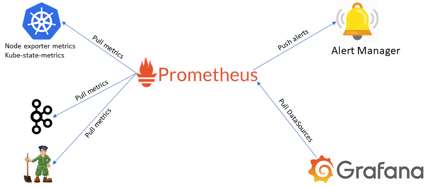
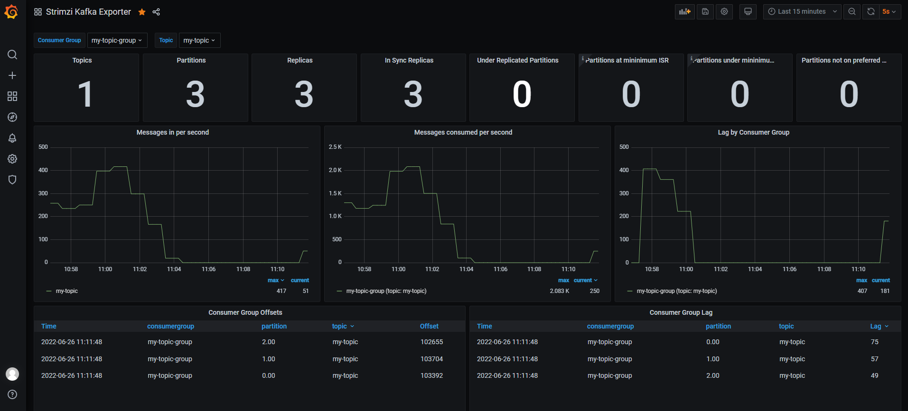

#  < KT Cloud Setup >


# 1. 서버생성


## 1) k3s Cluster 용도 vm 생성

ktcloud 에 k3s cluster 용도의 서버 생성

```
master01  ubuntu 2core, 4GB
master02  ubuntu 2core, 4GB
master03  ubuntu 2core, 4GB
worker01  ubuntu 2core, 4GB
worker02  ubuntu 2core, 4GB
worker03  ubuntu 2core, 4GB
```


## 2) port-forwarding set

### (1) ssh 접근용

master02 서버에 user 들 접근 가능하도록 port-forwarding한다.

```
211.254.212.105 : 10021  = master01 : 22
211.254.212.105 : 10022  = master02 : 22
211.254.212.105 : 10023  = master03 : 22

211.254.212.105 : 10031  = worker01 : 22
211.254.212.105 : 10032  = worker02 : 22
211.254.212.105 : 10033  = worker03 : 22
```


## 3) k3s 셋팅


### (1) node root pass 셋팅

passwd: \*****


### (2) master node - HA 구성

```sh
# master01에서
$ curl -sfL https://get.k3s.io | sh -s - --write-kubeconfig-mode 644 --cluster-init

# 확인
$ kubectl version
Client Version: version.Info{Major:"1", Minor:"23", GitVersion:"v1.23.6+k3s1", GitCommit:"418c3fa858b69b12b9cefbcff0526f666a6236b9", GitTreeState:"clean", BuildDate:"2022-04-28T22:16:18Z", GoVersion:"go1.17.5", Compiler:"gc", Platform:"linux/amd64"}
Server Version: version.Info{Major:"1", Minor:"23", GitVersion:"v1.23.6+k3s1", GitCommit:"418c3fa858b69b12b9cefbcff0526f666a6236b9", GitTreeState:"clean", BuildDate:"2022-04-28T22:16:18Z", GoVersion:"go1.17.5", Compiler:"gc", Platform:"linux/amd64"}


# IP/ token 확인
$ cat /var/lib/rancher/k3s/server/node-token
K1096832a7d37c319f56386fc6f604922569d288e858563a7daea451cc3ea783f63::server:43e60b80a724226ba7cc986f30b2b468


# master02, 03 에서
$ export MASTER_TOKEN="K1096832a7d37c319f56386fc6f604922569d288e858563a7daea451cc3ea783f63::server:43e60b80a724226ba7cc986f30b2b468"
  export MASTER_IP="172.27.0.186"

$ curl -sfL https://get.k3s.io | sh -s - --write-kubeconfig-mode 644 --server https://${MASTER_IP}:6443 --token ${MASTER_TOKEN}

…
[INFO]  systemd: Starting k3s-agent   ← 정상 로그


# master01 에서
$ kubectl get nodes
NAME       STATUS   ROLES                       AGE    VERSION
master01   Ready    control-plane,etcd,master   3m8s   v1.23.6+k3s1
master02   Ready    control-plane,etcd,master   46s    v1.23.6+k3s1
master03   Ready    control-plane,etcd,master   32s    v1.23.6+k3s1


# [참고]istio setup을 위한 k3s 설정시 아래 참고
## traefik 을 deploy 하지 않는다. 
## istio 에서 별도 traefic 을 설치하는데 이때 기설치된 controller 가 있으면 충돌 발생함
$ curl -sfL https://get.k3s.io |INSTALL_K3S_EXEC="--no-deploy traefik" sh -

```


- worker node

```sh
# worker node 01,02,03 에서 각각


$ export MASTER_TOKEN="K1096832a7d37c319f56386fc6f604922569d288e858563a7daea451cc3ea783f63::server:43e60b80a724226ba7cc986f30b2b468"
  export MASTER_IP="172.27.0.186"
  

$ curl -sfL https://get.k3s.io | K3S_URL=https://${MASTER_IP}:6443 K3S_TOKEN=${MASTER_TOKEN} sh -

…
[INFO]  systemd: Starting k3s-agent   ← 나오면 정상


# master01 에서
$ kubectl get nodes 
NAME       STATUS   ROLES                       AGE     VERSION
master01   Ready    control-plane,etcd,master   5m12s   v1.23.6+k3s1
master02   Ready    control-plane,etcd,master   2m50s   v1.23.6+k3s1
master03   Ready    control-plane,etcd,master   2m36s   v1.23.6+k3s1
worker01   Ready    <none>                      46s     v1.23.6+k3s1
worker02   Ready    <none>                      45s     v1.23.6+k3s1
worker03   Ready    <none>                      43s     v1.23.6+k3s1


# 참고 - 수동방식으로 시작
$ sudo k3s agent --server https://${MASTER_IP}:6443 --token ${NODE_TOKEN} &


## uninstall
$ sh /usr/local/bin/k3s-killall.sh
  sh /usr/local/bin/k3s-uninstall.sh

```


### (2) kubeconfig 설정

local 에서 직접 kubctl 명령 실행을 위해서는 ~/.kube/config 에 연결정보가 설정되어야 한다.

현재는 /etc/rancher/k3s/k3s.yaml 에 정보가 존재하므로 이를 복사한다. 또한 모든 사용자가 읽을 수 있도록 권한을 부여 한다.

```sh
## root 권한으로 실행
## kubeconfig
$ mkdir -p ~/.kube
$ sudo cp /etc/rancher/k3s/k3s.yaml ~/.kube/config


# 자신만 RW 권한 부여
$ sudo chmod 600 /etc/rancher/k3s/k3s.yaml ~/.kube/config

## 확인
$ kubectl version
Client Version: version.Info{Major:"1", Minor:"23", GitVersion:"v1.23.6+k3s1", GitCommit:"418c3fa858b69b12b9cefbcff0526f666a6236b9", GitTreeState:"clean", BuildDate:"2022-04-28T22:16:18Z", GoVersion:"go1.17.5", Compiler:"gc", Platform:"linux/amd64"}
Server Version: version.Info{Major:"1", Minor:"23", GitVersion:"v1.23.6+k3s1", GitCommit:"418c3fa858b69b12b9cefbcff0526f666a6236b9", GitTreeState:"clean", BuildDate:"2022-04-28T22:16:18Z", GoVersion:"go1.17.5", Compiler:"gc", Platform:"linux/amd64"}

```

root 권한자가 아닌 다른 사용자도 사용하려면 위와 동일하게 수행해야한다.


### (3) alias 정의

```sh
$ cat > ~/env
alias k='kubectl'
alias kk='kubectl -n kube-system'
alias ks='k -n song'
alias kkf='k -n kafka'
alias krs='k -n kafka'

## alias 를 적용하려면 source 명령 수행
$ source ~/env
```


### (5) ingress controller port-forwarding 

```sh
$ kubectl -n kube-system get svc
NAME             TYPE           CLUSTER-IP      EXTERNAL-IP                                                                  PORT(S)                      AGE
kube-dns         ClusterIP      10.43.0.10      <none>                                                                       53/UDP,53/TCP,9153/TCP       9m13s
metrics-server   ClusterIP      10.43.164.203   <none>                                                                       443/TCP                      9m12s
traefik          LoadBalancer   10.43.17.18     172.27.0.153,172.27.0.176,172.27.0.186,172.27.0.238,172.27.0.39,172.27.0.6   80:30176/TCP,443:30513/TCP   7m42s


```

80:30176 / 443:30513 node port 로 접근 가능한 것을 알수 있다.

master01 서버에 port-forwarding한다.

```
211.254.212.105 : 80   = master01 : 30176 
211.254.212.105 : 443  = master01 : 30513 
```

그러므로 우리는 211.254.212.105:80 으로 call 을 보내면 된다.  대신 Cluster 내 진입후 자신의 service 를 찾기 위한 host 를 같이 보내야 한다. 


### (6) Clean Up

```sh
# uninstall
$ sh /usr/local/bin/k3s-killall.sh
$ sh /usr/local/bin/k3s-uninstall.sh 

```


# < Strimzi on KTCloud >

# 1. Strimzi Cluster Operator Install

srimzi  operator 를 install 한다.


## 1) namespace 생성

strimzi operator 와 kafka cluster 를 kafka namespace 에 설치해야 한다.  worker node 를 준비한후 kafka namespace 를 생성하자.

```sh
# namespace 생성
$ kubectl create ns kafka

# 확인
$ kubectl get ns

NAME              STATUS   AGE
default           Active   4h42m
kafka             Active   11s
kube-node-lease   Active   4h42m
kube-public       Active   4h42m
kube-system       Active   4h42m


# alias 설정
$ alias kkf='kubectl -n kafka'
```


## 2) Strimzi  download


- 해당 사이트(https://strimzi.io/downloads/) 에서 해당 버젼을 다운로드 받는다.

```sh
$ mkdir -p ~/song/strimzi

$ cd ~/song/strimzi

$ wget https://github.com/strimzi/strimzi-kafka-operator/releases/download/0.29.0/strimzi-0.29.0.zip

$ unzip strimzi-0.29.0.zip
#unzip 이 없으면 설치
# apt install unzip

$ cd  ~/song/strimzi/strimzi-0.29.0
```


## 3) single name 모드 namespace 설정

- single name 모드로 설치진행
  - strimzi operator 는 다양한 namespace 에서 kafka cluster 를 쉽게 생성할 수 있는 구조로 운영이 가능하다.  이때 STRIMZI_NAMESPACE 를 설정하여 특정 namespace 만으로 cluster 를 제한 할 수 있다.  ICIS-TR SA의 경우는 kafka-system 라는 namespace 에서만  kafka cluster 를 구성할 수 있도록 설정한다. 그러므로 아래 중 Single namespace 설정에 해당한다.

```sh
$ cd  ~/song/strimzi/strimzi-0.29.0

$ sed -i 's/namespace: .*/namespace: kafka/' ./install/cluster-operator/*RoleBinding*.yaml
```


## 4) Operator Deploy

- kafka namespace 를 watch 할 수 있는 권한 부여

```sh
$ cd  ~/song/strimzi/strimzi-0.29.0

# kafka namespace 를 watch 할 수 있는 권한 부여
# 1) operator 권한부여
$ kubectl -n kafka create -f ./install/cluster-operator/020-RoleBinding-strimzi-cluster-operator.yaml

# 2) entity-operator 권한부여
$ kubectl -n kafka create -f ./install/cluster-operator/031-RoleBinding-strimzi-cluster-operator-entity-operator-delegation.yaml

# 3) Deploy the CRDs
$ kubectl -n kafka create -f ./install/cluster-operator/


# operator 설치 확인
$ kubectl -n kafka get pod
NAME                                        READY   STATUS    RESTARTS   AGE
strimzi-cluster-operator-7c77f74847-c9r6m   0/1     Running   0          3s


# operator pod log 확인
$ kubectl -n kafka logs -f strimzi-cluster-operator-7c77f74847-c9r6m

2022-07-03 00:59:43 INFO  ClusterOperator:79 - Creating ClusterOperator for namespace kafka
2022-07-03 00:59:43 INFO  ClusterOperator:94 - Starting ClusterOperator for namespace kafka

```


# 2. Kafka Cluster 생성


## 1) Kafka Cluster 생성

인증 작업


### (1) Kafka cluster 생성(인증)

```sh
$ cd ~/githubrepo/ktds-edu2

$ cat ./kafka/strimzi/kafka/12.kafka-ephemeral-auth.yaml
apiVersion: kafka.strimzi.io/v1beta2
kind: Kafka
metadata:
  name: my-cluster
  namespace: kafka
spec:
  kafka:
    version: 3.2.0
    replicas: 3
    authorization:
      type: simple
    listeners:
      - name: plain
        port: 9092
        type: internal
        tls: false
        authentication:
          type: scram-sha-512
      - name: tls
        port: 9093
        type: internal
        tls: true
    config:
      offsets.topic.replication.factor: 3
      transaction.state.log.replication.factor: 3
      transaction.state.log.min.isr: 2
      default.replication.factor: 3
      min.insync.replicas: 2
      inter.broker.protocol.version: "3.2"
    storage:
      type: ephemeral
  zookeeper:
    replicas: 3
    storage:
      type: ephemeral
  entityOperator:
    topicOperator: {}
    userOperator: {}

# kafka Cluster 생성
$ kubectl -n kafka apply -f ./kafka/strimzi/kafka/12.kafka-ephemeral-auth.yaml

```

- 인증메커니즘

  - SASL 은 인증 및 보안 서비스를 제공하는 프레임워크이다.
  - 위 yaml 파일의 인증방식은 scram-sha-512  방식인데 이는 SASL 이 지원하는 메커니즘 중 하나이며 Broker 를 SASL 구성로 구성한다.


### (2) Kafka Cluster 확인

```sh
$ kkf get pod -w

$ kkf get pod
NAME                                         READY   STATUS    RESTARTS   AGE
my-cluster-entity-operator-7cfdb67c4-d4qc7   3/3     Running   0          3m24s
my-cluster-kafka-0                           1/1     Running   0          4m3s
my-cluster-kafka-1                           1/1     Running   0          4m3s
my-cluster-kafka-2                           1/1     Running   0          4m3s
my-cluster-zookeeper-0                       1/1     Running   0          4m28s
my-cluster-zookeeper-1                       1/1     Running   0          4m28s
my-cluster-zookeeper-2                       1/1     Running   0          4m28s
strimzi-cluster-operator-86864b86d5-8rlfx    1/1     Running   0          5h24m

# kafka broker 3개와  zookeeper 3개 실행된것을 확인 할 수 있다.


# Kafka Cluster 확인
$ kkf get kafka
NAME         DESIRED KAFKA REPLICAS   DESIRED ZK REPLICAS   READY   WARNINGS
my-cluster   3                        3                     True

# kafka Cluster 의 ready 상태가 True 인것을 확인하자.


```


### (3) [참고]Kafka cluster 생성(No 인증)

아래는 인증없이 접근 가능한 kafka cluster 를 생성하는 yaml 이므로 참고만 하자.

```sh
$ cd ~/githubrepo/ktds-edu2

$ cat ./kafka/strimzi/kafka/11.kafka-ephemeral-no-auth.yaml
apiVersion: kafka.strimzi.io/v1beta2
kind: Kafka
metadata:
  name: my-cluster
  namespace: kafka
spec:
  kafka:
    version: 3.2.0
    replicas: 3
    listeners:
      - name: plain
        port: 9092
        type: internal
        tls: false
      - name: tls
        port: 9093
        type: internal
        tls: true
    config:
      offsets.topic.replication.factor: 3
      transaction.state.log.replication.factor: 3
      transaction.state.log.min.isr: 2
      default.replication.factor: 3
      min.insync.replicas: 2
      inter.broker.protocol.version: "3.2"
    storage:
      type: ephemeral
  zookeeper:
    replicas: 3
    storage:
      type: ephemeral
  entityOperator:
    topicOperator: {}
    userOperator: {} 


$ kubectl -n kafka apply -f  ./strimzi/kafka/11.kafka-ephemeral-no-auth.yaml

```


## 2)  KafkaUser

- kafka cluster 생성시 scram-sha-512 type 의 authentication 를 추가했다면 반드시 KafkaUser 가 존재해야 한다.

- KafkaUser 를 생성하면 secret 에 Opaque 가 생성되며 향후 인증 password 로 사용된다.
- 어떤 topic 에 어떻게 접근할지 에 대한 ACL 기능을 추가할 수 있다.


### (1) User 정책

아래와 같이 ACL (Access Control List) 정책을 지정할 수 있다.

- sample user 별 설명

```
ㅇ my-user
my 로 시작하는 모든 topic을 처리할 수 있음
my 로 시작하는 모든 group을 Consume 가능

ㅇ order-user
order로 시작하는 모든 topic을 처리할 수 있음
order로 시작하는 모든 group을 Consume 가능

ㅇ order-user-readonly
order로 시작하는 모든 topic을 읽을 수 있음
order로 시작하는 모든 group을 Consume 가능
```


### (2) KafkaUser생성

```sh
$ cd ~/githubrepo/ktds-edu2

$ cat ./kafka/strimzi/user/11.kafka-user.yaml
---
apiVersion: kafka.strimzi.io/v1beta1
kind: KafkaUser
metadata:
  name: my-user
  labels:
    strimzi.io/cluster: arsenal-cluster
  namespace: kafka
spec:
  authentication:
    type: scram-sha-512
  authorization:
    type: simple
    acls:
      - operation: All
        resource:
          type: topic
          name: my
          patternType: prefix
      - operation: All
        resource:
          name: my
          patternType: prefix
          type: group
      - operation: All
        resource:
          type: topic
          name: edu
          patternType: prefix
      - operation: All
        resource:
          name: edu
          patternType: prefix
          type: group
---


# KafkaUser 생성 명령 실행
$ kubectl -n kafka apply -f ./kafka/strimzi/user/11.kafka-user.yaml

# kafkauser 확인
$ kubectl -n kafka get kafkauser
NAME      CLUSTER      AUTHENTICATION   AUTHORIZATION   READY
my-user   my-cluster   scram-sha-512    simple          True

# Ready 상태가 True인것을 확인하자.
```

- ACL 권한설명

  - my~  또는 edu 로 시작하는 topic 을 모두 처리가능
  - ex) my-board-create,  my-board-update,  edu-topic

  

  

### (3) password 확인

```sh
$ kubectl -n kafka get secret my-user
NAME      TYPE     DATA   AGE
my-user   Opaque   2      28s


$ kubectl -n kafka get secret my-user -o jsonpath='{.data.password}' | base64 -d
KykkJNJTcTJB

# user/pass 
## KTCloud기준: my-user / KykkJNJTcTJB 
## 강사님 기준 : my-user / KykkJNJTcTJB 
## 수강생 기준 : my-user /               <-- 여기에 Password 를 기록하세요.


```


## 3) KafkaTopic


### (1) Topic 정책 

앞서 KafkaUser 의 ACL 기능을 이용해서 kafka topic 을 제어하는 방법을 확인했다.  topiic 명칭을 어떻게 정하는지에 대해서 다양한 시나리오를 생각해 볼 수 있다. 아래 특정 프로젝트의 topic name 정책을 살펴보자.

- topic 정책

```
[Part명]-[서비스명]-[서브도메인]-[사용자정의]
```


#### [참고] ICIS-TR Topic Name 정책

```
order-intl-board-create
order-intl-board-update
order-intl-board-delete

bill-intl-board-create
bill-intl-board-update
bill-intl-board-delete

rater-intl-board-create
rater-intl-board-update
rater-intl-board-delete
```


### (2) KafkaTopic 생성

```sh
$ cd ~/githubrepo/ktds-edu2

$ cat ./kafka/strimzi/topic/11.kafka-topic.yaml
---
apiVersion: kafka.strimzi.io/v1beta2
kind: KafkaTopic
metadata:
  name: my-topic
  labels:
    strimzi.io/cluster: my-cluster
  namespace: kafka
spec:
  partitions: 3
  replicas: 3
  config:
    retention.ms: 7200000      # 2 hour
    #retention.ms: 86400000      # 24 hours
    segment.bytes: 1073741824   # 1GB


# topic 생성 명령 실행
$ kubectl -n kafka apply -f ./kafka/strimzi/topic/11.kafka-topic.yaml


# topic 생성 확인
$ kubectl -n kafka get kafkatopic my-topic
NAME       CLUSTER      PARTITIONS   REPLICATION FACTOR   READY
my-topic   my-cluster   3            3                    True

```


### (3) Topic  상세 확인

```sh

$ kubectl -n kafka get kafkatopic my-topic -o yaml
apiVersion: kafka.strimzi.io/v1beta2
kind: KafkaTopic
metadata:
  annotations:
    kubectl.kubernetes.io/last-applied-configuration: |
      {"apiVersion":"kafka.strimzi.io/v1beta2","kind":"KafkaTopic","metadata":{"annotations":{},"labels":{"strimzi.io/cluster":"my-cluster"},"name":"my-topic","namespace":"kafka"},"spec":{"config":{"retention.ms":86400000,"segment.bytes":1073741824},"partitions":3,"replicas":3}}
  creationTimestamp: "2022-07-03T01:07:32Z"
  generation: 1
  labels:
    strimzi.io/cluster: my-cluster
  name: my-topic
  namespace: kafka
  resourceVersion: "7214"
  uid: 0888ea4d-f966-40cb-8d7c-9f25d10e16dc
spec:
  config:
    retention.ms: 86400000
    segment.bytes: 1073741824
  partitions: 3
  replicas: 3
status:
  conditions:
  - lastTransitionTime: "2022-07-03T01:07:33.321346Z"
    status: "True"
    type: Ready
  observedGeneration: 1
  topicName: my-topic


```

- status 에서 true, ready 임을 확인하자.


# 3. Accessing Kafka


## 1) Internal Access


### (1) Kafka Cluster Service 확인


```sh
$ kubectl -n kafka get svc
NAME                          TYPE        CLUSTER-IP      EXTERNAL-IP   PORT(S)                               AGE
my-cluster-kafka-bootstrap    ClusterIP   10.43.235.30    <none>        9091/TCP,9092/TCP,9093/TCP            6m41s
my-cluster-kafka-brokers      ClusterIP   None            <none>        9090/TCP,9091/TCP,9092/TCP,9093/TCP   6m41s
my-cluster-zookeeper-client   ClusterIP   10.43.157.164   <none>        2181/TCP                              7m56s
my-cluster-zookeeper-nodes    ClusterIP   None            <none>        2181/TCP,2888/TCP,3888/TCP            7m56s


$ kubectl -n kafka get pod
NAME                                          READY   STATUS    RESTARTS        AGE
my-cluster-entity-operator-8485dfd4fb-l5fng   3/3     Running   0               6m12s
my-cluster-kafka-0                            1/1     Running   0               6m49s
my-cluster-kafka-1                            1/1     Running   0               6m49s
my-cluster-kafka-2                            1/1     Running   0               6m49s
my-cluster-zookeeper-0                        1/1     Running   1 (7m14s ago)   8m5s
my-cluster-zookeeper-1                        1/1     Running   0               8m4s
my-cluster-zookeeper-2                        1/1     Running   1 (7m41s ago)   8m4s
strimzi-cluster-operator-7c77f74847-c9r6m     1/1     Running   0               11m

```

- my-cluster-kafka-bootstrap 이 일반 kubernetes service 이며 POD 로 트래픽을 RR 방식으로 연결한다.
- my-cluster-kafka-brokers 는 ip 가 없는 headless service 이다. 그러므로 pod 명을 붙여서 DNS 로 사용된다.
  - headless service 사용예시
    - my-cluster-kafka-0.my-cluster-kafka-brokers.kafka.svc
    - my-cluster-kafka-1.my-cluster-kafka-brokers.kafka.svc
    - my-cluster-kafka-2.my-cluster-kafka-brokers.kafka.svc

- 우리는 Cluster 내에서  my-cluster-kafka-bootstrap:9092 로 접근을 시도할 것이다.


### (2) kafkacat 로 확인

Kubernetes Cluster 내에서 kafka 접근 가능여부를 확인하기 위해 kafka Client 용 app 인 kafkacat 을 설치하자.


#### kafkacat 설치

```sh
# kafka cat 설치
$ kubectl -n kafka create deploy kafkacat \
    --image=confluentinc/cp-kafkacat:latest \
    -- sleep 365d

# 설치진행 확인
$ kubectl -n kafka get pod
NAME                                         READY   STATUS              RESTARTS   AGE
kafkacat-5b845776c4-c7tmh                     0/1     ContainerCreating   0               4s


## READY 상태가 1/1 로 변할때까지 대기...


# pod 내부로 진입( bash 명령 수행)
$ kubectl -n kafka exec -it deploy/kafkacat -- bash
[appuser@kafkacat-7648db7f48-wg4hn ~]$


```


#### ※ 참고

windows 환경의 gitbash 를 이용해 pod 내부명령을 수행한다면 prompt 가 보이지 않을수도 있다.

이런경우 windows 에서 linux 체제와 호환이 되지 않아서 발생하는 이슈이다.

아래와 같이 winpty 를 붙인다면 prompt 가 보이니 참고하자.

```sh
# pod 내부명령 수행
$ winpty kubectl -n kafka exec -it deploy/kafkacat -- bash

```


#### pub/sub test

id/pass 가 필요

```sh
$ kubectl -n kafka exec -it deploy/kafkacat -- bash

export BROKERS=my-cluster-kafka-bootstrap:9092
export KAFKAUSER=my-user
export PASSWORD=KykkJNJTcTJB        ## 개인별 passwrod 붙여넣자.   위 3.2 KafkaUser 를 참고하자. 
export TOPIC=my-topic
 
 
## topic 리스트
kafkacat -b $BROKERS \
  -X security.protocol=SASL_PLAINTEXT \
  -X sasl.mechanisms=SCRAM-SHA-512 \
  -X sasl.username=$KAFKAUSER \
  -X sasl.password=$PASSWORD -L

Metadata for all topics (from broker -1: sasl_plaintext://my-cluster-kafka-bootstrap:9092/bootstrap):
 3 brokers:
  broker 0 at my-cluster-kafka-0.my-cluster-kafka-brokers.kafka.svc:9092
  broker 2 at my-cluster-kafka-2.my-cluster-kafka-brokers.kafka.svc:9092
  broker 1 at my-cluster-kafka-1.my-cluster-kafka-brokers.kafka.svc:9092 (controller)
 1 topics:
  topic "my-topic" with 3 partitions:
    partition 0, leader 1, replicas: 1, isrs: 1
    partition 1, leader 0, replicas: 0, isrs: 0
    partition 2, leader 2, replicas: 2, isrs: 2

## 위 내용중 3개의 brokers 주소를 잘 이해하자.
## 위주소는 headless service 이용한 pod dns 이다.


## consumer
kafkacat -b $BROKERS \
  -X security.protocol=SASL_PLAINTEXT \
  -X sasl.mechanisms=SCRAM-SHA-512 \
  -X sasl.username=$KAFKAUSER \
  -X sasl.password=$PASSWORD \
  -t $TOPIC -C -o -5


## terminal 을 한개 더 실행하여 위 환경변수 인식후 아래 producer 를 실행하자.
## producer
kafkacat -b $BROKERS \
  -X security.protocol=SASL_PLAINTEXT \
  -X sasl.mechanisms=SCRAM-SHA-512 \
  -X sasl.username=$KAFKAUSER \
  -X sasl.password=$PASSWORD \
  -t $TOPIC -P -X acks=1 

# 임의의 text 실행
```


- Consumer 결과확인

```
% Reached end of topic my-topic [2] at offset 0
% Reached end of topic my-topic [0] at offset 0
% Reached end of topic my-topic [1] at offset 0

asdf
% Reached end of topic my-topic [2] at offset 1
asdf
% Reached end of topic my-topic [2] at offset 2
asdf
asd
% Reached end of topic my-topic [1] at offset 2
fsad
% Reached end of topic my-topic [2] at offset 3
f
% Reached end of topic my-topic [2] at offset 4
sdf
% Reached end of topic my-topic [1] at offset 3
asdfasd
% Reached end of topic my-topic [0] at offset 1
fas
% Reached end of topic my-topic [0] at offset 2
fsda
% Reached end of topic my-topic [0] at offset 3
fsa
% Reached end of topic my-topic [1] at offset 4

```

- offset 값이 partition 단위로 증가됨을 할 수 있다.


#### [참고] kafkacat 추가명령

```sh
## consumer group
kafkacat -b $BROKERS \
  -X security.protocol=SASL_PLAINTEXT \
  -X sasl.mechanisms=SCRAM-SHA-512 \
  -X sasl.username=$KAFKAUSER \
  -X sasl.password=$PASSWORD \
  -t $TOPIC -C \
  -X group.id=my-board-group


## consumer group
kafkacat -b $BROKERS \
  -X security.protocol=SASL_PLAINTEXT \
  -X sasl.mechanisms=SCRAM-SHA-512 \
  -X sasl.username=$KAFKAUSER \
  -X sasl.password=$PASSWORD \
  -t $TOPIC -C \
  -X group.id=order-intl-board-group -o -5


## producer : 입력모드
kafkacat -b $BROKERS \
  -X security.protocol=SASL_PLAINTEXT \
  -X sasl.mechanisms=SCRAM-SHA-512 \
  -X sasl.username=$KAFKAUSER \
  -X sasl.password=$PASSWORD \
  -t $TOPIC -P -X acks=1
 


## 대량 발송 모드
$ cat > msg.txt
---
{"eventName":"a","num":1,"title":"a", "writeId":"", "writeName": "", "writeDate":"" }
---

## producer : file mode
kafkacat -b $BROKERS \
  -X security.protocol=SASL_PLAINTEXT \
  -X sasl.mechanisms=SCRAM-SHA-512 \
  -X sasl.username=$KAFKAUSER \
  -X sasl.password=$PASSWORD \
  -t $TOPIC -P ./msg.txt


## producer : while
while true; do kafkacat -b $BROKERS \
  -X security.protocol=SASL_PLAINTEXT \
  -X sasl.mechanisms=SCRAM-SHA-512 \
  -X sasl.username=$KAFKAUSER \
  -X sasl.password=$PASSWORD \
  -t $TOPIC -P ./msg.txt; done;

```


## 2) External Access(Node Port)

참고: https://strimzi.io/blog/2019/04/17/accessing-kafka-part-1/

- Strimzi 는 외부에서 접근가능하도록  다양한 기능을 제공함

- Strimzi 가 제공하는 외부 접근방식
  - Node port
  - Ingress
  - Openshift Route
  - Load Balancer


그중 Node Port 접근 방식을 알아보자.


### (1) Node Port

#### Node IP 확인

- node port 를 인식할 수 있는 본인 PC 의 IP를 확인하자.
- 이 IP 는 아래 Node Port 등록시 nip host 에 사용된다.
- KT Cloud 에서는 Virtual Router IP 를 사용한다.

```sh

# KT Cloud 에서는 Virtual Router IP
211.254.212.105

```


#### NodePort Listener 등록

- Kafka Cluster 를 수정모드로 변경하여 node port  listener 를 삽입하자.
- node Port 를 직접 명시할 수 있다.
- AdvertisedHost 필드에는 DNS 이름이나 IP 주소를 표기할 수 있다.

```sh
$ kubectl -n kafka edit kafka my-cluster

apiVersion: kafka.strimzi.io/v1beta2
kind: Kafka
metadata:
  name: my-cluster
  namespace: kafka
  ...
spec:
  ...
    listeners:
    - authentication:
        type: scram-sha-512
      name: plain
      port: 9092
      tls: false
      type: internal
    - name: tls
      port: 9093
      tls: true
      type: internal
    
    ## nodeport type 등록 - 아래내용을 삽입 하자.
    - name: external
      port: 9094
      type: nodeport
      tls: false
      authentication:
        type: scram-sha-512
      configuration:
        bootstrap:
          nodePort: 32100
        brokers:
        - broker: 0
          advertisedHost: my-cluster.kafka.localhost.211.254.212.105.nip.io    # Node IP 사용
          nodePort: 32000
        - broker: 1
          advertisedHost: my-cluster.kafka.localhost.211.254.212.105.nip.io    # Node IP 사용
          nodePort: 32001
        - broker: 2
          advertisedHost: my-cluster.kafka.localhost.211.254.212.105.nip.io    # Node IP 사용
          nodePort: 32002

...
---


```


#### Kafka Cluster 확인

```sh
# 확인
$ kubectl -n kafka get kafka my-cluster
NAME         DESIRED KAFKA REPLICAS   DESIRED ZK REPLICAS   READY   WARNINGS
my-cluster   3                        3                     True


$ kubectl -n kafka get kafka my-cluster -o yaml
...
status:
...
  - addresses:
    - host: my-cluster.kafka.localhost.211.254.212.105.nip.io
      port: 32100
    bootstrapServers: my-cluster.kafka.localhost.211.254.212.105.nip.io:32100
    name: external
    type: external
  observedGeneration: 2
---

## name: external 이 표기되어야 정상 반영 된 것이다.


$ kubectl -n kafka get svc
NAME                                  TYPE        CLUSTER-IP      EXTERNAL-IP   PORT(S)                               AGE
my-cluster-kafka-0                    NodePort    10.43.49.1      <none>        9094:32000/TCP                        3m
my-cluster-kafka-1                    NodePort    10.43.58.31     <none>        9094:32001/TCP                        2m59s
my-cluster-kafka-2                    NodePort    10.43.71.96     <none>        9094:32002/TCP                        3m
my-cluster-kafka-bootstrap            ClusterIP   10.43.235.30    <none>        9091/TCP,9092/TCP,9093/TCP            18m
my-cluster-kafka-brokers              ClusterIP   None            <none>        9090/TCP,9091/TCP,9092/TCP,9093/TCP   18m
my-cluster-kafka-external-bootstrap   NodePort    10.43.238.127   <none>        9094:32100/TCP                        3m
my-cluster-zookeeper-client           ClusterIP   10.43.157.164   <none>        2181/TCP                              19m
my-cluster-zookeeper-nodes            ClusterIP   None            <none>        2181/TCP,2888/TCP,3888/TCP            19m


```

- 외부에서 접근시 아래 주소로 cluster내부에 있는 kafka 에 접근 할 수 있다.

  ```
  bootstrap  : my-cluster.kafka.localhost.211.254.212.105.nip.io:32100
  broker0    : my-cluster.kafka.localhost.211.254.212.105.nip.io:32000
  broker1    : my-cluster.kafka.localhost.211.254.212.105.nip.io:32001
  broker2    : my-cluster.kafka.localhost.211.254.212.105.nip.io:32002
  ```

  


### (2) kafkacat 로 확인

Local PC(Cluster 외부) 에서  kafka 접근 가능여부를 확인하기 위해 kafkacat 을 docker 로 PC 에 설치하자.

#### docker run

kafkacat 을 docker 로 설치한다.

docker CLI terminal 에서 수행한다.

```sh
# 실행
$ docker run --name kafkacat -d --user root confluentinc/cp-kafkacat:latest sleep 365d


# 확인
$ docker ps -a
CONTAINER ID   IMAGE                             COMMAND                  CREATED          STATUS                      PORTS     NAMES
3a0ae7a699ad   confluentinc/cp-kafkacat:latest   "sleep 365d"             2 weeks ago      Up 2 seconds                          kafkacat


# docker 내부로 진입( bash 명령 수행)
$  docker exec -it kafkacat bash
[root@3a0ae7a699ad appuser]#

```


#### pub/sub 확인

password  와 주소를 확인한 후 변경하자.

```sh
$ docker exec -it kafkacat bash

export BROKERS=my-cluster.kafka.localhost.211.254.212.105.nip.io:32100
export KAFKAUSER=my-user
export PASSWORD=KykkJNJTcTJB        ## passwrod 붙여넣자.   위 3.2 KafkaUser 를 참고하자. 
export TOPIC=my-topic
export GROUP=my-topic-group


## topic 리스트
kafkacat -b $BROKERS \
  -X security.protocol=SASL_PLAINTEXT \
  -X sasl.mechanisms=SCRAM-SHA-512 \
  -X sasl.username=$KAFKAUSER \
  -X sasl.password=$PASSWORD -L
  
  
Metadata for all topics (from broker -1: sasl_plaintext://my-cluster.kafka.localhost.211.254.212.105.nip.io:32100/bootstrap):
 3 brokers:
  broker 0 at my-cluster.kafka.localhost.211.254.212.105.nip.io:32000 (controller)
  broker 2 at my-cluster.kafka.localhost.211.254.212.105.nip.io:32002
  broker 1 at my-cluster.kafka.localhost.211.254.212.105.nip.io:32001
 1 topics:
  topic "my-topic" with 3 partitions:
    partition 0, leader 2, replicas: 2,0,1, isrs: 0,2,1
    partition 1, leader 1, replicas: 1,2,0, isrs: 0,2,1
    partition 2, leader 0, replicas: 0,1,2, isrs: 0,2,1


# 3개의 brokers 를 확인하자.
# Internal 에서 확인했을때와 주소가 다른 것을 확인할 수 있다.
# local PC 에서 접근가능한 3개의 nodeport 주소가 kafka discovery 에 의해 반환되었다.
# kafka discovery protocol 임을 이해하자.


## consumer
kafkacat -b $BROKERS \
  -X security.protocol=SASL_PLAINTEXT \
  -X sasl.mechanisms=SCRAM-SHA-512 \
  -X sasl.username=$KAFKAUSER \
  -X sasl.password=$PASSWORD \
  -t $TOPIC -C -o -5


## terminal 을 한개 더 실행하여 위 환경변수 인식후 아래 producer 를 실행하자.
## producer : 입력모드
kafkacat -b $BROKERS \
  -X security.protocol=SASL_PLAINTEXT \
  -X sasl.mechanisms=SCRAM-SHA-512 \
  -X sasl.username=$KAFKAUSER \
  -X sasl.password=$PASSWORD \
  -t $TOPIC -P -X acks=1
  

```


# 4. Monitoring

모니터링이 필요할 경우 exporter 를 설치후 promtheus와 연동할 수 있다. 





## 1) metric

모니터링이 필요할 경우 아래와 같이 exporter 를 설치후 promtheus와 연동할 수 있다. 


- exporter 기능은 Strimzi에서 제공되는 통합 이미지 내에 포함되어 있음.   

  - strimzi/kafka:0.29.0-kafka-3.2.0    <-- strimzi-cluster-operator 에서 기본 이미지 설정가능
- kafka cluster 에서 위 yaml 파일만 수정후 apply 해도 추가가능.(kafka cluster 를 재설치 하지 않아도 됨.)
- prometheus / grafana 는 일반적인 내용과 동일함.
- grafana 에서는 strimzi dashboard 를 찾아서 import 한다.
- arsenal-cluster-kafka-exporter:9404 로 접근가능


### (1) my-cluter 에 exporter 생성

```sh
$ kubectl -n kafka edit kafka my-cluster
---
apiVersion: kafka.strimzi.io/v1beta2
kind: Kafka
metadata:
  name: sa-cluster
  namespace: kafka-system
  ...
spec:
  entityOperator:
  kafka:
  zookeeper:
  
  ############# 아래 exporter 추가 ################
  kafkaExporter:
    groupRegex: .*
    topicRegex: .*
  ...    
---


```


- exporter pod 생성 여부 확인

```sh
# 확인
$ kubectl -n kafka get pod
NAME                                          READY   STATUS              RESTARTS      AGE
...
my-cluster-kafka-exporter-79b8c986f8-wg259    0/1     ContainerCreating   0             0s
...


## my-cluster-kafka-exporter 가 추가된다.


```


### (2) exporter service 생성

exporter service 는 자동으로 생성되지 않는다.

아래와 같이 수동으로 추가해야 한다.

```sh
$ cd ~/githubrepo/ktds-edu2

$ cat ./kafka/strimzi/monitoring/11.my-cluster-kafka-exporter-service.yaml
---
kind: Service
apiVersion: v1
metadata:
  name: my-cluster-kafka-exporter
  namespace: kafka
spec:
  ports:
    - name: http
      protocol: TCP
      port: 80
      targetPort: 9404
  selector:    
    app.kubernetes.io/instance: my-cluster
    app.kubernetes.io/managed-by: strimzi-cluster-operator
    app.kubernetes.io/name: kafka-exporter    
  type: ClusterIP


$ kubectl -n kafka apply -f ./kafka/strimzi/monitoring/11.my-cluster-kafka-exporter-service.yaml


```


- 확인

```
kkf get svc
NAME                                  TYPE        CLUSTER-IP      EXTERNAL-IP   PORT(S)                               AGE
...
my-cluster-kafka-exporter             ClusterIP   10.43.246.16    <none>        80/TCP                                4s
...
```


- exporter pod 에서 metric 정상 수집 여부 확인

```sh

# my-cluster-kafka-exporter POD 내로 진입(bash 실행)
$ kkf exec -it deploy/my-cluster-kafka-exporter -- bash


# metric 이 유효한지 조회
$ curl localhost:9404/metrics
# HELP go_gc_duration_seconds A summary of the pause duration of garbage collection cycles.
# TYPE go_gc_duration_seconds summary
go_gc_duration_seconds{quantile="0"} 0.00037912
go_gc_duration_seconds{quantile="0.25"} 0.00037912
go_gc_duration_seconds{quantile="0.5"} 0.00037912
go_gc_duration_seconds{quantile="0.75"} 0.00037912
go_gc_duration_seconds{quantile="1"} 0.00037912
go_gc_duration_seconds_sum 0.00037912
go_gc_duration_seconds_count 1
# HELP go_goroutines Number of goroutines that currently exist.
# TYPE go_goroutines gauge
go_goroutines 19
# HELP go_info Information about the Go environment.
# TYPE go_info gauge
go_info{version="go1.17.1"} 1


# 서비스명으로 조회 시도
$ curl my-cluster-kafka-exporter.kafka.svc/metrics
<-- ok
```


## 2) helm tool 설치

root 권한으로 설치

```sh
## 임시 디렉토리를 하나 만들자.
$ mkdir -p ~/song/helm/
$ cd ~/song/helm/


# download 후 bin 으로 Copy
$ wget https://get.helm.sh/helm-v3.9.0-linux-amd64.tar.gz
  tar -zxvf helm-v3.9.0-linux-amd64.tar.gz
  mv linux-amd64/helm /usr/local/bin/helm


# 확인
$ ll /usr/local/bin/helm*
-rwxr-xr-x 1 song song 46182400 May 19 01:45 /usr/local/bin/helm*

```


- 확인

```sh
$ helm version
version.BuildInfo{Version:"v3.9.0", GitCommit:"7ceeda6c585217a19a1131663d8cd1f7d641b2a7", GitTreeState:"clean", GoVersion:"go1.17.5"}


$ helm -n kafka ls
NAME    NAMESPACE       REVISION        UPDATED STATUS  CHART   APP VERSION

```


## 3) prometheus 


### (1) 권한부여

- openshift 에서 수행시 anyuid 권한이 필요하다.

```
# 권한부여시
oc adm policy add-scc-to-user    anyuid -z prometheus-server -n kafka

# 권한삭제시
oc adm policy remove-scc-from-user anyuid  -z prometheus-server -n kafka

```


### (2) helm deploy

```sh

# repo추가
$ helm repo add prometheus-community https://prometheus-community.github.io/helm-charts

# 설치전 기설치여부 확인
$ helm -n kafka list

# 설치
$ helm -n kafka install prometheus prometheus-community/prometheus \
  --set alertmanager.enabled=false \
  --set configmapReload.prometheus.enabled=false \
  --set configmapReload.alertmanager.enabled=false \
  --set kubeStateMetrics.enabled=false \
  --set nodeExporter.enabled=false \
  --set server.enabled=true \
  --set server.image.repository=quay.io/prometheus/prometheus \
  --set server.namespaces[0]=kafka \
  --set server.ingress.enabled=false \
  --set server.persistentVolume.enabled=false \
  --set pushgateway.enabled=false \
  --dry-run=true > dry-run.yaml


## 설치목록 확인
$ helm -n kafka ls
NAME            NAMESPACE       REVISION        UPDATED                                 STATUS          CHART                   APP VERSION
prometheus      kafka           1               2022-07-03 01:38:05.084720138 +0000 UTC deployed        prometheus-15.10.2      2.34.0


## 확인
$ helm -n kafka status prometheus
$ helm -n kafka get all prometheus

```


#### [참고] remote설치가 안될때는 fetch 받아서 수행

```sh
$ mkdir ~/song/helm/charts/

$ cd ~/song/helm/charts/

$ helm fetch prometheus-community/prometheus

$ ll ../
-rw-r--r-- 1 root root 36620 Jul  3 01:50 prometheus-15.10.2.tgz


$ tar -zxvf prometheus-15.10.2.tgz

$ cd prometheus/

$ helm -n kafka install prometheus prometheus-community/prometheus \
  --set alertmanager.enabled=false \
  --set configmapReload.prometheus.enabled=false \
  --set configmapReload.alertmanager.enabled=false \
  --set kubeStateMetrics.enabled=false \
  --set nodeExporter.enabled=false \
  --set server.enabled=true \
  --set server.image.repository=quay.io/prometheus/prometheus \
  --set server.namespaces[0]=kafka \
  --set server.ingress.enabled=false \:ㅂ!
  --set server.persistentVolume.enabled=false \
  --set pushgateway.enabled=false \
  --dry-run=true > dry-run.yaml
  

```


#### [Troble Shooting]CRB 추가 생성

- 권한 오류가 발생하여 확인하니 helm chart 에 의해서 당연히  설치되어야 할 권한이 생기지 않았다.
- helm chart 오류인듯 하다.
- 아래와 같이 수동으로 생성한다.

```sh
$ kubectl -n kafka apply -f - <<EOF
apiVersion: rbac.authorization.k8s.io/v1
kind: ClusterRoleBinding
metadata:
  labels:
    component: "server"
    app: prometheus
    release: prometheus
    chart: prometheus-15.10.1
    heritage: Helm
  name: prometheus-server
subjects:
  - kind: ServiceAccount
    name: prometheus-server
    namespace: kafka
roleRef:
  apiGroup: rbac.authorization.k8s.io
  kind: ClusterRole
  name: prometheus-server
EOF

```


### (3) prometheus 확인 

```sh

# pod 확인
$ kkf get pod 
NAME                                          READY   STATUS    RESTARTS      AGE
prometheus-server-5b5d787f8d-rb8zz            1/1     Running   0             4m36s

# pod log 확인
$ kkf logs -f deploy/prometheus-server


# svc 확인
$ kkf get svc
NAME                                  TYPE        CLUSTER-IP       EXTERNAL-IP   PORT(S)                               AGE
...
prometheus-server                     ClusterIP   172.30.246.251   <none>        80/TCP                                68s


# ClusterRoleBinding 확인
$ kkf get ClusterRoleBinding prometheus-server
NAME                ROLE                            AGE
prometheus-server   ClusterRole/prometheus-server   36s


```


### (4) ingress

````sh
$ cd ~/githubrepo/ktds-edu2

$ cat ./kafka/strimzi/monitoring/21.prometheus-ingress.yaml
---
apiVersion: networking.k8s.io/v1
kind: Ingress
metadata:
  name: prometheus-ingress
  annotations:
    kubernetes.io/ingress.class: "traefik"
spec:
  rules:
  - host: "prometheus.kafka.ktcloud.211.254.212.105.nip.io"
    http:
      paths:
      - path: /
        pathType: Prefix
        backend:
          service:
            name: prometheus-server
            port:
              number: 80


$ kubectl -n kafka apply -f ./kafka/strimzi/monitoring/21.prometheus-ingress.yaml

````

- 확인
  - URL : http://prometheus.kafka.ktcloud.211.254.212.105.nip.io


#### [참고] Openshift Route

openshift 환경일때는 route 를 생성한다.

````sh
$ cd ~/githubrepo/ktds-edu2

$ cat ./kafka/strimzi/monitoring/22.prometheus-route.yaml
---
kind: Route
apiVersion: route.openshift.io/v1
metadata:
  name: prometheus-route
  namespace: kafka-system
  labels:
    app: prometheus
    app.kubernetes.io/managed-by: Helm
    chart: prometheus-15.8.4
    component: server
    heritage: Helm
    release: prometheus
spec:
  host: prometheus-kafka.apps.211-34-231-82.nip.io
  to:
    kind: Service
    name: prometheus-server
    weight: 100
  port:
    targetPort: http
    
$ kubectl -n kafka apply -f ./kafka/strimzi/monitoring/22.prometheus-route.yaml
````


### (5) configmap 정리

- 기존에 존재하는 모든 job_name 을 삭제하고
- kafka-exporter jobname 만 추가하자.

````sh
$ kubectl -n kafka edit configmap prometheus-server
---
kind: ConfigMap
apiVersion: v1
metadata:
  name: prometheus-server
  namespace: kafka
  ...
data:
  ...
  prometheus.yml: |
    global:
      evaluation_interval: 1m
      scrape_interval: 1m
      scrape_timeout: 10s
    rule_files:
    - /etc/config/recording_rules.yml
    - /etc/config/alerting_rules.yml
    - /etc/config/rules
    - /etc/config/alerts
    scrape_configs: 
    
    #### 아래 부분 추가 ####
    - job_name: kafka-exporter
      metrics_path: /metrics
      scrape_interval: 10s
      scrape_timeout: 10s
      static_configs:
      - targets:
        - my-cluster-kafka-exporter.kafka.svc
     ...
````

- 추가후 prometheus server 재기동

```sh
$ kkf get pod
NAME                                          READY   STATUS    RESTARTS      AGE
...
prometheus-server-5dc67b6855-cdm54            1/1     Running   0             24m
...


$ kkf delete pod prometheus-server-5dc67b6855-cdm54
pod "prometheus-server-5dc67b6855-cdm54" deleted


$ kkf get pod
NAME                                          READY   STATUS    RESTARTS      AGE
my-cluster-kafka-exporter-79b8c986f8-wg259    1/1     Running   1 (60m ago)   60m
prometheus-server-5dc67b6855-67xts            0/1     Running   0             9s

```


- target 확인 
  - URL : http://prometheus.kafka.ktcloud.211.254.212.105.nip.io
  - 메뉴 : status / target 에서 아래와 같이 kafka-exporter 가 추가된것을 확인한다.


- metric 확인
  - 메뉴 : Graph

```
kafka_topic_partition_current_offset

```


```

sum(rate(kafka_topic_partition_current_offset{topic="edu-topic-01"}[1m])) by (topic)
```


### (6) clean up

```sh

## 삭제
$ helm -n kafka delete prometheus 

```


## 4) Grafana deploy

- deploy

```sh
$ cd ~/githubrepo/ktds-edu2

$ cat ./kafka/strimzi/monitoring/31.grafana-deployment.yaml
---
apiVersion: apps/v1
kind: Deployment
metadata:
  name: grafana
  namespace: kafka
  labels:
    app: strimzi
spec:
  replicas: 1
  selector:
    matchLabels:
      name: grafana
  template:
    metadata:
      labels:
        name: grafana
    spec:
      containers:
      - name: grafana
        image: docker.io/grafana/grafana:7.3.7
        ports:
        - name: grafana
          containerPort: 3000
          protocol: TCP
        volumeMounts:
        - name: grafana-data
          mountPath: /var/lib/grafana
        - name: grafana-logs
          mountPath: /var/log/grafana
        readinessProbe:
          httpGet:
            path: /api/health
            port: 3000
          initialDelaySeconds: 5
          periodSeconds: 10
        livenessProbe:
          httpGet:
            path: /api/health
            port: 3000
          initialDelaySeconds: 15
          periodSeconds: 20
      volumes:
      - name: grafana-data
        emptyDir: {}
      - name: grafana-logs
        emptyDir: {}
        
$ kubectl -n kafka apply -f ./kafka/strimzi/monitoring/31.grafana-deployment.yaml
deployment.apps/grafana created

```


- service

```sh
$ cd ~/githubrepo/ktds-edu2

$ cat ./kafka/strimzi/monitoring/32.grafana-svc.yaml
---
apiVersion: v1
kind: Service
metadata:
  name: grafana
  namespace: kafka
  labels:
    app: strimzi
spec:
  ports:
  - name: grafana
    port: 3000
    targetPort: 3000
    protocol: TCP
  selector:
    name: grafana
  type: ClusterIP

$ kubectl -n kafka apply -f ./kafka/strimzi/monitoring/32.grafana-svc.yaml
service/grafana created


```


- ingress

```sh
$ cat ./kafka/strimzi/monitoring/33.grafana-ingress.yaml
---
apiVersion: networking.k8s.io/v1
kind: Ingress
metadata:
  name: grafana-ingress
  annotations:
    kubernetes.io/ingress.class: "traefik"
spec:
  rules:
  - host: "grafana.kafka.ktcloud.211.254.212.105.nip.io"
    http:
      paths:
      - path: /
        pathType: Prefix
        backend:
          service:
            name: grafana
            port:
              number: 3000


$ kubectl -n kafka apply -f ./kafka/strimzi/monitoring/33.grafana-ingress.yaml
ingress.networking.k8s.io/grafana-ingress created

```


- [참고] Openshift Route
  - openshift 환경에서만 사용

```yaml
$ cat ./kafka/strimzi/monitoring/34.grafana-route.yaml
---
kind: Route
apiVersion: route.openshift.io/v1
metadata:
  name: grafana-kafka-route
  namespace: kafka
  labels:
    app: strimzi
spec:
  host: grafana.kafka.ktcloud.211.254.212.105.nip.io
  to:
    kind: Service
    name: grafana
    weight: 100
  port:
    targetPort: grafana
  wildcardPolicy: None
$ kubectl -n kafka apply -f ./kafka/strimzi/monitoring/34.grafana-route.yaml
```


- 로그인

기본 Grafana 사용자 이름과 암호는 모두 admin 이다.


 

## 5) Grafana Monitoring

### (1) Grafana 접속

- URL : http://grafana.kafka.ktcloud.211.254.212.105.nip.io

- User/Pass : admin / \****


### (2) promehteus 연동

- 메뉴 : Data Sources / Promehteus 
- URL : prometheus-server  입력


### (3) strimzi exporter dashboard import

- 메뉴: Dashboards / Manage
- import : 11285입력
- 참고링크 : https://grafana.com/grafana/dashboards/11285-strimzi-kafka-exporter


### (4) 확인

http://grafana.kafka.ktcloud.211.254.212.105.nip.io/d/jwPKIsniz/strimzi-kafka-exporter?orgId=1&refresh=5s&from=now-30m&to=now&var-consumergroup=edu-topic-group&var-topic=edu-topic-01


- 메뉴 위치 : Dashboards > Manage > Strimzi Kafka Exporter




## 6) Clean Up

```sh

## 1) Grafana 삭제
cd ~/githubrepo/ktds-edu2
kubectl -n kafka delete -f ./kafka/strimzi/monitoring/31.grafana-deployment.yaml
kubectl -n kafka delete -f ./kafka/strimzi/monitoring/33.grafana-ingress.yaml

## 2) Prometheus 삭제
helm -n kafka delete prometheus 
kubectl -n kafka apply -f ./kafka/strimzi/monitoring/21.prometheus-ingress.yaml
kubectl -n kafka delete ClusterRoleBinding prometheus-server
  
```


# < Redis on KT Cloud >


# 1. Install 준비


## 1) helm install


### (1) helm client download

helm client 를 local 에 설치해 보자.

```sh
# root 권한으로 수행
## 임시 디렉토리를 하나 만들자.
$ mkdir -p ~/helm/
$ cd ~/helm/

$ wget https://get.helm.sh/helm-v3.9.0-linux-amd64.tar.gz
$ tar -zxvf helm-v3.9.0-linux-amd64.tar.gz
$ mv linux-amd64/helm /usr/local/bin/helm

$ ll /usr/local/bin/helm*
-rwxr-xr-x 1 song song 46182400 May 19 01:45 /usr/local/bin/helm*


# 권한정리
$ sudo chmod 600  /home/song/.kube/config


# 확인
$ helm version
version.BuildInfo{Version:"v3.9.0", GitCommit:"7ceeda6c585217a19a1131663d8cd1f7d641b2a7", GitTreeState:"clean", GoVersion:"go1.17.5"}

$ helm -n user01 ls
NAME    NAMESPACE       REVISION        UPDATED STATUS  CHART   APP VERSION

```


## 2) namespace 생성

```sh
$ kubectl create ns redis-system

$ alias krs='kubectl -n redis-system'

```


# 2. Redis Cluster Install

kubernetes 기반에서 Redis 를 설치해보자.

참조link : https://github.com/bitnami/charts/tree/master/bitnami/redis-cluster


## 1) helm chart download


### (1) Repo add

redis-cluster chart 를 가지고 있는 bitnami repogistory 를  helm repo 에 추가한다.

```sh
$ helm repo add bitnami https://charts.bitnami.com/bitnami
```


### (2) Chart Search

추가된 bitnami repo에서 redis-cluster 를 찾는다.

```sh
$ helm search repo redis
bitnami/redis                                   16.13.0         6.2.7           Redis(R) is an open source, advanced key-value ...
bitnami/redis-cluster                           7.6.3           6.2.7           Redis(R) is an open source, scalable, distribut...
prometheus-community/prometheus-redis-exporter  4.8.0           1.27.0          Prometheus exporter for Redis metrics

```

우리가 사용할 redis-cluster 버젼은 chart version 7.6.3( app version: 6.2.7) 이다.


### (3) Chart Fetch

helm chart 를 fetch 받는다.

```sh
# chart 를 저장할 적당한 위치로 이동
$ cd ~/song/helm3/charts

$ helm fetch bitnami/redis-cluster

$ ls
redis-cluster-7.6.3.tgz

$ tar -xzvf redis-cluster-7.6.3.tgz
...

$ cd redis-cluster

$ ls -ltr
drwxr-xr-x 5 root root  4096 Jun 26 05:37 ./
drwxr-xr-x 4 root root  4096 Jun 26 05:37 ../
-rw-r--r-- 1 root root   220 Jun 10 16:31 Chart.lock
drwxr-xr-x 3 root root  4096 Jun 26 05:37 charts/
-rw-r--r-- 1 root root   761 Jun 10 16:31 Chart.yaml
-rw-r--r-- 1 root root   333 Jun 10 16:31 .helmignore
drwxr-xr-x 2 root root  4096 Jun 26 05:37 img/
-rw-r--r-- 1 root root 67832 Jun 10 16:31 README.md
drwxr-xr-x 2 root root  4096 Jun 26 05:37 templates/
-rw-r--r-- 1 root root 39649 Jun 10 16:31 values.yaml

```


## 2) install - without pv


### (1) emptyDir 설정

chart 의 기본은 pv/pvc 를 참조하도록 설정되어 있다.

아직 pv/pvc 가 준비되어 있지 않다면 emptydir 로 설정한후 install 을 시도해야 한다.  그렇지 않으면 pvc 를 찾지못해 오류 발생한다.

아래 chart 의  파일을 찾아서 일부 내용을 변경해야 한다.

```sh
$ cd ~/song/helm/charts/redis-cluster/templates

$ ll
-rw-r--r-- 1 root root 90053 Jun 10 16:31 configmap.yaml
-rw-r--r-- 1 root root   117 Jun 10 16:31 extra-list.yaml
-rw-r--r-- 1 root root   903 Jun 10 16:31 headless-svc.yaml
-rw-r--r-- 1 root root  8774 Jun 10 16:31 _helpers.tpl
-rw-r--r-- 1 root root  2599 Jun 10 16:31 metrics-prometheus.yaml
-rw-r--r-- 1 root root  1520 Jun 10 16:31 metrics-svc.yaml
-rw-r--r-- 1 root root  2424 Jun 10 16:31 networkpolicy.yaml
-rw-r--r-- 1 root root  6195 Jun 10 16:31 NOTES.txt
-rw-r--r-- 1 root root   921 Jun 10 16:31 poddisruptionbudget.yaml
-rw-r--r-- 1 root root  1223 Jun 10 16:31 prometheusrule.yaml
-rw-r--r-- 1 root root  1508 Jun 10 16:31 psp.yaml
-rw-r--r-- 1 root root   833 Jun 10 16:31 redis-rolebinding.yaml
-rw-r--r-- 1 root root  1082 Jun 10 16:31 redis-role.yaml
-rw-r--r-- 1 root root   954 Jun 10 16:31 redis-serviceaccount.yaml
-rw-r--r-- 1 root root 22299 Jun 10 16:31 redis-statefulset.yaml          <--- 변경파일
-rw-r--r-- 1 root root  2568 Jun 10 16:31 redis-svc.yaml
-rw-r--r-- 1 root root  3279 Jun 10 16:31 scripts-configmap.yaml
-rw-r--r-- 1 root root   699 Jun 10 16:31 secret.yaml
-rw-r--r-- 1 root root  2055 Jun 10 16:31 svc-cluster-external-access.yaml
-rw-r--r-- 1 root root  1511 Jun 10 16:31 tls-secret.yaml
-rw-r--r-- 1 root root 16247 Jun 10 16:31 update-cluster.yaml

```


- 변경내용 정리

해당 파일 내의 volumeClaimTemplates 부분을 삭제하고 volumes 에 아래와 같이 emptyDir 내용을 추가해야 한다.

        - name: redis-data
          emptyDir: {}


- 변경전

```yaml
      volumes:
        - name: scripts
          configMap:
            name: {{ include "common.names.fullname" . }}-scripts
            defaultMode: 0755
        {{- if .Values.usePasswordFile }}
        - name: redis-password
          secret:
            secretName: {{ include "redis-cluster.secretName" . }}
            items:
              - key: {{ include "redis-cluster.secretPasswordKey" . }}
                path: redis-password
        {{- end }}
        - name: default-config
          configMap:
            name: {{ include "common.names.fullname" . }}-default
        {{- if .Values.sysctlImage.mountHostSys }}
        - name: host-sys
          hostPath:
            path: /sys
        {{- end }}
        - name: redis-tmp-conf
          emptyDir: {}
        {{- if .Values.redis.extraVolumes }}
        {{- include "common.tplvalues.render" ( dict "value" .Values.redis.extraVolumes "context" $ ) | nindent 8 }}
        {{- end }}
        {{- if .Values.tls.enabled }}
        - name: redis-certificates
          secret:
            secretName: {{ include "redis-cluster.tlsSecretName" . }}
            defaultMode: 256
        {{- end }}
  volumeClaimTemplates:
    - metadata:
        name: redis-data
        labels: {{- include "common.labels.matchLabels" . | nindent 10 }}
        {{- if .Values.persistence.annotations }}
        annotations: {{- include "common.tplvalues.render" (dict "value" .Values.persistence.annotations "context" $) | nindent 10 }}
        {{- end }}
      spec:
        accessModes:
        {{- range .Values.persistence.accessModes }}
          - {{ . | quote }}
        {{- end }}
        resources:
          requests:
            storage: {{ .Values.persistence.size | quote }}
        {{- include "common.storage.class" (dict "persistence" .Values.persistence "global" .Values.global) | nindent 8 }}
        {{- if or .Values.persistence.matchLabels .Values.persistence.matchExpressions }}
        selector:
        {{- if .Values.persistence.matchLabels }}
          matchLabels:
          {{- toYaml .Values.persistence.matchLabels | nindent 12 }}
        {{- end -}}
        {{- if .Values.persistence.matchExpressions }}
          matchExpressions:
          {{- toYaml .Values.persistence.matchExpressions | nindent 12 }}
        {{- end -}}
        {{- end }}
{{- end }}

```


- 변경후

```yaml
      volumes:
        - name: scripts
          configMap:
            name: {{ include "common.names.fullname" . }}-scripts
            defaultMode: 0755
        {{- if .Values.usePasswordFile }}
        - name: redis-password
          secret:
            secretName: {{ include "redis-cluster.secretName" . }}
            items:
              - key: {{ include "redis-cluster.secretPasswordKey" . }}
                path: redis-password
        {{- end }}
        - name: default-config
          configMap:
            name: {{ include "common.names.fullname" . }}-default
        {{- if .Values.sysctlImage.mountHostSys }}
        - name: host-sys
          hostPath:
            path: /sys
        {{- end }}
        - name: redis-tmp-conf
          emptyDir: {}
        {{- if .Values.redis.extraVolumes }}
        {{- include "common.tplvalues.render" ( dict "value" .Values.redis.extraVolumes "context" $ ) | nindent 8 }}
        {{- end }}
        {{- if .Values.tls.enabled }}
        - name: redis-certificates
          secret:
            secretName: {{ include "redis-cluster.tlsSecretName" . }}
            defaultMode: 256
        {{- end }}
        - name: redis-data                     <--- 이부분 으로 대체
          emptyDir: {}
{{- end }}
```


### (2) helm install

```sh
$ cd  ~/song/helm/charts/redis-cluster

## dry-run 으로 실행
$ helm -n redis-system install my-release . \
    --set image.registry=docker.io \
    --set cluster.nodes=6 \
    --set cluster.replicas=1 \
    --set password=new1234 \
    --debug --dry-run=true > dry-run_1.yaml


## 기본값으로 실행
$ helm -n redis-system install my-release . \
    --set image.registry=docker.io \
    --set cluster.nodes=6 \
    --set cluster.replicas=1 \
    --set password=new1234


To get your password run:
    export REDIS_PASSWORD=$(kubectl get secret --namespace "redis-system" my-release-redis-cluster -o jsonpath="{.data.redis-password}" | base64 -d)

You have deployed a Redis&reg; Cluster accessible only from within you Kubernetes Cluster.INFO: The Job to create the cluster will be created.To connect to your Redis&reg; cluster:

1. Run a Redis&reg; pod that you can use as a client:
kubectl run --namespace redis-system my-release-redis-cluster-client --rm --tty -i --restart='Never' \
 --env REDIS_PASSWORD=$REDIS_PASSWORD \
--image docker.io/bitnami/redis-cluster:6.2.7-debian-11-r3 -- bash

2. Connect using the Redis&reg; CLI:

redis-cli -c -h my-release-redis-cluster -a $REDIS_PASSWORD


## 확인
$ helm -n redis-system ls
NAME            NAMESPACE       REVISION        UPDATED                                 STATUS          CHART                   APP VERSION
my-release      redis-system    1               2022-06-26 05:45:14.961024747 +0000 UTC deployed        redis-cluster-7.6.3     6.2.7     


$ helm -n redis-system status my-release
NAME: my-release
LAST DEPLOYED: Sun Jun 26 05:45:14 2022
NAMESPACE: redis-system
STATUS: deployed
REVISION: 1
TEST SUITE: None
NOTES:
CHART NAME: redis-cluster
CHART VERSION: 7.6.3
APP VERSION: 6.2.7** Please be patient while the chart is being deployed **


To get your password run:
    export REDIS_PASSWORD=$(kubectl get secret --namespace "redis-system" my-release-redis-cluster -o jsonpath="{.data.redis-password}" | base64 -d)

You have deployed a Redis&reg; Cluster accessible only from within you Kubernetes Cluster.INFO: The Job to create the cluster will be created.To connect to your Redis&reg; cluster:

1. Run a Redis&reg; pod that you can use as a client:
kubectl run --namespace redis-system my-release-redis-cluster-client --rm --tty -i --restart='Never' \
 --env REDIS_PASSWORD=$REDIS_PASSWORD \
--image docker.io/bitnami/redis-cluster:6.2.7-debian-11-r3 -- bash

2. Connect using the Redis&reg; CLI:

redis-cli -c -h my-release-redis-cluster -a $REDIS_PASSWORD

```


## 3) pod/svc 확인

```sh
## redis cluster 를 구성하고 있는 pod 를 조회
$ kubectl -n redis-system get pod -o wide
NAME                            READY   STATUS    RESTARTS   AGE     IP            NODE       NOMINATED NODE   READINESS GATES
my-release-redis-cluster-0      1/1     Running   0          12m     10.42.1.108   master02   <none>           <none>
my-release-redis-cluster-1      1/1     Running   0          12m     10.42.4.131   worker02   <none>           <none>
my-release-redis-cluster-2      1/1     Running   0          12m     10.42.2.160   master03   <none>           <none>
my-release-redis-cluster-3      1/1     Running   0          12m     10.42.5.114   worker03   <none>           <none>
my-release-redis-cluster-4      1/1     Running   0          12m     10.42.0.121   master01   <none>           <none>
my-release-redis-cluster-5      1/1     Running   0          12m     10.42.3.126   worker01   <none>           <none>
...


$ kubectl -n redis-system get svc
NAME                                TYPE        CLUSTER-IP    EXTERNAL-IP   PORT(S)              AGE
my-release-redis-cluster            ClusterIP   10.43.35.97   <none>        6379/TCP             16m
my-release-redis-cluster-headless   ClusterIP   None          <none>        6379/TCP,16379/TCP   16m


```


## 4) Internal Access

redis client를 cluster 내부에서 실행후 접근하는 방법을 알아보자.

### (1) Redis client 실행

먼저 아래와 같이 동일한 Namespace 에 redis-client 를 실행한다.

```sh
## redis-client 용도로 deployment 를 실행한다.
$ kubectl -n redis-system create deploy redis-client --image=docker.io/bitnami/redis-cluster:6.2.7-debian-11-r3 -- sleep 365d
deployment.apps/redis-client created


## redis client pod 확인
$ kubectl -n redis-system get pod
NAME                            READY   STATUS    RESTARTS   AGE
redis-client-7cdd56bb6c-njjls   1/1     Running   0          5s     <--- redis client pod


## redis-client 로 접근한다.
## okd web console 에서 해당 pod 의 terminal 로 접근해도 된다.
$ kubectl -n redis-system exec -it deploy/redis-client -- bash

```


### (2) Redis-cluster 상태 확인

```sh
## service 명으로 cluster mode 접근
$ redis-cli -h my-release-redis-cluster -c -a new1234

## cluster node 를 확인
my-release-redis-cluster:6379> cluster nodes
e24b97c55fe808bb8cec4d3c84dded7b8b997fdc 10.42.3.126:6379@16379 slave 414a8ae9ed8d19b0c2beecdebead7c3149cf0aa2 0 1656222687801 2 connected
414a8ae9ed8d19b0c2beecdebead7c3149cf0aa2 10.42.4.131:6379@16379 myself,master - 0 1656222686000 2 connected 5461-10922
b310995bc9db36ebe51c1f25b09d01885a66cc86 10.42.2.160:6379@16379 master - 0 1656222685794 3 connected 10923-16383
506d16c194f3582ecf290ecf83602f1cef672dae 10.42.1.108:6379@16379 master - 0 1656222687000 1 connected 0-5460
bdff18b3bacefcd328c33fb37e905db8dc7486cc 10.42.0.121:6379@16379 slave 506d16c194f3582ecf290ecf83602f1cef672dae 0 1656222688000 1 connected
3008b31ef8be6e456112242e2a8c92582f2536c7 10.42.5.114:6379@16379 slave b310995bc9db36ebe51c1f25b09d01885a66cc86 0 1656222688806 3 connected
## master 3개, slave가 3개 사용하는 모습을 볼 수가 있다.


## cluster info 확인
my-release-redis-cluster:6379> cluster info
cluster_state:ok
cluster_slots_assigned:16384
cluster_slots_ok:16384
cluster_slots_pfail:0
cluster_slots_fail:0
cluster_known_nodes:6
cluster_size:3
cluster_current_epoch:6
cluster_my_epoch:2
cluster_stats_messages_ping_sent:396
cluster_stats_messages_pong_sent:366
cluster_stats_messages_meet_sent:1
cluster_stats_messages_sent:763
cluster_stats_messages_ping_received:366
cluster_stats_messages_pong_received:397
cluster_stats_messages_received:763
## cluster state 가 OK 인 것을 확인할 수 있다.

```


### (3) set / get 확인

```sh
## service 명으로 cluster mode 접근
$ redis-cli -h my-release-redis-cluster -c -a new1234


## set 명령 수행
my-release-redis-cluster:6379> set a 1
OK
my-release-redis-cluster:6379> set b 2
-> Redirected to slot [3300] located at 10.42.1.108:6379
OK
10.42.1.108:6379> set c 3
-> Redirected to slot [7365] located at 10.42.4.131:6379
OK
10.42.4.131:6379> set d 4
-> Redirected to slot [11298] located at 10.42.2.160:6379
OK
10.42.2.160:6379> set e 5
OK
10.42.2.160:6379> set f 6
-> Redirected to slot [3168] located at 10.42.1.108:6379
OK
10.42.1.108:6379> set g 7
-> Redirected to slot [7233] located at 10.42.4.131:6379
OK
10.42.4.131:6379> set h 8
-> Redirected to slot [11694] located at 10.42.2.160:6379
OK
10.42.2.160:6379> set i 9
OK
10.42.2.160:6379> set j 10
-> Redirected to slot [3564] located at 10.42.1.108:6379
OK

## Set 명령수행시 master node 를 변경하면서 set 하는 모습을 확인할 수 있다.


# get 명령 수행
my-release-redis-cluster:6379> get a
"1"
my-release-redis-cluster:6379> get b
-> Redirected to slot [3300] located at 10.42.1.108:6379
"2"
10.42.1.108:6379> get c
-> Redirected to slot [7365] located at 10.42.4.131:6379
"3"
10.42.4.131:6379> get d
-> Redirected to slot [11298] located at 10.42.2.160:6379
"4"
10.42.2.160:6379> get e
"5"
10.42.2.160:6379> get f
-> Redirected to slot [3168] located at 10.42.1.108:6379
"6"
10.42.1.108:6379> get g
-> Redirected to slot [7233] located at 10.42.4.131:6379
"7"
10.42.4.131:6379> get h
-> Redirected to slot [11694] located at 10.42.2.160:6379
"8"
10.42.2.160:6379> get i
"9"
10.42.2.160:6379> get j
-> Redirected to slot [3564] located at 10.42.1.108:6379
"10"

## get 명령을 실행하면 해당 데이터가 존재하는 master pod 로 redirectred 되는 것을 확인할 수 있다.


```


## 5) Clean Up & Update

### (1) delete

helm delete 명령을 이용하면 helm chart 로 설치된 모든 리소스가 한꺼번에 삭제된다.

```sh
## 삭제하기
$ helm -n redis-system delete my-release

```


### (2) update 

node 추가와 같은 helm 기반 update 가 필요할때는 아래와 같은 방식으로 update 를 수행한다.

```sh
## update sample 1
$ helm3 upgrade --timeout 600s my-release \
    --set "password=${REDIS_PASSWORD},cluster.nodes=7,cluster.update.addNodes=true,cluster.update.currentNumberOfNodes=6" bitnami/redis-cluster

## update sample 2
$ helm upgrade <release> \
  --set "password=${REDIS_PASSWORD}
  --set cluster.externalAccess.enabled=true
  --set cluster.externalAccess.service.type=LoadBalancer
  --set cluster.externalAccess.service.loadBalancerIP[0]=<loadBalancerip-0>
  --set cluster.externalAccess.service.loadBalancerIP[1]=<loadbalanacerip-1>
  --set cluster.externalAccess.service.loadBalancerIP[2]=<loadbalancerip-2>
  --set cluster.externalAccess.service.loadBalancerIP[3]=<loadbalancerip-3>
  --set cluster.externalAccess.service.loadBalancerIP[4]=<loadbalancerip-4>
  --set cluster.externalAccess.service.loadBalancerIP[5]=<loadbalancerip-5>
  --set cluster.externalAccess.service.loadBalancerIP[6]=
  --set cluster.nodes=7
  --set cluster.init=false bitnami/redis-cluster


```


# 3. Redis Install

External (Cluster 외부) 에서 access 하기 위해서 node port 를 이용해야 한다.

하지만 Redis Cluster 의 경우 접근해야 할 Master Node 가 두개 이상이며 해당 데이터가 저장된 위치를 찾아 redirect 된다.

이때 redirect 가 정확히 이루어지려면 Client 가 인식가능한 Node 주소를 알아야 한다.

하지만 Redis Cluster 는 원격지 Client 가 인식가능한 Node 들의 DNS를 지원하지 않는다.

결국 Redis Cluster 는 PRD환경과 같이 Kubernetes Cluster 내에서는 사용가능하지만 

개발자 PC에서 연결이 필요한 DEV환경에서는 적절치 않다.

그러므로 redis-cluster 가 아닌 redis 로 설치 하여 테스트를 진행한다.


## 1) Redis(Single Master) Install


### (1)  Redis Install


#### helm search

추가된 bitnami repo에서 redis-cluster 를 찾는다.

```sh
$ helm search repo redis
bitnami/redis                                   16.13.0         6.2.7           Redis(R) is an open source, advanced key-value ...
bitnami/redis-cluster                           7.6.3           6.2.7           Redis(R) is an open source, scalable, distribut...
prometheus-community/prometheus-redis-exporter  4.8.0           1.27.0          Prometheus exporter for Redis metrics

```

bitnami/redis


#### helm install

```sh
$ cd ~/song/helm/charts/redis

# helm install
# master 1, slave 3 실행
$ helm -n redis-system install my-release bitnami/redis \
    --set global.redis.password=new1234 \
    --set image.registry=docker.io \
    --set master.persistence.enabled=false \
    --set master.service.type=NodePort \
    --set master.service.nodePorts.redis=32200 \
    --set replica.replicaCount=3 \
    --set replica.persistence.enabled=false \
    --set replica.service.type=NodePort \
    --set replica.service.nodePorts.redis=32210

##
    my-release-redis-master.redis-system.svc.cluster.local for read/write operations (port 6379)
    my-release-redis-replicas.redis-system.svc.cluster.local for read-only operations (port 6379)


To get your password run:

    export REDIS_PASSWORD=$(kubectl get secret --namespace redis-system my-release-redis -o jsonpath="{.data.redis-password}" | base64 -d)

To connect to your Redis&reg; server:

1. Run a Redis&reg; pod that you can use as a client:

   kubectl run --namespace redis-system redis-client --restart='Never'  --env REDIS_PASSWORD=$REDIS_PASSWORD  --image docker.io/bitnami/redis:6.2.7-debian-11-r9 --command -- sleep infinity

   Use the following command to attach to the pod:

   kubectl exec --tty -i redis-client \
   --namespace redis-system -- bash

2. Connect using the Redis&reg; CLI:
   REDISCLI_AUTH="$REDIS_PASSWORD" redis-cli -h my-release-redis-master
   REDISCLI_AUTH="$REDIS_PASSWORD" redis-cli -h my-release-redis-replicas

To connect to your database from outside the cluster execute the following commands:

    export NODE_IP=$(kubectl get nodes --namespace redis-system -o jsonpath="{.items[0].status.addresses[0].address}")
    export NODE_PORT=$(kubectl get --namespace redis-system -o jsonpath="{.spec.ports[0].nodePort}" services my-release-redis-master)
    REDISCLI_AUTH="$REDIS_PASSWORD" redis-cli -h $NODE_IP -p $NODE_PORT


# 확인
$ helm -n redis-system ls
NAME            NAMESPACE       REVISION        UPDATED                                 STATUS          CHART           APP VERSION
my-release      redis-system    1               2022-07-01 01:21:32.6958631 +0900 KST   deployed        redis-16.13.1   6.2.7


```

my-release-redis-master 는 read/write 용도로 사용되며 my-release-redis-replicas 는 read-only 용도로 사용된다.


### (2) Chart Fetch 이후 Install

설치 과정에서 chart 를 다운 받지 못한다면 Chart 를 fetch 받아서 설치하자.


#### Chart Fetch

helm chart 를 fetch 받는다.

```sh
# chart 를 저장할 적당한 위치로 이동
$ cd ~/song/helm/charts

$ helm fetch bitnami/redis

$ ls
redis-16.13.0.tgz

$ tar -xzvf redis-16.13.0.tgz
...

$ cd redis

$ ls -ltr
-rw-r--r-- 1 root root    220 Jun 24 17:57 Chart.lock
drwxr-xr-x 3 root root   4096 Jun 26 07:15 charts/
-rw-r--r-- 1 root root    773 Jun 24 17:57 Chart.yaml
-rw-r--r-- 1 root root    333 Jun 24 17:57 .helmignore
drwxr-xr-x 2 root root   4096 Jun 26 07:15 img/
-rw-r--r-- 1 root root 100896 Jun 24 17:57 README.md
drwxr-xr-x 5 root root   4096 Jun 26 07:15 templates/
-rw-r--r-- 1 root root   4483 Jun 24 17:57 values.schema.json
-rw-r--r-- 1 root root  68558 Jun 24 17:57 values.yaml

```


#### helm install

```sh
$ cd ~/song/helm/charts/redis   

# helm install
# node 2, replicas 1 이므로 Master / Slave 한개씩 사용됨
$ helm -n redis-system install my-release . \
    --set global.redis.password=new1234 \
    --set image.registry=docker.io \
    --set master.persistence.enabled=false \
    --set master.service.type=NodePort \
    --set master.service.nodePorts.redis=32200 \
    --set replica.replicaCount=3 \
    --set replica.persistence.enabled=false \
    --set replica.service.type=NodePort \
    --set replica.service.nodePorts.redis=32210

##
my-release-redis-master.redis-system.svc.cluster.local for read/write operations (port 6379)
my-release-redis-replicas.redis-system.svc.cluster.local for read-only operations (port 6379)


$ helm -n redis-system ls
NAME            NAMESPACE       REVISION        UPDATED                                 STATUS          CHART                   APP VERSION
my-release      redis-system    1               2022-06-26 06:59:30.08278938 +0000 UTC  deployed        redis-cluster-7.6.3     6.2.7


# 삭제시
$ helm -n redis-system delete my-release

```

my-release-redis-master 는 read/write 용도로 사용되며 my-release-redis-replicas 는 read-only 용도로 사용된다.


### (3) pod / svc 확인

```sh
$ krs get pod
NAME                          READY   STATUS    RESTARTS   AGE
my-release-redis-master-0     1/1     Running   0          6m30s
my-release-redis-replicas-0   1/1     Running   0          6m30s
my-release-redis-replicas-1   1/1     Running   0          5m34s
my-release-redis-replicas-2   1/1     Running   0          5m9s


$ krs get svc
NAME                        TYPE        CLUSTER-IP      EXTERNAL-IP   PORT(S)          AGE
my-release-redis-headless   ClusterIP   None            <none>        6379/TCP         6m40s
my-release-redis-master     NodePort    10.108.249.49   <none>        6379:32200/TCP   6m40s
my-release-redis-replicas   NodePort    10.96.105.76    <none>        6379:32210/TCP   6m40s

```


### (4) Catch up

```sh
# 삭제시
$ helm -n redis-system delete my-release

```


## 2) Internal Access

redis client를 cluster 내부에서 실행후 접근하는 방법을 알아보자.

### (1) Redis client 확인

#### docker redis client

local pc 에서 access 테스트를 위해 docker redis client 를 설치하자.

```sh
## redis-client 용도로 docker client 를 실행한다.
$ docker run --name redis-client -d --rm --user root docker.io/bitnami/redis-cluster:6.2.7-debian-11-r3 sleep 365d

## docker 내에 진입후
$ docker exec -it redis-client bash

## Local PC IP로 cluster mode 접근
$ redis-cli -h 192.168.31.1 -c -a new1234 -p 32200


```


### (2) set/get 확인

```
192.168.31.1:32200>  set a 1
OK
192.168.31.1:32200> set b 2
OK
192.168.31.1:32200> set c 3
OK
192.168.31.1:32200> get a
"1"
192.168.31.1:32200> get b
"2"
192.168.31.1:32200> get c
"3"

```


# 4. P3X Redis UI

참고링크
https://www.electronjs.org/apps/p3x-redis-ui

https://github.com/patrikx3/redis-ui/blob/master/k8s/manifests/service.yaml

Redis DB 관리를 위한  편리한 데이터베이스 GUI app이며  WEB  UI 와 Desktop App 에서 작동한다.

P3X Web UI 를 kubernetes 에 설치해 보자.


## 1) redis-ui deploy

아래 yaml  manifest file을 활용하여 configmap, deployment, service, ingress 를 일괄 실행한다.

```sh
$ cd ~/githubrepo/ktds-edu2


$ cat ./redis/redisui/11.p3xredisui.yaml
apiVersion: v1
kind: ConfigMap
metadata:
  name: p3x-redis-ui-settings
data:
  .p3xrs-conns.json: |
    {
      "list": [
        {
          "name": "cluster",
          "host": "my-release-redis-master",
          "port": 6379,
          "password": "new1234",
          "id": "unique"
        }
      ],
      "license": ""
    }
---
apiVersion: apps/v1
kind: Deployment
metadata:
  name: p3x-redis-ui
spec:
  replicas: 1
  selector:
    matchLabels:
      app.kubernetes.io/name: p3x-redis-ui
  template:
    metadata:
      labels:
        app.kubernetes.io/name: p3x-redis-ui
    spec:
      containers:
      - name: p3x-redis-ui
        image: patrikx3/p3x-redis-ui
        ports:
        - name: p3x-redis-ui
          containerPort: 7843
        volumeMounts:
        - name: p3x-redis-ui-settings
          mountPath: /settings/.p3xrs-conns.json
          subPath: .p3xrs-conns.json
      volumes:
      - name: p3x-redis-ui-settings
        configMap:
          name: p3x-redis-ui-settings
---
apiVersion: v1
kind: Service
metadata:
  name: p3x-redis-ui-service
  labels:
    app.kubernetes.io/name: p3x-redis-ui-service
spec:
  ports:
  - port: 7843
    targetPort: p3x-redis-ui
    name: p3x-redis-ui
  selector:
    app.kubernetes.io/name: p3x-redis-ui
---
apiVersion: networking.k8s.io/v1
kind: Ingress
metadata:
  name: p3x-redis-ui-ingress
  annotations:
    # kubernetes.io/ingress.class: nginx
    kubernetes.io/ingress.class: traefik
    # cert-manager support
    # cert-manager.io/cluster-issuer: letsencrypt
    # oauth2-proxy support
    # nginx.ingress.kubernetes.io/auth-url: "https://$host/oauth2/auth"
    # nginx.ingress.kubernetes.io/auth-signin: "https://$host/oauth2/start?rd=$escaped_request_uri"
spec:
  # tls:
  # - hosts: [p3x-redis-ui.example.com]
  #   secretName: p3x-redis-ui-tls
  rules:
  - host: p3xredisui.redis-system.ktcloud.211.254.212.105.nip.io
    http:
      paths:
      - backend:
          service:
            name: p3x-redis-ui-service
            port:
              number: 7843
        path: /
        pathType: Prefix
---

# install
$ kubectl -n redis-system apply -f ./redis/redisui/11.p3xredisui.yaml


# 삭제시
$ kubectl -n redis-system delete -f ./redis/redisui/11.p3xredisui.yaml


```


## 2) ui 확인

http://p3xredisui.redis-system.ktcloud.211.254.212.105.nip.io/main/key/people


# 5. ACL

Redis 6.0 이상부터는 계정별 access 수준을 정의할 수 있다.  

이러한 ACL 기능을 이용해서 아래와 같은 계정을 관리 할 수 있다.

- 읽기전용 계정생성도 가능

- 특정 프리픽스로 시작하는 Key 만 access 가능하도록 하는 계정 생성


## 1) ACL 기본명령


```sh
$ redis-cli -h 211.254.212.105 -c -a new1234 -p 32200

# 계정 목록
211.254.212.105:32200> acl list
1) "user default on #65fd3b5c243ea857f91daef8e3d5c203fa045f33e034861998b9d74cc42ceb24 ~* &* +@all"


# 계정 추가
211.254.212.105:32200> acl setuser supersong on >new1234 allcommands allkeys
OK
211.254.212.105:32200> acl setuser tempsong on >new1234 allcommands allkeys
OK


211.254.212.105:32200> acl list
1) "user default on #65fd3b5c243ea857f91daef8e3d5c203fa045f33e034861998b9d74cc42ceb24 ~* &* +@all"
2) "user supersong on #65fd3b5c243ea857f91daef8e3d5c203fa045f33e034861998b9d74cc42ceb24 ~* &* +@all"
3) "user tempsong on #65fd3b5c243ea857f91daef8e3d5c203fa045f33e034861998b9d74cc42ceb24 ~* &* +@all"


# 계정 전환
211.254.212.105:32200> acl whoami
"default"

211.254.212.105:32200> auth supersong new1234
OK
211.254.212.105:32200> acl whoami
"supersong"

211.254.212.105:32200> auth default new1234
OK

# 계정 삭제
211.254.212.105:32200> acl deluser tempsong
(integer) 1

```


## 2) 읽기전용 계정 생성

- 읽기전용 계정 테스트

```sh
# 계정생성
211.254.212.105:32200> acl setuser readonlysong on >new1234 allcommands allkeys -set +get
OK

211.254.212.105:32200> acl list
1) "user default on #65fd3b5c243ea857f91daef8e3d5c203fa045f33e034861998b9d74cc42ceb24 ~* &* +@all"
2) "user readonlysong on #65fd3b5c243ea857f91daef8e3d5c203fa045f33e034861998b9d74cc42ceb24 ~* &* +@all -set"
3) "user supersong on #65fd3b5c243ea857f91daef8e3d5c203fa045f33e034861998b9d74cc42ceb24 ~* &* +@all"


# 읽기는 가능
127.0.0.1:6379> get a
"1"

# 쓰기는 불가능
211.254.212.105:32200> set a 1
(error) NOPERM this user has no permissions to run the 'set' command or its subcommand

```


## 3) 특정 key만 접근 허용

- song으로 로그인 하면 song으로 시작하는 key 만 get/set 가능하도록 설정

```sh
# song 으로 시작하는 key 만 접근가능하도록 설정


211.254.212.105:32200> acl setuser song on >new1234 allcommands allkeys
OK
211.254.212.105:32200> acl list
1) "user default on #65fd3b5c243ea857f91daef8e3d5c203fa045f33e034861998b9d74cc42ceb24 ~* &* +@all"
2) "user readonlysong on #65fd3b5c243ea857f91daef8e3d5c203fa045f33e034861998b9d74cc42ceb24 ~* &* +@all -set"
3) "user song on #65fd3b5c243ea857f91daef8e3d5c203fa045f33e034861998b9d74cc42ceb24 ~* &* +@all"
4) "user supersong on #65fd3b5c243ea857f91daef8e3d5c203fa045f33e034861998b9d74cc42ceb24 ~* &* +@all"


211.254.212.105:32200> acl setuser song resetkeys ~song*
OK


211.254.212.105:32200> acl list
1) "user default on #65fd3b5c243ea857f91daef8e3d5c203fa045f33e034861998b9d74cc42ceb24 ~* &* +@all"
2) "user readonlysong on #65fd3b5c243ea857f91daef8e3d5c203fa045f33e034861998b9d74cc42ceb24 ~* &* +@all -set"
3) "user song on #65fd3b5c243ea857f91daef8e3d5c203fa045f33e034861998b9d74cc42ceb24 ~song* &* +@all"
4) "user supersong on #65fd3b5c243ea857f91daef8e3d5c203fa045f33e034861998b9d74cc42ceb24 ~* &* +@all"


211.254.212.105:32200> auth song new1234
OK

211.254.212.105:32200> acl whoami
"song"


# set 명령 테스트
211.254.212.105:32200> set a 1
(error) NOPERM this user has no permissions to access one of the keys used as arguments

211.254.212.105:32200> set song_a 1
OK

# get 명령 테스트
211.254.212.105:32200> get a
(error) NOPERM this user has no permissions to access one of the keys used as arguments


211.254.212.105:32200> get song_a
"1"


```


# 6. Java Sample


## 1) Jedis vs Lettuce

참고: https://jojoldu.tistory.com/418

- Java 의 Redis Client 는 크게 Jedis 와 Lettuce  가 있음.

- 초기에는 Jedis 를 많이 사용했으나 현재는 Lettuce 를 많이 사용하는 추세임.

- Jedis 의 단점
  -  멀티 쓰레드 불안정, Pool 한계 등
- Lettuce 의 장점
  - Netty 기반으로 비동기 지원 가능 등

- 결국 Spring Boot 2.0 부터 Jedis 가 기본 클라이언트에서 deprecated 되고 Lettuce 가 탑재되었음


## 2) Spring Boot Sample

sample source github link


- pom.xml

```xml
...
	<dependencies>
		<dependency>
			<groupId>org.springframework.boot</groupId>
			<artifactId>spring-boot-starter-data-redis</artifactId>
		</dependency>
...
```


- application.yaml

```yaml
spring:
  redis:
    lettuce:
      pool:
        max-active: 10
        max-idle: 10
        min-idle: 2
    host: localhost
    port: 6379
    password: 'new1234'
```


- 참고 : 각 항목들에 대한 설명

| 변수                         | 기본값                             | 설명                                                         |
| ---------------------------- | ---------------------------------- | ------------------------------------------------------------ |
| spring.redis.database        | 0                                  | 커넥션  팩토리에 사용되는 데이터베이스 인덱스                |
| spring.redis.host            | localhost                          | 레디스  서버 호스트                                          |
| spring.redis.password        | 레디스  서버 로그인 패스워드       |                                                              |
| spring.redis.pool.max-active | 8                                  | pool에  할당될 수 있는 커넥션 최대수 (음수로 하면 무제한)    |
| spring.redis.pool.max-idle   | 8                                  | pool의  "idle" 커넥션 최대수 (음수로 하면 무제한)            |
| spring.redis.pool.max-wait   | -1                                 | pool이  바닥났을 때 예외발생 전에 커넥션 할당 차단의 최대 시간 (단위: 밀리세컨드, 음수는 무제한 차단) |
| spring.redis.pool.min-idle   | 0                                  | 풀에서  관리하는 idle 커넥션의 최소 수 대상 (양수일 때만 유효) |
| spring.redis.port            | 6379                               | 레디스  서버 포트                                            |
| spring.redis.sentinel.master | 레디스  서버 이름                  |                                                              |
| spring.redis.sentinel.nodes  | 호스트:포트  쌍 목록 (콤마로 구분) |                                                              |
| spring.redis.timeout         | 0                                  | 커넥션  타임아웃 (단위: 밀리세컨드)                          |


Redis에 Connection을 하기 위한 RedisConnectionFactory 생성

```java
@Configuration
public class RedisConfig {

    @Value("${spring.redis.host}")
    private String host;

    @Value("${spring.redis.port}")
    private int port;

    @Bean
    public RedisConnectionFactory redisConnectionFactory() {
        return new LettuceConnectionFactory(host, port);
    }
}

```

**RedisConnectionFactory 인터페이스를 통해 LettuceConnectionFactory를 생성하여 반환합니다.**


```java
@Getter
@RedisHash(value = "people", timeToLive = 30)
public class Person {

    @Id
    private String id;
    private String name;
    private Integer age;
    private LocalDateTime createdAt;

    public Person(String name, Integer age) {
        this.name = name;
        this.age = age;
        this.createdAt = LocalDateTime.now();
    }
}
```

- Redis 에 저장할 자료구조인 객체를 정의함

- 일반적인 객체 선언 후 @RedisHash 를 붙임
  - value  값이 Redis 의 key prefix 로 사용됨
  - timeToLive : 만료시간을 seconds 단위로 설정할 수 있음 
    - 기본값은 만료시간이 없는 -1L 임.
- @Id 어노테이션이 붙은 필드가 Redis Key 값이 되며 null 로 세팅하면 랜덤값이 설정됨
  - keyspace 와 합쳐져서 레디스에 저장된 최종 키 값은 keyspace:id 가 됨
    - key 생성형식: "people:{id}"


