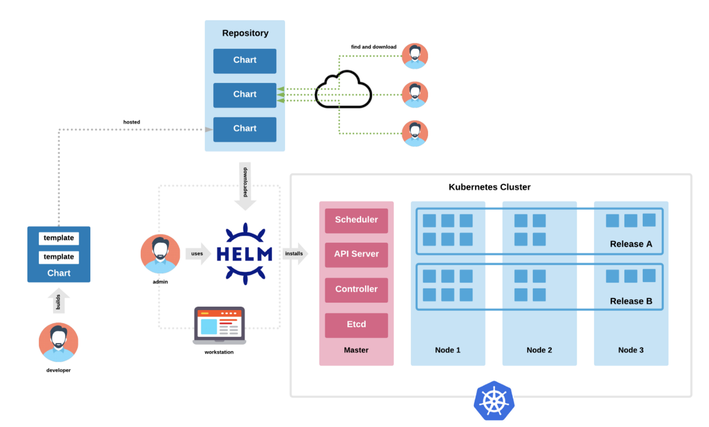
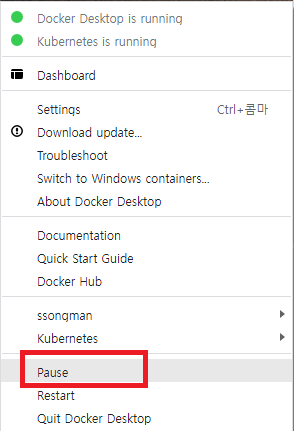

# Redis Hands-in

> Redis On Kubernetes


# 1. Redis Install 준비

WSL 환경에서 redis 를 설치해 보자.


## 1.1 namespace 생성

```sh
$ kubectl create ns redis-system

$ alias krs='kubectl -n redis-system'

```


## 1.2 helm chart

쿠버네티스에 서비스를 배포하는 방법이 다양하게 존재하는데 그중 대표적인 방법중에 하나가 Helm chart 방식 이다.


### (1) [참고] Helm Architecture

- helm chart 의 필요성

일반적으로 Kubernetes 에 서비스를 배포하기 위해 준비되는 Manifest 파일은 정적인 형태이다. 따라서 데이터를 수정하기 위해선 파일 자체를 수정해야 한다.  잘 관리를 한다면야 큰 어려움은 없겠지만, 문제는 CI/CD 등 자동화된 파이프라인을 구축해서 애플리케이션 라이프사이클을 관리할 때 발생한다.  

보통 애플리케이션 이미지를 새로 빌드하게 되면, 빌드 넘버가 변경된다. 이렇게 되면 새로운 이미지를 사용하기 위해 Kubernetes Manifest의 Image도 변경되어야 한다.  하지만 Kubernetes Manifest를 살펴보면, 이를 변경하기 쉽지 않다. Image Tag가 별도로 존재하지 않고 Image 이름에 붙어있기 때문입니다. 이를 자동화 파이프라인에서 변경하려면, sed 명령어를 쓰는 등의 힘든 작업을 해야 한다.

Image Tag는 굉장히 단적인 예제이다.  이 외에 도 Configmap 등 배포시마다 조금씩 다른 형태의 데이터를 배포해야 할때 Maniifest 파일 방식은 너무나 비효율적이다.  Helm Chart 는 이런 어려운 점을 모두 해결한 훌륭한 도구이다.  비단,  사용자가 개발한 AP 뿐아니라 kubernetes 에 배포되는 오픈소스 기반 솔루션들은 거의 모두 helm chart 를 제공한다.





### (2) helm client download

helm client 를 local 에 설치해 보자.

```sh
# root 권한으로 수행
## 임시 디렉토리를 하나 만들자.
$ mkdir -p ~/helm/
$ cd ~/helm/

# helm download 후 bin 으로 move
$ wget https://get.helm.sh/helm-v3.9.0-linux-amd64.tar.gz
$ tar -zxvf helm-v3.9.0-linux-amd64.tar.gz

$ sudo mv linux-amd64/helm /usr/local/bin/helm

# 확인
$ ll /usr/local/bin/helm*
-rwxr-xr-x 1 song song 46182400 May 19 01:45 /usr/local/bin/helm*


# 권한정리
$ ll ~/.kube/config
$ sudo chmod 600 ~/.kube/config


# 확인
$ helm version
version.BuildInfo{Version:"v3.9.0", GitCommit:"7ceeda6c585217a19a1131663d8cd1f7d641b2a7", GitTreeState:"clean", GoVersion:"go1.17.5"}

$ helm -n redis-system ls
NAME    NAMESPACE       REVISION        UPDATED STATUS  CHART   APP VERSION

## 이렇게 나오면 정상


```


# 2. Redis Cluster Install

kubernetes 기반에서 Redis 를 설치해보자.

참조link : https://github.com/bitnami/charts/tree/master/bitnami/redis-cluster


## 2.1 helm chart download


### (1) Repo add

redis-cluster chart 를 가지고 있는 bitnami repogistory 를  helm repo 에 추가한다.

```sh
$ helm repo add bitnami https://charts.bitnami.com/bitnami
```


### (2) Chart Search

추가된 bitnami repo에서 redis-cluster 를 찾는다.

```sh
$ helm search repo redis
NAME                    CHART VERSION   APP VERSION     DESCRIPTION
bitnami/redis           16.13.1         6.2.7           Redis(R) is an open source, advanced key-value ...
bitnami/redis-cluster   7.6.4           6.2.7           Redis(R) is an open source, scalable, distribut...


```

우리가 사용할 redis-cluster 버젼은 chart version 7.6.4( app version: 6.2.7) 이다.


### (3) Chart Fetch

helm chart 를 fetch 받는다.

```sh
# chart 를 저장할 적당한 위치로 이동
$ mkdir -p ~/helm/charts

$ cd ~/helm/charts

$ helm fetch bitnami/redis-cluster

$ ll
-rw-r--r-- 1 song song 100171 Jul  3 16:24 redis-cluster-7.6.4.tgz

$ tar -xzvf redis-cluster-7.6.4.tgz
...

$ cd redis-cluster

$ ls -ltr
-rw-r--r-- 1 song song   333 Jun 30 23:23 .helmignore
-rw-r--r-- 1 song song   220 Jun 30 23:23 Chart.lock
-rw-r--r-- 1 song song   761 Jun 30 23:23 Chart.yaml
-rw-r--r-- 1 song song 67832 Jun 30 23:23 README.md
drwxr-xr-x 3 song song  4096 Jul  3 16:24 charts/
drwxr-xr-x 2 song song  4096 Jul  3 16:24 img/
drwxr-xr-x 2 song song  4096 Jul  3 16:24 templates/
-rw-r--r-- 1 song song 39651 Jun 30 23:23 values.yaml

```


## 2.2 install - without pv


### (1) emptyDir 설정

chart 의 기본은 pv/pvc 를 참조하도록 설정되어 있다.

아직 pv/pvc 가 준비되어 있지 않다면 emptydir 로 설정한후 install 을 시도해야 한다.  그렇지 않으면 pvc 를 찾지못해 오류 발생한다.

아래 chart 의  파일을 찾아서 일부 내용을 변경해야 한다.

```sh
$ cd ~/helm/charts/redis-cluster/templates

$ ll
-rw-r--r-- 1 root root 90053 Jun 10 16:31 configmap.yaml
-rw-r--r-- 1 root root   117 Jun 10 16:31 extra-list.yaml
-rw-r--r-- 1 root root   903 Jun 10 16:31 headless-svc.yaml
-rw-r--r-- 1 root root  8774 Jun 10 16:31 _helpers.tpl
-rw-r--r-- 1 root root  2599 Jun 10 16:31 metrics-prometheus.yaml
-rw-r--r-- 1 root root  1520 Jun 10 16:31 metrics-svc.yaml
-rw-r--r-- 1 root root  2424 Jun 10 16:31 networkpolicy.yaml
-rw-r--r-- 1 root root  6195 Jun 10 16:31 NOTES.txt
-rw-r--r-- 1 root root   921 Jun 10 16:31 poddisruptionbudget.yaml
-rw-r--r-- 1 root root  1223 Jun 10 16:31 prometheusrule.yaml
-rw-r--r-- 1 root root  1508 Jun 10 16:31 psp.yaml
-rw-r--r-- 1 root root   833 Jun 10 16:31 redis-rolebinding.yaml
-rw-r--r-- 1 root root  1082 Jun 10 16:31 redis-role.yaml
-rw-r--r-- 1 root root   954 Jun 10 16:31 redis-serviceaccount.yaml
-rw-r--r-- 1 root root 22299 Jun 10 16:31 redis-statefulset.yaml          <--- 변경파일
-rw-r--r-- 1 root root  2568 Jun 10 16:31 redis-svc.yaml
-rw-r--r-- 1 root root  3279 Jun 10 16:31 scripts-configmap.yaml
-rw-r--r-- 1 root root   699 Jun 10 16:31 secret.yaml
-rw-r--r-- 1 root root  2055 Jun 10 16:31 svc-cluster-external-access.yaml
-rw-r--r-- 1 root root  1511 Jun 10 16:31 tls-secret.yaml
-rw-r--r-- 1 root root 16247 Jun 10 16:31 update-cluster.yaml

```


- 변경내용 정리

해당 파일 내의 volumeClaimTemplates 부분을 삭제하고 volumes 에 아래와 같이 emptyDir 내용을 추가해야 한다.

        - name: redis-data
          emptyDir: {}


- 변경전

```yaml

      volumes:
        - name: scripts
          configMap:
            name: {{ include "common.names.fullname" . }}-scripts
            defaultMode: 0755
        {{- if .Values.usePasswordFile }}
        - name: redis-password
          secret:
            secretName: {{ include "redis-cluster.secretName" . }}
            items:
              - key: {{ include "redis-cluster.secretPasswordKey" . }}
                path: redis-password
        {{- end }}
        - name: default-config
          configMap:
            name: {{ include "common.names.fullname" . }}-default
        {{- if .Values.sysctlImage.mountHostSys }}
        - name: host-sys
          hostPath:
            path: /sys
        {{- end }}
        - name: redis-tmp-conf
          emptyDir: {}
        {{- if .Values.redis.extraVolumes }}
        {{- include "common.tplvalues.render" ( dict "value" .Values.redis.extraVolumes "context" $ ) | nindent 8 }}
        {{- end }}
        {{- if .Values.tls.enabled }}
        - name: redis-certificates
          secret:
            secretName: {{ include "redis-cluster.tlsSecretName" . }}
            defaultMode: 256
        {{- end }}
  volumeClaimTemplates:
    - metadata:
        name: redis-data
        labels: {{- include "common.labels.matchLabels" . | nindent 10 }}
        {{- if .Values.persistence.annotations }}
        annotations: {{- include "common.tplvalues.render" (dict "value" .Values.persistence.annotations "context" $) | nindent 10 }}
        {{- end }}
      spec:
        accessModes:
        {{- range .Values.persistence.accessModes }}
          - {{ . | quote }}
        {{- end }}
        resources:
          requests:
            storage: {{ .Values.persistence.size | quote }}
        {{- include "common.storage.class" (dict "persistence" .Values.persistence "global" .Values.global) | nindent 8 }}
        {{- if or .Values.persistence.matchLabels .Values.persistence.matchExpressions }}
        selector:
        {{- if .Values.persistence.matchLabels }}
          matchLabels:
          {{- toYaml .Values.persistence.matchLabels | nindent 12 }}
        {{- end -}}
        {{- if .Values.persistence.matchExpressions }}
          matchExpressions:
          {{- toYaml .Values.persistence.matchExpressions | nindent 12 }}
        {{- end -}}
        {{- end }}
{{- end }}

```


- 변경후

```yaml
      volumes:
        - name: scripts
          configMap:
            name: {{ include "common.names.fullname" . }}-scripts
            defaultMode: 0755
        {{- if .Values.usePasswordFile }}
        - name: redis-password
          secret:
            secretName: {{ include "redis-cluster.secretName" . }}
            items:
              - key: {{ include "redis-cluster.secretPasswordKey" . }}
                path: redis-password
        {{- end }}
        - name: default-config
          configMap:
            name: {{ include "common.names.fullname" . }}-default
        {{- if .Values.sysctlImage.mountHostSys }}
        - name: host-sys
          hostPath:
            path: /sys
        {{- end }}
        - name: redis-tmp-conf
          emptyDir: {}
        {{- if .Values.redis.extraVolumes }}
        {{- include "common.tplvalues.render" ( dict "value" .Values.redis.extraVolumes "context" $ ) | nindent 8 }}
        {{- end }}
        {{- if .Values.tls.enabled }}
        - name: redis-certificates
          secret:
            secretName: {{ include "redis-cluster.tlsSecretName" . }}
            defaultMode: 256
        {{- end }}
        - name: redis-data                     <--- 이부분 으로 대체
          emptyDir: {}
{{- end }}
```


### (2) helm install

```sh
$ cd  ~/song/helm/charts/redis-cluster

## dry-run 으로 실행
$ helm -n redis-system install my-release . \
    --set image.registry=docker.io \
    --set cluster.nodes=6 \
    --set cluster.replicas=1 \
    --set password=new1234 \
    --debug --dry-run=true > dry-run_1.yaml


## 기본값으로 실행
$ helm -n redis-system install my-release . \
    --set image.registry=docker.io \
    --set cluster.nodes=6 \
    --set cluster.replicas=1 \
    --set password=new1234


To get your password run:
    export REDIS_PASSWORD=$(kubectl get secret --namespace "redis-system" my-release-redis-cluster -o jsonpath="{.data.redis-password}" | base64 -d)

You have deployed a Redis&reg; Cluster accessible only from within you Kubernetes Cluster.INFO: The Job to create the cluster will be created.To connect to your Redis&reg; cluster:

1. Run a Redis&reg; pod that you can use as a client:
kubectl run --namespace redis-system my-release-redis-cluster-client --rm --tty -i --restart='Never' \
 --env REDIS_PASSWORD=$REDIS_PASSWORD \
--image docker.io/bitnami/redis-cluster:6.2.7-debian-11-r3 -- bash

2. Connect using the Redis&reg; CLI:

redis-cli -c -h my-release-redis-cluster -a $REDIS_PASSWORD


## 확인
$ helm -n redis-system ls
NAME            NAMESPACE       REVISION        UPDATED                                 STATUS          CHART                   APP VERSION
my-release      redis-system    1               2022-06-26 05:45:14.961024747 +0000 UTC deployed        redis-cluster-7.6.3     6.2.7     


$ helm -n redis-system status my-release
NAME: my-release
LAST DEPLOYED: Sun Jun 26 05:45:14 2022
NAMESPACE: redis-system
STATUS: deployed
REVISION: 1
TEST SUITE: None
NOTES:
CHART NAME: redis-cluster
CHART VERSION: 7.6.3
APP VERSION: 6.2.7** Please be patient while the chart is being deployed **


To get your password run:
    export REDIS_PASSWORD=$(kubectl get secret --namespace "redis-system" my-release-redis-cluster -o jsonpath="{.data.redis-password}" | base64 -d)

You have deployed a Redis&reg; Cluster accessible only from within you Kubernetes Cluster.INFO: The Job to create the cluster will be created.To connect to your Redis&reg; cluster:

1. Run a Redis&reg; pod that you can use as a client:
kubectl run --namespace redis-system my-release-redis-cluster-client --rm --tty -i --restart='Never' \
 --env REDIS_PASSWORD=$REDIS_PASSWORD \
--image docker.io/bitnami/redis-cluster:6.2.7-debian-11-r3 -- bash

2. Connect using the Redis&reg; CLI:

redis-cli -c -h my-release-redis-cluster -a $REDIS_PASSWORD

```


## 2.3 pod/svc 확인

```sh
## redis cluster 를 구성하고 있는 pod 를 조회
$ kubectl -n redis-system get pod -o wide
NAME                            READY   STATUS    RESTARTS   AGE     IP            NODE       NOMINATED NODE   READINESS GATES
my-release-redis-cluster-0      1/1     Running   0          12m     10.42.1.108   master02   <none>           <none>
my-release-redis-cluster-1      1/1     Running   0          12m     10.42.4.131   worker02   <none>           <none>
my-release-redis-cluster-2      1/1     Running   0          12m     10.42.2.160   master03   <none>           <none>
my-release-redis-cluster-3      1/1     Running   0          12m     10.42.5.114   worker03   <none>           <none>
my-release-redis-cluster-4      1/1     Running   0          12m     10.42.0.121   master01   <none>           <none>
my-release-redis-cluster-5      1/1     Running   0          12m     10.42.3.126   worker01   <none>           <none>
...


$ kubectl -n redis-system get svc
NAME                                TYPE        CLUSTER-IP    EXTERNAL-IP   PORT(S)              AGE
my-release-redis-cluster            ClusterIP   10.43.35.97   <none>        6379/TCP             16m
my-release-redis-cluster-headless   ClusterIP   None          <none>        6379/TCP,16379/TCP   16m


```


## 2.4 Internal Access

redis client를 cluster 내부에서 실행후 접근하는 방법을 알아보자.

### (1) Redis client 실행

먼저 아래와 같이 동일한 Namespace 에 redis-client 를 실행한다.

```sh
## redis-client 용도로 deployment 를 실행한다.
$ kubectl -n redis-system create deploy redis-client --image=docker.io/bitnami/redis-cluster:6.2.7-debian-11-r3 -- sleep 365d
deployment.apps/redis-client created


## redis client pod 확인
$ kubectl -n redis-system get pod
NAME                            READY   STATUS    RESTARTS   AGE
redis-client-7cdd56bb6c-njjls   1/1     Running   0          5s     <--- redis client pod


## redis-client 로 접근한다.
## okd web console 에서 해당 pod 의 terminal 로 접근해도 된다.
$ kubectl -n redis-system exec -it deploy/redis-client -- bash

```


### (2) Redis-cluster 상태 확인

```sh

## service 명으로 cluster mode 접근
$ redis-cli -h my-release-redis-cluster -c -a new1234

## cluster node 를 확인
my-release-redis-cluster:6379> cluster nodes
e24b97c55fe808bb8cec4d3c84dded7b8b997fdc 10.42.3.126:6379@16379 slave 414a8ae9ed8d19b0c2beecdebead7c3149cf0aa2 0 1656222687801 2 connected
414a8ae9ed8d19b0c2beecdebead7c3149cf0aa2 10.42.4.131:6379@16379 myself,master - 0 1656222686000 2 connected 5461-10922
b310995bc9db36ebe51c1f25b09d01885a66cc86 10.42.2.160:6379@16379 master - 0 1656222685794 3 connected 10923-16383
506d16c194f3582ecf290ecf83602f1cef672dae 10.42.1.108:6379@16379 master - 0 1656222687000 1 connected 0-5460
bdff18b3bacefcd328c33fb37e905db8dc7486cc 10.42.0.121:6379@16379 slave 506d16c194f3582ecf290ecf83602f1cef672dae 0 1656222688000 1 connected
3008b31ef8be6e456112242e2a8c92582f2536c7 10.42.5.114:6379@16379 slave b310995bc9db36ebe51c1f25b09d01885a66cc86 0 1656222688806 3 connected
## master 3개, slave가 3개 사용하는 모습을 볼 수가 있다.


## cluster info 확인
my-release-redis-cluster:6379> cluster info
cluster_state:ok
cluster_slots_assigned:16384
cluster_slots_ok:16384
cluster_slots_pfail:0
cluster_slots_fail:0
cluster_known_nodes:6
cluster_size:3
cluster_current_epoch:6
cluster_my_epoch:2
cluster_stats_messages_ping_sent:396
cluster_stats_messages_pong_sent:366
cluster_stats_messages_meet_sent:1
cluster_stats_messages_sent:763
cluster_stats_messages_ping_received:366
cluster_stats_messages_pong_received:397
cluster_stats_messages_received:763
## cluster state 가 OK 인 것을 확인할 수 있다.

```


### (3) set / get 확인

```sh

## service 명으로 cluster mode 접근
$ redis-cli -h my-release-redis-cluster -c -a new1234


## set 명령 수행
my-release-redis-cluster:6379> set a 1
OK
my-release-redis-cluster:6379> set b 2
-> Redirected to slot [3300] located at 10.42.1.108:6379
OK
10.42.1.108:6379> set c 3
-> Redirected to slot [7365] located at 10.42.4.131:6379
OK
10.42.4.131:6379> set d 4
-> Redirected to slot [11298] located at 10.42.2.160:6379
OK
10.42.2.160:6379> set e 5
OK
10.42.2.160:6379> set f 6
-> Redirected to slot [3168] located at 10.42.1.108:6379
OK
10.42.1.108:6379> set g 7
-> Redirected to slot [7233] located at 10.42.4.131:6379
OK
10.42.4.131:6379> set h 8
-> Redirected to slot [11694] located at 10.42.2.160:6379
OK
10.42.2.160:6379> set i 9
OK
10.42.2.160:6379> set j 10
-> Redirected to slot [3564] located at 10.42.1.108:6379
OK

## Set 명령수행시 master node 를 변경하면서 set 하는 모습을 확인할 수 있다.


# get 명령 수행
my-release-redis-cluster:6379> get a
"1"
my-release-redis-cluster:6379> get b
-> Redirected to slot [3300] located at 10.42.1.108:6379
"2"
10.42.1.108:6379> get c
-> Redirected to slot [7365] located at 10.42.4.131:6379
"3"
10.42.4.131:6379> get d
-> Redirected to slot [11298] located at 10.42.2.160:6379
"4"
10.42.2.160:6379> get e
"5"
10.42.2.160:6379> get f
-> Redirected to slot [3168] located at 10.42.1.108:6379
"6"
10.42.1.108:6379> get g
-> Redirected to slot [7233] located at 10.42.4.131:6379
"7"
10.42.4.131:6379> get h
-> Redirected to slot [11694] located at 10.42.2.160:6379
"8"
10.42.2.160:6379> get i
"9"
10.42.2.160:6379> get j
-> Redirected to slot [3564] located at 10.42.1.108:6379
"10"

## get 명령을 실행하면 해당 데이터가 존재하는 master pod 로 redirectred 되는 것을 확인할 수 있다.


```


## 2.5 결론

- External (Cluster 외부) 에서 access 하기 위해서 node port 를 이용해야 함

- 하지만 Redis Cluster 의 경우 접근해야 할 Node 가 두개 이상이며 데이터가 저장된 위치를 찾아 redirect 됨

- 이때 redirect 가 정확히 이루어지려면 Client 가 인식가능한 Node 주소를 알아야 함

- 하지만 Redis Cluster 는 원격지 Client 가 인식가능한 Node 들의 DNS 제공을 지원하지 않음

- 결국 Redis Cluster 는 PRD환경과 같이 Kubernetes Cluster 내에서는 사용가능하지만 

- 개발자 PC에서 연결이 필요한 DEV환경에서 적절치 않음


## 2.6 Clean Up

```sh

# 1) helm 삭제
# helm delete 명령을 이용하면 helm chart 로 설치된 모든 리소스가 한꺼번에 삭제된다.
$ helm -n redis-system delete my-release


# 2) helm chart 삭제
$ rm -rf ~/helm/charts/redis-cluster/
$ rm -rf ~/helm/charts/redis-cluster-7.6.4.tgz

```


# 3. Redis Install


## 3.1 Redis(Single Master) Install


### (1) helm search

추가된 bitnami repo에서 redis-cluster 를 찾는다.

```sh
$ helm search repo redis
NAME                    CHART VERSION   APP VERSION     DESCRIPTION
bitnami/redis           16.13.1         6.2.7           Redis(R) is an open source, advanced key-value ...
bitnami/redis-cluster   7.6.4           6.2.7           Redis(R) is an open source, scalable, distribut...

```

bitnami/redis chart 를 이용할것이다.


### (2) helm install

```sh

# helm install
# master 1, slave 3 실행
$ helm -n redis-system install my-release bitnami/redis \
    --set global.redis.password=new1234 \
    --set image.registry=docker.io \
    --set master.persistence.enabled=false \
    --set master.service.type=NodePort \
    --set master.service.nodePorts.redis=32200 \
    --set replica.replicaCount=3 \
    --set replica.persistence.enabled=false \
    --set replica.service.type=NodePort \
    --set replica.service.nodePorts.redis=32210

##
    my-release-redis-master.redis-system.svc.cluster.local for read/write operations (port 6379)
    my-release-redis-replicas.redis-system.svc.cluster.local for read-only operations (port 6379)


To get your password run:

    export REDIS_PASSWORD=$(kubectl get secret --namespace redis-system my-release-redis -o jsonpath="{.data.redis-password}" | base64 -d)

To connect to your Redis&reg; server:

1. Run a Redis&reg; pod that you can use as a client:

   kubectl run --namespace redis-system redis-client --restart='Never'  --env REDIS_PASSWORD=$REDIS_PASSWORD  --image docker.io/bitnami/redis:6.2.7-debian-11-r9 --command -- sleep infinity

   Use the following command to attach to the pod:

   kubectl exec --tty -i redis-client \
   --namespace redis-system -- bash

2. Connect using the Redis&reg; CLI:
   REDISCLI_AUTH="$REDIS_PASSWORD" redis-cli -h my-release-redis-master
   REDISCLI_AUTH="$REDIS_PASSWORD" redis-cli -h my-release-redis-replicas

To connect to your database from outside the cluster execute the following commands:

    export NODE_IP=$(kubectl get nodes --namespace redis-system -o jsonpath="{.items[0].status.addresses[0].address}")
    export NODE_PORT=$(kubectl get --namespace redis-system -o jsonpath="{.spec.ports[0].nodePort}" services my-release-redis-master)
    REDISCLI_AUTH="$REDIS_PASSWORD" redis-cli -h $NODE_IP -p $NODE_PORT


# 설치목록 확인
$ helm -n redis-system ls
NAME            NAMESPACE       REVISION        UPDATED                                 STATUS          CHART           APP VERSION
my-release      redis-system    1               2022-07-03 16:43:46.7622445 +0900 KST   deployed        redis-16.13.1   6.2.7


# 확인
$ helm -n redis-system status my-release
$ helm -n redis-system get all my-release


```

my-release-redis-master 는 read/write 용도로 사용되며 my-release-redis-replicas 는 read-only 용도로 사용된다.


#### [참고] remote설치가 안될때는 fetch 받아서 수행

설치 과정에서 chart 를 다운 받지 못한다면 Chart 를 fetch 받아서 설치하자.

```sh
# chart 를 저장할 적당한 위치로 이동
$ mkdir -p ~/helm/charts

$ cd ~/helm/charts

$ helm fetch bitnami/redis

$ ll
-rw-r--r-- 1 song song 88772 Jul  3 16:46 redis-16.13.1.tgz

$ tar -xzvf redis-16.13.1.tgz
...

$ cd redis

$ ls -ltr
-rw-r--r-- 1 song song    333 Jun 30 18:13 .helmignore
-rw-r--r-- 1 song song    220 Jun 30 18:13 Chart.lock
-rw-r--r-- 1 song song    773 Jun 30 18:13 Chart.yaml
-rw-r--r-- 1 song song 100896 Jun 30 18:13 README.md
drwxr-xr-x 3 song song   4096 Jul  3 16:46 charts/
drwxr-xr-x 2 song song   4096 Jul  3 16:46 img/
drwxr-xr-x 5 song song   4096 Jul  3 16:46 templates/
-rw-r--r-- 1 song song   4483 Jun 30 18:13 values.schema.json
-rw-r--r-- 1 song song  68559 Jun 30 18:13 values.yaml


$ cd ~/helm/charts/redis

# helm install
# node 2, replicas 1 이므로 Master / Slave 한개씩 사용됨
$ helm -n redis-system install my-release . \
    --set global.redis.password=new1234 \
    --set image.registry=docker.io \
    --set master.persistence.enabled=false \
    --set master.service.type=NodePort \
    --set master.service.nodePorts.redis=32200 \
    --set replica.replicaCount=3 \
    --set replica.persistence.enabled=false \
    --set replica.service.type=NodePort \
    --set replica.service.nodePorts.redis=32210

##
my-release-redis-master.redis-system.svc.cluster.local for read/write operations (port 6379)
my-release-redis-replicas.redis-system.svc.cluster.local for read-only operations (port 6379)


$ helm -n redis-system ls
NAME            NAMESPACE       REVISION        UPDATED                                 STATUS          CHART                   APP VERSION
my-release      redis-system    1               2022-06-26 06:59:30.08278938 +0000 UTC  deployed        redis-cluster-7.6.3     6.2.7


# 삭제시
$ helm -n redis-system delete my-release


```


## 3.2 pod / svc 확인

```sh
$ krs get pod
NAME                          READY   STATUS    RESTARTS   AGE
my-release-redis-master-0     1/1     Running   0          6m46s
my-release-redis-replicas-0   1/1     Running   0          6m46s
my-release-redis-replicas-1   1/1     Running   0          6m11s
my-release-redis-replicas-2   1/1     Running   0          5m45s


$ krs get svc
NAME                        TYPE        CLUSTER-IP       EXTERNAL-IP   PORT(S)          AGE
my-release-redis-headless   ClusterIP   None             <none>        6379/TCP         7m2s
my-release-redis-master     NodePort    10.99.252.81     <none>        6379:32200/TCP   7m2s
my-release-redis-replicas   NodePort    10.103.228.149   <none>        6379:32210/TCP   7m2s

```

- master / replicas service 는 nodeport 로 접근한다.


## 3.3 Clean Up

```sh

# 삭제
$ helm -n redis-system delete my-release

# 확인
$ helm -n redis-system ls
$ kubectl -n redis-system get all

# namespace 삭제
$ kubectl delete namespace redis-system

```


# 4. Accessing Redis


## 4.1 Internal Access

redis client를 cluster 내부에서 실행후 접근하는 방법을 알아보자.


### (1) Redis Service 확인

```sh
$ krs get svc
NAME                        TYPE        CLUSTER-IP       EXTERNAL-IP   PORT(S)          AGE
my-release-redis-headless   ClusterIP   None             <none>        6379/TCP         11m
my-release-redis-master     NodePort    10.99.252.81     <none>        6379:32200/TCP   11m
my-release-redis-replicas   NodePort    10.103.228.149   <none>        6379:32210/TCP   11m


$ krs  get pod
NAME                          READY   STATUS    RESTARTS   AGE
my-release-redis-master-0     1/1     Running   0          13m
my-release-redis-replicas-0   1/1     Running   0          13m
my-release-redis-replicas-1   1/1     Running   0          12m
my-release-redis-replicas-2   1/1     Running   0          12m
```

- my-release-redis-master 이 일반 kubernetes service 이며 POD 로 트래픽을 RR 방식으로 연결한다.
- my-release-redis-headless 는 ip 가 없는 headless service 이다. 그러므로 pod 명을 붙여서 DNS 로 사용된다.
  - headless service 사용예시
    - my-release-redis-master-0.my-release-redis-headless.redis-system.svc

- 우리는 Cluster 내에서  my-release-redis-master:6379로 접근을 시도할 것이다.


### (2) Redis client 실행

먼저 아래와 같이 동일한 Namespace 에 redis-client 를 실행한다.

```sh
## redis-client 용도로 deployment 를 실행한다.
$ kubectl -n redis-system create deploy redis-client --image=docker.io/bitnami/redis-cluster:6.2.7-debian-11-r3 -- sleep 365d

deployment.apps/redis-client created


## redis client pod 확인
$ kubectl -n redis-system get pod
NAME                            READY   STATUS    RESTARTS   AGE
redis-client-644b7d87d5-rxl8q   1/1     Running   0          4s     <--- redis client pod


## redis-client 로 접근한다.
## okd web console 에서 해당 pod 의 terminal 로 접근해도 된다.
$ kubectl -n redis-system exec -it deploy/redis-client -- bash

```


### (3) set / get 확인

```sh
## service 명으로 cluster mode 접근
$ redis-cli -h my-release-redis-master -a new1234

my-release-redis-master:6379>


## set 명령 수행
my-release-redis-master:6379> set a 1
OK
my-release-redis-master:6379> set b 2
OK
my-release-redis-master:6379> set c 3
OK
my-release-redis-master:6379> set d 4


## Redis Cluster 와 다르게 한개의 노드에서만 동작한다.


# get 명령 수행
my-release-redis-master:6379> get a
"1"
my-release-redis-master:6379> get b
"2"
my-release-redis-master:6379> get c
"3"
my-release-redis-master:6379> get d
"4"

```


## 4.2 External Access

redis client를 cluster 외부에서 실행후 접근하는 방법을 알아보자.


### (1) Redis Service 확인

```sh
$ krs get svc
NAME                        TYPE        CLUSTER-IP       EXTERNAL-IP   PORT(S)          AGE
my-release-redis-headless   ClusterIP   None             <none>        6379/TCP         11m
my-release-redis-master     NodePort    10.99.252.81     <none>        6379:32200/TCP   11m
my-release-redis-replicas   NodePort    10.103.228.149   <none>        6379:32210/TCP   11m


```

- my-release-redis-master 서비스가 Node Port 32200 로 접근이 가능하다.
- 그러므로 Node Ip알아낸 다음 해당 IP 의 33200 로 접근할 수 있다.


### (2) Node IP 확인

- node port 를 인식할 수 있는 본인 PC 의 IP를 확인하자.
- 이 IP 는 아래 Node Port 등록시 nip host 에 사용된다.
- 참고로 본인  IP 는 아래와 같이 command 창에서  `ipconfig` 명령으로 확인할 수 있다. (WSL 이 아닌 Windows Command 임을 유의하자)

```sh
$ ipconfig

Windows IP 구성

무선 LAN 어댑터 로컬 영역 연결* 1:

미디어 상태 . . . . . . . . : 미디어 연결 끊김
연결별 DNS 접미사. . . . :

무선 LAN 어댑터 로컬 영역 연결* 10:

미디어 상태 . . . . . . . . : 미디어 연결 끊김
연결별 DNS 접미사. . . . :

이더넷 어댑터 VMware Network Adapter VMnet1:

연결별 DNS 접미사. . . . :
링크-로컬 IPv6 주소 . . . . : fe80::b43c:3b41:b773:48da%9
IPv4 주소 . . . . . . . . . : 192.168.31.1                   <=============  해당 IP 를 추출한다.
서브넷 마스크 . . . . . . . : 255.255.255.0
기본 게이트웨이 . . . . . . :

이더넷 어댑터 VMware Network Adapter VMnet8:

연결별 DNS 접미사. . . . :
링크-로컬 IPv6 주소 . . . . : fe80::905c:f7ec:a1e4:7ca6%12
IPv4 주소 . . . . . . . . . : 192.168.239.1
서브넷 마스크 . . . . . . . : 255.255.255.0
...
```

- 위 정보는 개인마다 틀린점을 유의하자.

- 접근 주소
  - 192.168.31.1:32200


### (3) Redis client 확인(Docker)

local pc 에서 access 테스트를 위해 docker redis client 를 설치하자.

※ wsl 에서도 docker 접근이 가능한 환경일 것이다. 그러므로 동일한 terminal 에서 수행하면 된다.

```sh
## redis-client 용도로 docker client 를 실행한다.
$ docker run --name redis-client -d --rm --user root docker.io/bitnami/redis-cluster:6.2.7-debian-11-r3 sleep 365d

## docker 내에 진입후
$ docker exec -it redis-client bash

## Local PC IP로 cluster mode 접근
$ redis-cli -h 192.168.31.1 -c -a new1234 -p 32200

```


### (4) set/get 확인

```sh

# get 명령 수행
# Internal Access 에서 테스트 했던 4개 값을 읽어오자.
192.168.31.1:32200> get a
"1"
192.168.31.1:32200> get b
"2"
192.168.31.1:32200> get c
"3"
192.168.31.1:32200> get d
"4"


# set 명령 수행
192.168.31.1:32200> set e 1
OK
192.168.31.1:32200> set f 2
OK
192.168.31.1:32200> set g 3
OK

```


# 5. P3X Redis UI

참고링크
https://www.electronjs.org/apps/p3x-redis-ui

https://github.com/patrikx3/redis-ui/blob/master/k8s/manifests/service.yaml

P3X Redis UI 는 Redis DB 관리를 위한  편리한 데이터베이스 GUI app이며  WEB  UI 와 Desktop App 에서 작동한다.

P3X Web UI 를 kubernetes 에 설치해 보자.


## 5.1 redis-ui deploy

아래 yaml  manifest file을 활용하여 configmap, deployment, service, ingress 를 일괄 실행한다.

```sh
$ cd ~/githubrepo/ktds-edu2


$ cat ./redis/redisui/12.p3xredisui-local.yaml
apiVersion: v1
kind: ConfigMap
metadata:
  name: p3x-redis-ui-settings
data:
  .p3xrs-conns.json: |
    {
      "list": [
        {
          "name": "cluster",
          "host": "my-release-redis-master",
          "port": 6379,
          "password": "new1234",
          "id": "unique"
        }
      ],
      "license": ""
    }
---
apiVersion: apps/v1
kind: Deployment
metadata:
  name: p3x-redis-ui
spec:
  replicas: 1
  selector:
    matchLabels:
      app.kubernetes.io/name: p3x-redis-ui
  template:
    metadata:
      labels:
        app.kubernetes.io/name: p3x-redis-ui
    spec:
      containers:
      - name: p3x-redis-ui
        image: patrikx3/p3x-redis-ui
        ports:
        - name: p3x-redis-ui
          containerPort: 7843
        volumeMounts:
        - name: p3x-redis-ui-settings
          mountPath: /settings/.p3xrs-conns.json
          subPath: .p3xrs-conns.json
      volumes:
      - name: p3x-redis-ui-settings
        configMap:
          name: p3x-redis-ui-settings
---
apiVersion: v1
kind: Service
metadata:
  name: p3x-redis-ui-service
  labels:
    app.kubernetes.io/name: p3x-redis-ui-service
spec:
  ports:
  - port: 7843
    nodePort: 32220
    targetPort: p3x-redis-ui
    name: p3x-redis-ui
  selector:
    app.kubernetes.io/name: p3x-redis-ui
  type: NodePort
---


# 설치
$ kubectl -n redis-system apply -f ./redis/redisui/12.p3xredisui-local.yaml


# 확인
$ kubectl -n redis-system get pod
NAME                                READY   STATUS    RESTARTS   AGE
pod/my-release-redis-master-0       1/1     Running   0          28m
pod/my-release-redis-replicas-0     1/1     Running   0          28m
pod/my-release-redis-replicas-1     1/1     Running   0          27m
pod/my-release-redis-replicas-2     1/1     Running   0          27m
pod/p3x-redis-ui-5cffc4b559-gng7x   1/1     Running   0          28s
pod/redis-client-644b7d87d5-rxl8q   1/1     Running   0          13m


$ kubectl -n redis-system get svc
NAME                                TYPE        CLUSTER-IP       EXTERNAL-IP   PORT(S)          AGE
service/my-release-redis-headless   ClusterIP   None             <none>        6379/TCP         28m
service/my-release-redis-master     NodePort    10.99.252.81     <none>        6379:32200/TCP   28m
service/my-release-redis-replicas   NodePort    10.103.228.149   <none>        6379:32210/TCP   28m
service/p3x-redis-ui-service        NodePort    10.106.54.18     <none>        7843:32220/TCP   28s

```

Node Port 32220 으로 접근이 가능하다.


## 5.2 UI 확인

http://localhost:32220/


## 5.3 Clean up

```sh
$ cd ~/githubrepo/ktds-edu2

# 삭제시
$ kubectl -n redis-system delete -f ./redis/redisui/12.p3xredisui-local.yaml
```


# 6. ACL

Redis 6.0 이상부터는 계정별 access 수준을 정의할 수 있다.  

이러한 ACL 기능을 이용해서 아래와 같은 계정을 관리 할 수 있다.

- 읽기전용 계정 생성 가능

- 특정 프리픽스로 시작하는 Key 만 access 가능하도록 하는 계정 생성


## 6.1 Redis Client 확인

local pc 에서 access 테스트를 위해 docker redis client 를 설치하자.

```sh
## redis-client 용도로 docker client 를 실행한다.
$ docker run --name redis-client -d --rm --user root docker.io/bitnami/redis-cluster:6.2.7-debian-11-r3 sleep 365d


## Container 확인
$ docker ps


## docker 내에 진입후
$ docker exec -it redis-client bash

root@453e3debccb3:/#


## Local PC IP로 cluster mode 접근
$ redis-cli -h 192.168.31.1 -a new1234 -p 32200
192.168.31.1:32200>

```


## 6.2 ACL 기본명령

```sh

# 1) 계정 목록
192.168.31.1:32200> acl list
1) "user default on #65fd3b5c243ea857f91daef8e3d5c203fa045f33e034861998b9d74cc42ceb24 ~* &* +@all"

## 기본적으로 default 라는 계정이 존재한다.


# 2) 계정 추가
192.168.31.1:32200> acl setuser supersong on >new1234 allcommands allkeys
OK
192.168.31.1:32200> acl setuser tempsong on >new1234 allcommands allkeys
OK


192.168.31.1:32200> acl list
1) "user default on #65fd3b5c243ea857f91daef8e3d5c203fa045f33e034861998b9d74cc42ceb24 ~* &* +@all"
2) "user supersong on #65fd3b5c243ea857f91daef8e3d5c203fa045f33e034861998b9d74cc42ceb24 ~* &* +@all"
3) "user tempsong on #65fd3b5c243ea857f91daef8e3d5c203fa045f33e034861998b9d74cc42ceb24 ~* &* +@all"


# 3) 계정 전환
192.168.31.1:32200> acl whoami
"default"

192.168.31.1:32200> auth supersong new1234
OK
192.168.31.1:32200> acl whoami
"supersong"

192.168.31.1:32200> auth default new1234
OK


# 4) 계정 삭제
192.168.31.1:32200> acl deluser tempsong
(integer) 1

```


## 6.3 읽기전용 계정 생성

- 읽기전용 계정 테스트

```sh

# 1) 읽기 계정 생성
192.168.31.1:32200> acl setuser readonlysong on >new1234 allcommands allkeys -set +get
OK

192.168.31.1:32200> acl list
1) "user default on #65fd3b5c243ea857f91daef8e3d5c203fa045f33e034861998b9d74cc42ceb24 ~* &* +@all"
2) "user readonlysong on #65fd3b5c243ea857f91daef8e3d5c203fa045f33e034861998b9d74cc42ceb24 ~* &* +@all -set"
3) "user supersong on #65fd3b5c243ea857f91daef8e3d5c203fa045f33e034861998b9d74cc42ceb24 ~* &* +@all"


# 2) 계정 전환
192.168.31.1:32200> acl whoami
"default"

192.168.31.1:32200> auth readonlysong new1234
OK
192.168.31.1:32200> acl whoami
"readonlysong"


# 3) 읽기 / 쓰기 확인
192.168.31.1:32200> get a
"1"

192.168.31.1:32200> set a 1
(error) NOPERM this user has no permissions to run the 'set' command or its subcommand


# 4) 계정 전환
192.168.31.1:32200> auth default new1234
OK
192.168.31.1:32200> acl whoami
"default"

```


## 6.4 특정 key만 접근 허용

- song으로 로그인 하면 song으로 시작하는 key 만 get/set 가능하도록 설정

```sh

# 1) song 으로 시작하는 key 만 접근가능한 User 새성
## 1-1) song 계정 생성
192.168.31.1:32200> acl setuser song on >new1234 allcommands allkeys
OK
192.168.31.1:32200> acl list
1) "user default on #65fd3b5c243ea857f91daef8e3d5c203fa045f33e034861998b9d74cc42ceb24 ~* &* +@all"
2) "user readonlysong on #65fd3b5c243ea857f91daef8e3d5c203fa045f33e034861998b9d74cc42ceb24 ~* &* +@all -set"
3) "user song on #65fd3b5c243ea857f91daef8e3d5c203fa045f33e034861998b9d74cc42ceb24 ~* &* +@all"
4) "user supersong on #65fd3b5c243ea857f91daef8e3d5c203fa045f33e034861998b9d74cc42ceb24 ~* &* +@all"


## 1-2) song 으로 시작하는 key 만 접근가능도록 설정
192.168.31.1:32200> acl setuser song resetkeys ~song*
OK


192.168.31.1:32200>  acl list
1) "user default on #65fd3b5c243ea857f91daef8e3d5c203fa045f33e034861998b9d74cc42ceb24 ~* &* +@all"
2) "user readonlysong on #65fd3b5c243ea857f91daef8e3d5c203fa045f33e034861998b9d74cc42ceb24 ~* &* +@all -set"
3) "user song on #65fd3b5c243ea857f91daef8e3d5c203fa045f33e034861998b9d74cc42ceb24 ~song* &* +@all"
4) "user supersong on #65fd3b5c243ea857f91daef8e3d5c203fa045f33e034861998b9d74cc42ceb24 ~* &* +@all"


# 2) 계정전환
192.168.31.1:32200> auth song new1234
OK

192.168.31.1:32200> acl whoami
"song"


# 3) set 명령 테스트
192.168.31.1:32200> set a 1
(error) NOPERM this user has no permissions to access one of the keys used as arguments

192.168.31.1:32200> set song_a 1
OK

# 4) get 명령 테스트
192.168.31.1:32200> get a
(error) NOPERM this user has no permissions to access one of the keys used as arguments


192.168.31.1:32200> get song_a
"1"

```


# 7. Java Sample


## 7.1 Jedis vs Lettuce

참고: https://jojoldu.tistory.com/418

Java 의 Redis Client 는 크게 Jedis 와 Lettuce  가 있음.

- 초기에는 Jedis 를 많이 사용했으나 현재는 Lettuce 를 많이 사용하는 추세임.

- Jedis 의 단점
  -  멀티 쓰레드 불안정, Pool 한계 등
- Lettuce 의 장점
  - Netty 기반으로 비동기 지원 가능 등

- 결국 Spring Boot 2.0 부터 Jedis 가 기본 클라이언트에서 deprecated 되고 Lettuce 가 탑재되었음


## 7.2 redis-sample

### (1) sample import

- Github 의 redis-sample repo 주소 확인

```
https://github.com/ssongman/redis-sample.git
```

복사하여 클립보드에 기억한다.


- STS 에서 import
  - Package Explorer 에서 우클릭 이후 아래 메뉴 선택

```
1) import - git - Project from Git(with smart import)

2) Select Repository Source
   Clone 선택

3) Source Git Repository
   URI 에 위 주소 붙여넣기
   클립보드에 기억된 git 주소로 자동 셋팅된다.

4) Branch Selection
   main 선택

5) local Destination 에서 프로젝트 위치 지정

6) Import Projects
   Maven 확인 후 finish

```


### (2) 소스내 주소 수정

src/main/resources/config/application.yaml 에서 아래 내용 수정

- application.yaml

```yaml
server:
  port: 8082
  
spring:
  redis:
    lettuce:
      pool:
        max-active: 8   # pool에 할당할수 있는 커넥션 최대수(default:8)
        max-idle: 8     # pool의 idle 커넥션 최대수(default:8)
        min-idle: 0     # pool의 idle 커넥션 최소수(default:0)
    host: 192.168.31.1  # 
    port: 32200
    password: 'new1234'
```


- 참고 : 각 항목들에 대한 설명

| 변수                         | 기본값                             | 설명                                                         |
| ---------------------------- | ---------------------------------- | ------------------------------------------------------------ |
| spring.redis.database        | 0                                  | 커넥션  팩토리에 사용되는 데이터베이스 인덱스                |
| spring.redis.host            | localhost                          | 레디스  서버 호스트                                          |
| spring.redis.password        | 레디스  서버 로그인 패스워드       |                                                              |
| spring.redis.pool.max-active | 8                                  | pool에  할당될 수 있는 커넥션 최대수 (음수로 하면 무제한)    |
| spring.redis.pool.max-idle   | 8                                  | pool의  "idle" 커넥션 최대수 (음수로 하면 무제한)            |
| spring.redis.pool.max-wait   | -1                                 | pool이  바닥났을 때 예외발생 전에 커넥션 할당 차단의 최대 시간 (단위: 밀리세컨드, 음수는 무제한 차단) |
| spring.redis.pool.min-idle   | 0                                  | 풀에서  관리하는 idle 커넥션의 최소 수 대상 (양수일 때만 유효) |
| spring.redis.port            | 6379                               | 레디스  서버 포트                                            |
| spring.redis.sentinel.master | 레디스  서버 이름                  |                                                              |
| spring.redis.sentinel.nodes  | 호스트:포트  쌍 목록 (콤마로 구분) |                                                              |
| spring.redis.timeout         | 0                                  | 커넥션  타임아웃 (단위: 밀리세컨드)                          |


### (3) 실행

```
[Package Explorer] 
- redis-sample 에서 우측버튼 클릭
- Run As 
- Spring Boot App 실행
```


## 7.3 CRUD 테스트

p3x UI tool 로 모니터 하면서 아래 CRUD 테스트를진행해 보자.

- p3x ui tool 링크: http://localhost:32220/main/statistics


### (1) set


```sh
curl -X POST http://localhost:8082/person \
  -H "Content-Type: application/json" \
  -d '{  
          "id": "aaaa",
          "name": "Song",
          "age": 20,
          "createdAt": "2022-07-03T11:03:00"
        }'

curl -X POST http://localhost:8082/person \
  -H "Content-Type: application/json" \
  -d '{  
          "id": "bbbb",
          "name": "Park",
          "age": 20,
          "createdAt": "2022-07-03T11:03:00"
        }'

```

### (2) get

```sh
curl localhost:8082/person/aaaa

curl localhost:8082/person/bbbb

```


### (3) delete

```sh
curl -X DELETE localhost:8082/person/aaaa

curl -X DELETE localhost:8082/person/bbbb

```


# 8. Redis Clean up

WSL 에서의 Redis 실습이 완료되었다. 불필요한 리소스 사용을 없애기 위해서 깨끗히 삭제하도록 하자.

local PC 자원 절약을 위해서 사용하지 않을때는 반드시 Clean Up해 놓자.


## 8.1 Strimzi All Clean Up

```sh
# 1) redis 삭제
$ helm -n redis-system delete my-release

# 확인
$ helm -n redis-system ls


# 2) p3x 삭제
$ cd ~/githubrepo/ktds-edu2
$ kubectl -n redis-system delete -f ./redis/redisui/12.p3xredisui-local.yaml

# 확인
$ kubectl -n redis-system get all


# 3) redis-client 삭제 - kubernetes deploy
$ kubectl -n redis-system delete deploy redis-client 


# 4) namespace 삭제
$ kubectl delete namespace redis-system


# 5) redis-client - Docker Container 삭제
$ docker rm -f redis-client

```


## 8.2 Docker Desktop 일시정지

Kubernetes 를 포함한 docker Desktop 은 CPU 나 메모리를 많이 차지 한다. 그러므로 원할 한 실습을 위해서 잠깐 pause 해 놓자.

- 메뉴 : 우측 docker Desktop 아이콘 클릭 > Puased 클릭



 


